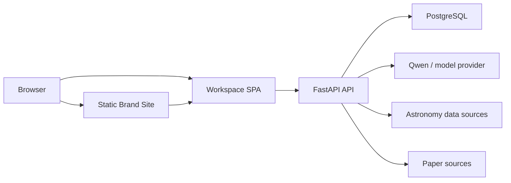

# Deployment

| 元数据         | 值                                                           |
| -------------- | ------------------------------------------------------------ |
| Status         | Accepted                                                     |
| Authority      | 环境拓扑、配置边界、迁移、健康检查和发布验证                 |
| Implementation | Current five-service local baseline（含 one-shot migrate）与 X-01 真实集成；public topology Pending |

本文说明系统如何运行和发布。安全要求由 [Security](SECURITY.md) 定义，产品退出标准由 [Acceptance](docs/product/ACCEPTANCE.md) 定义，本地开发命令由 [Local Setup](docs/setup.md) 维护。

## 1. 部署目标

MVP 需要提供稳定、可复现的公网作品环境，而不是大规模通用 SaaS。部署必须支持：

- 静态 Brand Site；
- Guided Tour 与 Research Workspace；
- FastAPI 单一 `/api/*` 面：Pipeline APIs（`/api/health`、`/api/tasks*`）与 Core APIs M1 Runtime；Session、Project/Contract/Run/Event、Artifact/Evidence 与 Workspace/Share Current；
- PostgreSQL Schema、Alembic migration、Workflow 恢复和 ArtifactVersion 原子发布基线已实现；M2 科研 Pipeline Pending；
- Demo Replay、Live Run、真实缓存、分享和导出；
- WebGL 或外部服务失败时的可用降级；
- 版本、来源、Evidence 和请求追踪。

## 2. Current：本地运行基线

当前 Compose 包含：

| Service     | Runtime                        | Purpose                              |
| ----------- | ------------------------------ | ------------------------------------ |
| `site`      | Node.js 24.18.0 + pnpm 11.13.1 | Astro Brand Site                     |
| `workspace` | Node.js 24.18.0 + pnpm 11.13.1 | React Research Workspace + HTTP Adapter |
| `api`       | Python 3.13 + uv               | FastAPI 单一 `/api/*` 面（Pipeline APIs 与 Core APIs M1 Runtime） |
| `migrate`   | Python 3.13 + uv               | Alembic `upgrade head` one-shot |
| `postgres`  | PostgreSQL 17                  | Project/Contract/Run/Event/Artifact 权威事实 |

`postgres healthy → migrate exited 0 → api` 是固定启动顺序；迁移失败时 API 不启动。当前启动、端口、X-01 隔离 Project 和故障排查只在 [Local Setup](docs/setup.md) 维护。

## 3. Target：公网拓扑

目标边界：

- Site 输出静态 HTML/CSS 和按需 Islands；
- Workspace 输出 SPA 静态资源；
- `/tour/*`、`/workspace/*`、`/share/*` 必须支持刷新 fallback；
- API、模型、数据库和外部来源凭据只在后端环境；
- 浏览器只接收非敏感公共配置；
- 同域优先简化 Cookie、CSRF 和 CORS；跨域部署必须显式验证凭据策略；
- Production 必须设置 `SESSION_COOKIE_SECURE=true`，并通过 HTTPS 验证 HttpOnly、SameSite、CSRF 与跨会话 404 行为；
- MVP 不要求 Nginx、Redis、Celery、对象存储或图数据库作为前置。

具体前端构建产物见 [Frontend Architecture](docs/architecture/FRONTEND_ARCHITECTURE.md)。

## 4. 环境

| Environment | Purpose                           | Data and external calls            |
| ----------- | --------------------------------- | ---------------------------------- |
| local       | 开发与完整本地复现                | Fixture、stub、recorded，按需 Live |
| preview     | PR 浏览器、路由、安全和部署 smoke | 隔离配置、受控 Live 或测试凭据     |
| production  | 公网作品环境                      | 限制主案例、配额和来源范围         |

每个环境使用独立配置和数据库边界。Preview 不得复用 Production 的高权限凭据或会话数据。

## 5. 配置与 Secrets

配置分类：

### Browser-visible

- API public origin；
- 公开部署标识；
- 非敏感 feature flag；
- 静态资源和监测的公开配置。

Astro 使用明确的 `PUBLIC_` 前缀，Workspace 使用 `VITE_` 前缀。所有此类值都应视为公开信息。

### Backend-only

- 数据库连接和密码；
- 模型、论文源和数据源凭据；
- Session / share signing or hashing secrets；
- Session 和 ShareSnapshot 创建限流配置（`SESSION_CREATE_RATE_LIMIT` / `SHARE_CREATE_RATE_LIMIT`）；
- 内部服务地址和管理开关。

`.env.example` 只存占位值和说明。生产环境必须拒绝 DEBUG、默认数据库凭据、空/占位密钥和通配 CORS。完整安全要求见 [Security](SECURITY.md)。

## 6. 路由与缓存边界

| Path                 | Owner     | Requirement                                       |
| -------------------- | --------- | ------------------------------------------------- |
| `/`、`/404.html`     | Site      | Current 静态输出，核心内容不依赖 JavaScript       |
| `/tour`              | Workspace | Current Guided Tour、Contract 与 Run 启动 |
| `/workspace`         | Workspace | Current 私有 Session、WorkspaceSnapshot 与恢复 |
| `/share/$shareToken` | Workspace | Current 匿名只读冻结 ShareSnapshot |
| `/api/health`、`/api/tasks*` | API       | Current Pipeline APIs（Phase 0 基线）          |
| `/api/*`             | API       | Current Core APIs M1 资源 Runtime；M2 科研能力 Pending |

CDN 或平台缓存不得缓存私有 Workspace/API 响应。公开分享默认 `no-store`，除非安全和撤销语义证明可采用其他策略。静态资产可使用内容 hash 长缓存。

## 7. 数据库迁移与保留

- Migration 必须在应用切换前运行，并具有明确失败退出；
- 本地 Compose 使用独立 `migrate` one-shot，API 只在其成功退出后启动；应用进程不执行 migration；
- 破坏性迁移需要备份、回滚或双读/迁移方案；
- Run、ArtifactVersion、Evidence、SourceSnapshot 和 Share 的事务不变量必须保持；
- Session 过期、Share 保留和临时导出清理策略需要配置并测试；
- 生产环境不使用应用启动时的隐式 destructive migration；
- 回滚应用版本时必须确认 Schema 兼容性。

## 8. 健康检查与可观测性

### Health

- Site 静态入口可返回有效 HTML；
- Workspace 入口和 fallback 可返回应用资源；
- API liveness 不依赖外部模型；
- API readiness 验证必要数据库和迁移状态；
- PostgreSQL 使用平台或 `pg_isready` 等价检查。

### Observability

至少记录：

- request id、Run id、step key 和公开 error code；
- API latency、错误率和限流；
- 外部数据/论文/模型超时和无效响应；
- Run 终态、失败步骤、CacheSelector 选择；
- migration、部署版本和健康检查结果。

日志不得记录密钥、Cookie、share 原 token、受限全文或模型私有推理。

## 9. 发布流程

1. 锁定 Commit、Contract 和数据库 migration。
2. 执行 frozen install/sync、lint、typecheck、test、build 和生成物检查。
3. 在 Preview 运行路由、Session、Share、安全、WebGL fallback 和 E2E smoke。
4. 备份或确认数据库恢复点，执行 migration。
5. 部署 Site、Workspace 和 API/DB 变更。
6. 执行 Production smoke 和关键主案例读取。
7. 记录部署版本、时间、URL、migration 和验证结果。
8. 失败时停止流量切换或按预案回滚；不得用缓存或 Fixture 掩盖部署故障。

## 10. 发布验证

至少验证：

- 静态首屏、SEO 元信息和无 WebGL fallback；
- `/tour/*`、`/workspace/*`、`/share/*` 深链接与刷新；
- Pipeline APIs（`/api/health`、`/api/tasks*`）回归与 Core APIs 契约；
- Session、CSRF、401/403/404、Share 撤销/过期；
- Project、Run、ArtifactVersion、Evidence 和导出读取；
- Demo Replay 与 Live/Cached 语义；
- 外部服务失败和无缓存失败；
- 数据库 migration、readiness 和恢复流程；
- CSP、HSTS、MIME、Referrer、Permissions Policy 和 CORS；
- 移动端、Reduced Motion、context loss 和 Poster。

阶段级完整标准见 [Acceptance](docs/product/ACCEPTANCE.md)。

## 11. 禁止事项

- 前端或静态站携带后端 Secrets；
- 浏览器使用 Docker 内部服务名访问 API；
- Production 使用 DEBUG、默认密码、占位密钥或通配 CORS；
- 私有数据或可撤销分享被不可控 CDN 缓存；
- 未运行 migration/回归验证就切换流量；
- 把 Fixture、seed 或手写数据当作真实缓存；
- 用部署成功替代科研产物、Evidence 和版本验收；
- 未经 ADR 和负载依据引入复杂基础设施。
