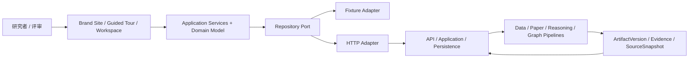

# DESIGN

| 项目状态     | 口径                                                             |
| ------------ | ---------------------------------------------------------------- |
| Status       | Active                                                           |
| A-01 runtime | Implemented：Astro Brand Site、React Research Workspace 与共享包 |
| Product UI   | A-02、A-03 Pending                                               |
| API          | `/api/v1` Current；`/api/v2` Pending                             |

本文件是星文智析的**产品设计总纲、体验域、系统边界与专项规范入口**。它不重复产品主流程、页面交互、技术栈、Run 状态、视觉细则或验收清单；这些事实由对应专项文档维护。

A-01 只交付前端运行时与最小入口。本文件描述的完整品牌、Guided Tour、科研工作区和 v2 业务能力仍需对应 Issue、代码、测试与运行证据。

## 1. 产品设计定位

星文智析不是通用聊天 Agent，也不是装饰性的天文数据大屏。产品围绕“从科学问题到可用数据与可核验证据”，建立可运行、可复现、可溯源的天文科研工作环境。

MVP 固定主案例为 **系外行星候选体与宿主恒星参数整合**。用户、场景、产品范围、成功标准和主流程只在 [PRD.md](PRD.md) 定义。

产品的两个核心识别面是：

- **艺术化天文入口**：用独立品牌语言建立主题、问题与可信性认知。
- **科研产物工作台**：以 Project、Run、Contract、Artifact、Version 和 Evidence 为主要对象，不以聊天历史组织研究。

## 2. 设计原则

| 原则           | 设计要求                                                                                |
| -------------- | --------------------------------------------------------------------------------------- |
| 科研产物优先   | 结构化数据、论文、Claim、Relation、Graph 与 Evidence 是主界面对象；对话只提供上下文操作 |
| Evidence-first | 关键数据、结论、关系和图谱边都能回到来源、证据和明确版本                                |
| 自主可理解     | 无现场讲解时，品牌入口与引导体验仍能说明价值、过程和可信边界                            |
| 可复现而不失真 | Demo、实时运行、历史缓存和修订关系分别表达，不把示例包装成真实结论                      |
| 渐进复杂度     | 先建立问题与主动作，再逐步揭示产物、来源、版本和审查工具                                |
| 视觉服从阅读   | 强视觉服务品牌与转场；表格、论文、Evidence 和长文本保持高可读性                         |
| 降级仍可用     | 动效、Canvas 或设备能力下降时，核心内容、状态和操作仍由 DOM 承载                        |
| 状态明确       | Current、Implemented 与 Pending 始终分别标注                                            |

完整视觉规则只在 [VISUAL_LANGUAGE.md](docs/design/VISUAL_LANGUAGE.md) 维护。

## 3. 体验域关系

星文智析包含三个连续但职责不同的体验域：

| 体验域             | 设计职责                                                    | 与下一域的关系               |
| ------------------ | ----------------------------------------------------------- | ---------------------------- |
| Brand Site         | 建立品牌、主案例和可信性认知，提供明确入口                  | 将用户带入可操作的引导体验   |
| Guided Tour        | 用确定性场景解释 Contract、Run、Artifact 与 Evidence 的关系 | 保留上下文进入真实工作台     |
| Research Workspace | 管理研究项目、运行、产物审查、反馈、分享与导出              | 形成可复现、可提交的研究结果 |

三个体验域共享领域语言、视觉 Token、证据规则和数据访问边界，但不共享不必要的页面状态。首页叙事、Guided Tour 状态机和 Workspace 交互只在 [WORKSPACE_UX.md](docs/design/WORKSPACE_UX.md) 定义。

## 4. 系统边界

边界规则：

- 体验组件只依赖稳定 Domain Model，不直接读取 Transport DTO、拼接 API URL 或调用外部数据源与模型。
- Fixture 与 HTTP 通过同一 Repository Port 返回同一领域形状，并接受一致性测试。
- Workflow、权限、版本发布、缓存选择和分享冻结由服务端负责，浏览器状态不能替代后端事实。
- Prompt 只位于 `packages/prompts`；模型输出必须先通过 Schema 与 Evidence 校验。
- ArtifactVersion、Evidence、SourceSnapshot 与 ShareSnapshot 是复现和审查边界，不能以漂移的 latest 代替固定引用。

前端技术栈、目录、依赖方向和构建规则只在 [FRONTEND_ARCHITECTURE.md](docs/architecture/FRONTEND_ARCHITECTURE.md) 定义；跨模块职责见 [MODULES.md](docs/architecture/MODULES.md)。

## 5. 领域设计不变量

- ResearchProject 表示持续研究上下文；ResearchRun 表示一次执行；ResearchArtifact 表示稳定身份；ArtifactVersion 表示不可变内容快照。
- ResearchContract 固定研究输入和质量约束，不保存执行方式；执行方式在创建 Run 或启动 Guided Tour 时确定。
- 执行方式、产物来源和修订派生关系是三个独立维度；修订不会成为新的来源枚举值。
- 用户重试、修订或改变研究范围时创建派生 Run；自动瞬态重试只形成 StepAttempt。
- 缓存只引用真实历史 Run、ArtifactVersion 与 SourceSnapshot；Fixture 不能冒充缓存。
- Summary、Accepted Relation、ReasoningTrace 和 GraphEdge 均按契约绑定 Evidence。
- ReasoningTrace 只记录可审查依据、条件和引用，不保存模型私有 chain-of-thought。
- WorkspaceSnapshot 是私有恢复状态；ShareSnapshot 是冻结、只读、最小公开范围的投影。

实体与不变量以 [DATA_MODEL.md](docs/architecture/DATA_MODEL.md) 为准；Run 状态与派生规则以 [WORKFLOW_DESIGN.md](docs/architecture/WORKFLOW_DESIGN.md) 为准；版本、缓存、修订与分享以 [DATA_VERSIONING.md](docs/architecture/DATA_VERSIONING.md) 为准。

## 6. 安全与可信边界

- 前端不保存或直传模型、论文源、天文数据源密钥。
- 私有 Project、Run 和 Artifact 由服务端会话所有权隔离；公开分享不得暴露编辑会话。
- 用户输入与外部文本默认按文本渲染；外部 URL、HTML、导出参数和分享范围必须校验。
- 错误信息不得暴露密钥、连接串、堆栈、受限全文或私有推理。
- Seed、Fixture、缓存、模型推断和真实科研结果必须按真实来源明确标注。

HTTP 与授权语义见 [API_CONTRACT.md](docs/architecture/API_CONTRACT.md)，部署安全见 [SECURITY.md](SECURITY.md)，风险治理见 [RISK_REGISTER.md](docs/quality/RISK_REGISTER.md)。

## 7. 专项规范入口

| 事实范围                           | 唯一正文来源                                                           |
| ---------------------------------- | ---------------------------------------------------------------------- |
| 用户、场景、范围、成功标准、主流程 | [PRD.md](PRD.md)                                                       |
| 品牌、颜色、字体、视觉引擎、动效   | [VISUAL_LANGUAGE.md](docs/design/VISUAL_LANGUAGE.md)                   |
| 首页、Guided Tour、Workspace 交互  | [WORKSPACE_UX.md](docs/design/WORKSPACE_UX.md)                         |
| 前端技术栈、目录、依赖、构建       | [FRONTEND_ARCHITECTURE.md](docs/architecture/FRONTEND_ARCHITECTURE.md) |
| HTTP 资源与传输契约                | [API_CONTRACT.md](docs/architecture/API_CONTRACT.md)                   |
| 领域实体与不变量                   | [DATA_MODEL.md](docs/architecture/DATA_MODEL.md)                       |
| Run 状态、重试、取消、派生         | [WORKFLOW_DESIGN.md](docs/architecture/WORKFLOW_DESIGN.md)             |
| 版本、缓存、修订、分享             | [DATA_VERSIONING.md](docs/architecture/DATA_VERSIONING.md)             |
| 产品退出标准                       | [ACCEPTANCE.md](docs/product/ACCEPTANCE.md)                            |
| PR 与发布检查                      | [REVIEW_CHECKLIST.md](docs/quality/REVIEW_CHECKLIST.md)                |
| 材料提交顺序                       | [handoff/README.md](docs/handoff/README.md)                            |
| Agent 执行纪律与红线               | [AGENTS.md](AGENTS.md)                                                 |

## 8. 实施边界

本设计的实施必须由对应 Issue 驱动。A-01 已完成运行时基线；A-02 不得提前实现 A-03 领域行为，A-03 不得把 `/api/v2` 写成当前可调用能力。每项能力只有通过对应 Contract、E2E、可访问性、降级与部署门禁后才能标记为 Implemented。
