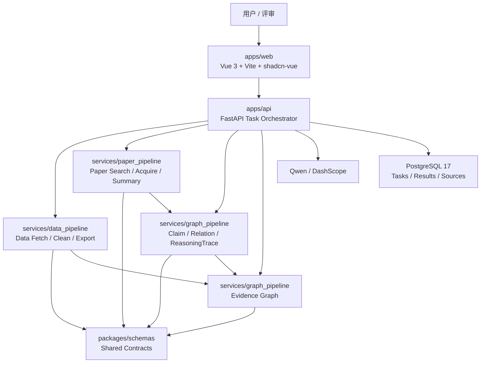

# DESIGN

本文件是系统架构、技术栈与 UI 设计基线的唯一入口。接口细节见 `docs/architecture/API_CONTRACT.md`，数据结构见 `docs/architecture/DATA_MODEL.md`，本地启动见 `docs/setup.md`。

## 1. 设计目标

| 目标 | 要求 |
| --- | --- |
| 科研可信 | 数据、论文获取、文献总结、跨文献关系和图谱均可溯源，关键结果绑定 `Evidence` |
| 演示稳定 | 主案例公网 Demo 可在外部服务失败时使用真实运行缓存 |
| 协作清晰 | 前端、后端、数据、文献、推理、图谱通过固定契约协作 |
| Web-first | 先完成 Web 页面和 Mock 闭环，再逐步接入真实 Pipeline |
| Docker-first | 成员本地统一通过 Docker Compose 启动，避免依赖和版本漂移 |
| 视觉克制 | 米白纸感、低饱和灰、低饱和靛灰强调，避免炫技和包装感 |

MVP 固定主案例：**系外行星候选体与宿主恒星参数整合**。

MVP 必须纳入主案例内的自动论文获取与跨文献逻辑推理；边界是不做任意天文方向、任意 PDF 全文高精度解析或无证据科学发现。

## 2. 技术栈基线

| 层级 | 固定口径 |
| --- | --- |
| 前端运行时 | Node.js 24 LTS |
| 前端包管理 | pnpm 10.x，禁止混用 npm/yarn/bun 安装依赖 |
| 前端框架 | Vue 3 + TypeScript + Vite |
| UI 组件 | shadcn-vue + reka-ui |
| 样式 | Tailwind CSS 4 + CSS Variables |
| 路由/状态 | Vue Router + Pinia |
| 图谱 | Vue Flow；统计图表按需使用 ECharts |
| 后端 | FastAPI + Python 3.13 + Pydantic v2 |
| Python 依赖 | uv + `pyproject.toml` + `uv.lock` |
| 数据库 | PostgreSQL 17-alpine |
| 数据访问 | SQLAlchemy 2 + Alembic |
| 外部请求 | httpx |
| 本地编排 | Docker Compose：`web`、`api`、`postgres` |
| M1 暂缓 | Redis、Celery、MinIO、Nginx、RabbitMQ |

依赖规则：

- 前端提交 `pnpm-lock.yaml` 和 `packageManager` 字段。
- 后端提交 `pyproject.toml` 和 `uv.lock`。
- Docker Compose 是团队统一入口，本机裸命令只作为调试补充。
- 前端 fixtures 只允许用于开发模式，字段必须对齐 `API_CONTRACT.md`。

## 3. 总体架构



## 4. Docker 本地架构

M1 只保留三容器：

| 服务 | 镜像基线 | 职责 | 暴露端口 |
| --- | --- | --- | --- |
| `web` | `node:24-alpine` | Vue/Vite Web 端、shadcn-vue 页面、Vue Flow 图谱 | `5173` |
| `api` | `python:3.13-slim` | FastAPI、任务状态、Mock API、后续 Pipeline 编排 | `8000` |
| `postgres` | `postgres:17-alpine` | 本地任务、来源、结果、缓存元信息 | `5432` |

禁止在 M1 加入 Redis、Celery、MinIO、Nginx、RabbitMQ。任务耗时变重后再通过 ADR 评估队列方案。

## 5. 模块边界

| 模块 | 负责 | 不负责 |
| --- | --- | --- |
| `apps/web` | 页面、状态展示、论文获取过程、文献总结、跨文献推理、Vue Flow 图谱、反馈提交、shadcn-vue 组件和 UI token 落地 | 直接调用 Qwen、直接访问外部数据源或论文源 |
| `apps/api` | 任务编排、API、缓存、导出、统一错误、鉴权预留、论文源后端代理 | 具体清洗规则、论文检索策略和图谱算法细节 |
| `services/data_pipeline` | 数据源查询、字段映射、单位统一、溯源、质量评分 | 页面展示和用户交互 |
| `services/paper_pipeline` | 论文检索、候选获取、去重、相关性排序、结构化总结、来源绑定 | 绕过付费全文或生成无法溯源的结论 |
| `services/graph_pipeline` | Claim 抽取、LiteratureRelation、ReasoningTrace、图谱节点、边、证据链构建 | 只为视觉效果生成无证据边或无证据推理 |
| `packages/schemas` | 共享类型、枚举、JSON Schema | 业务流程实现 |

详细边界见 `docs/architecture/MODULES.md`。

## 6. 数据流

```text
科研目标
-> 创建 ResearchTask
-> 解析任务计划
-> 获取并清洗主案例数据
-> 自动检索并获取主案例相关论文候选
-> 去重、相关性排序、选择用于总结的论文
-> 生成文献结构化总结
-> 抽取 LiteratureClaim 并构建 LiteratureRelation
-> 生成 ReasoningTrace
-> 构建证据图谱
-> 聚合展示与导出
-> 字段 / 单位 / 来源 / 文献关系局部反馈修正
```

关键要求：

- 前端只提交 `goal`、`case_key` 和反馈，不直接调用模型、论文源或外部数据源。
- 后端统一聚合 `Dataset`、`PaperAcquisitionRun`、`PaperSummary`、`LiteratureClaim`、`LiteratureRelation`、`ReasoningTrace`、`Graph`、`Evidence`。
- 所有展示结果至少满足 `result -> evidence -> source/paper -> url/query/retrieved_at`。
- 跨文献逻辑推理必须落到可核验的 `LiteratureRelation` 和 `ReasoningTrace`，不能只输出自然语言结论。
- 反馈修正只做字段单位、字段映射、来源标注、文献总结和图谱关系局部修正，不做开放式科学发现闭环。

## 7. 任务状态机

| 状态 | 含义 | 下一步 |
| --- | --- | --- |
| `pending` | 任务已创建 | `planning` |
| `planning` | 正在解析目标和生成计划 | `fetching_data` / `failed` |
| `fetching_data` | 正在获取天文数据 | `cleaning_data` / `failed` |
| `cleaning_data` | 正在字段对齐、单位统一、质量评分 | `searching_papers` / `failed` |
| `searching_papers` | 正在检索、获取、筛选主案例相关论文 | `summarizing_papers` / `failed` |
| `summarizing_papers` | 正在生成文献结构化总结 | `reasoning_literature` / `failed` |
| `reasoning_literature` | 正在抽取 Claim、构建跨文献关系和推理链 | `building_graph` / `failed` |
| `building_graph` | 正在构建证据图谱 | `completed` / `failed` |
| `completed` | 任务完成 | `revising` |
| `revising` | 根据用户反馈局部修正 | `completed` / `failed` |
| `failed` | 任务失败 | 人工排查或缓存兜底 |

`using_cache` 不作为主任务状态。缓存命中通过 `meta.cached`、`ResearchTask.used_cache`、`SourceRecord.cached` 和页面提示表达。

M1 可先实现 `pending`、`planning`、`completed`、`failed` 子集；细粒度过程用 `TaskStep` 展示，TaskStep 必须预留 `searching_papers` 和 `reasoning_literature`。

## 8. 证据、论文获取与缓存原则

### 8.1 Evidence

每条关键展示结果必须能定位证据：

```text
展示字段 / 文献结论 / 跨文献关系 / 图谱边
-> evidence_id
-> source_id / paper_id
-> locator / quote_or_value / source_snapshot
```

`Evidence` 必须支持：

- `locator`：字段名、表格列、段落、页码或 URL 片段。
- `quote_or_value`：可核验短文本、字段值或查询依据。
- `extraction_method`：规则映射、模型抽取、自动检索、人工反馈或缓存记录。
- `source_snapshot`：查询时间、查询 hash、缓存版本或文献版本。

### 8.2 Paper Acquisition

自动论文获取是 MVP 主链路，不是后续扩展。

| 项 | 要求 |
| --- | --- |
| 检索范围 | 固定主案例内，围绕目标、字段、对象类型和 seed keywords |
| 来源 | 至少 1 个可运行论文来源；seed list 只能作为兜底、评测基准和演示缓存 |
| 候选处理 | 记录检索参数、来源、获取时间、去重规则、相关性分数 |
| 文本边界 | MVP 优先使用元数据、摘要、开放可访问文本片段，不绕过付费全文 |
| 失败兜底 | 外部源失败时使用真实运行缓存并明确标注 |

### 8.3 Literature Reasoning

跨文献逻辑推理必须工程化为结构化关系：

```text
PaperSummary -> LiteratureClaim -> LiteratureRelation -> ReasoningTrace -> Evidence
```

MVP 至少支持 3 类关系：

- `supports`：一篇或多篇文献支持同一发现。
- `extends` / `derived_from`：后续工作扩展或派生前置结论、数据或方法。
- `limits` / `contradicts`：文献对结论适用范围、数据可靠性或解释提出限制或矛盾。

每条 `LiteratureRelation` 必须绑定 `evidence_ids` 和 `reasoning_trace_id`。无证据关系只能作为候选，不进入最终图谱。

### 8.4 Cache

| 类型 | 用途 | 要求 |
| --- | --- | --- |
| 数据源缓存 | 外部天文数据源不可用时展示 | 记录原查询、来源 URL、获取时间 |
| 论文获取缓存 | 论文源不可用时展示候选论文 | 记录检索参数、来源、获取时间、去重版本 |
| 模型结果缓存 | Qwen 调用失败时展示 | 记录 prompt 版本、模型名、生成时间 |
| 演示样例缓存 | 公网 Demo 稳定演示 | 必须来自真实运行，不允许手写假结果 |

缓存只能描述结果来源，不改变主状态机语义。

## 9. UI 设计基线

前端视觉服务科研可信和演示清晰，不做强装饰。初始实现应优先沉淀 CSS 变量、Tailwind 语义 utility 和 shadcn-vue 组件基线，再开发业务页面。

### 9.1 组件策略

首批 shadcn-vue 组件范围：

```text
Button, Card, Badge, Input, Textarea, Select, Table, Tabs,
Dialog, Sheet, Tooltip, Skeleton, Alert, Progress, Sonner
```

规则：

- 基础控件优先采用 shadcn-vue，不从零自建重复组件。
- 业务组件在 `apps/web` 内先服务页面，稳定后再抽象复用。
- 组件样式必须通过 CSS Variables 和 Tailwind token 控制。
- 不为单个页面另起颜色、阴影、圆角或动效体系。

### 9.2 视觉方向

| 维度 | 要求 |
| --- | --- |
| 基调 | 米白纸感、低饱和灰、低饱和靛灰强调 |
| 气质 | 安静、克制、科研工具感，避免营销大屏感 |
| 对比 | 中低对比，关键状态和证据入口保持可见 |
| 信息密度 | 数据页可读优先，图谱页关系清晰优先 |
| 装饰 | 不使用高饱和渐变、霓虹、重阴影、强拟物 |

### 9.3 颜色 Token

业务组件不得散落基础色值。初始推荐值如下，后续以前端 token 文件为准。

| Token | 建议值 | 用途 |
| --- | --- | --- |
| `--color-bg` | `#F7F3EA` | 全局米白背景 |
| `--color-surface` | `#FFFCF5` | 卡片、面板、Dialog、Popover |
| `--color-surface-muted` | `#EEE9DF` | 次级卡片、表头、弱选中 |
| `--color-surface-hover` | `#E8E3D8` | hover、浅强调背景 |
| `--color-text-primary` | `#2F3136` | 正文与标题 |
| `--color-text-secondary` | `#626873` | 辅助说明 |
| `--color-text-tertiary` | `#8A9099` | 占位、弱标签 |
| `--color-border` | `#D8D1C5` | 默认边界 |
| `--color-border-subtle` | `#E7E0D5` | 弱边界、分隔线 |
| `--color-brand` | `#4F5D7A` | 低饱和靛灰主强调 |
| `--color-brand-muted` | `#E2E6F0` | 品牌弱底色 |
| `--color-focus` | `#7482A4` | focus ring |
| `--color-success` | `#5F7F6C` | 成功、完成状态 |
| `--color-warning` | `#9A7B41` | 缓存、等待、风险提示 |
| `--color-error` | `#9B5B5B` | 失败、错误状态 |
| `--mask-overlay` | `color-mix(in srgb, #2F3136 28%, transparent)` | Dialog 遮罩 |

禁止：

- 业务组件直接写 `white`、`black`、高饱和蓝/绿/红。
- 使用 `rgba()` 乱配透明度；透明色统一用 `color-mix()` 或语义 token。
- 为单个页面另起一套颜色体系。

### 9.4 字体与排版

| 场景 | 规则 |
| --- | --- |
| UI 控件 | 系统 sans，保持清晰，不追求装饰字体 |
| 数据表格 | 数字和代码字段可使用 mono；中文说明使用 sans |
| 证据内容 | 短证据用 sans；代码、query、hash 用 mono |
| 标题 | 字重克制，避免超大标题和营销式口号 |

字号建议：

| Token | 用途 |
| --- | --- |
| `--font-size-xs` | badge、表格辅助信息 |
| `--font-size-sm` | 表单说明、弱提示 |
| `--font-size-md` | 默认正文、控件文字 |
| `--font-size-lg` | 卡片标题、页面小标题 |
| `--font-size-xl` | 页面主标题 |

### 9.5 间距、圆角、阴影

| Token | 建议值 | 用途 |
| --- | --- | --- |
| `--spacing-xs` | `4px` | 图标文字间距、badge 内距 |
| `--spacing-sm` | `8px` | 表单小 gap、紧凑列表 |
| `--spacing-md` | `12px` | 卡片内部常规间距 |
| `--spacing-lg` | `20px` | 页面区块间距 |
| `--spacing-xl` | `32px` | 页面主留白 |
| `--radius-sm` | `6px` | badge、内部小元素 |
| `--radius-md` | `10px` | Button、Input、Dropdown item |
| `--radius-lg` | `14px` | 卡片、表格容器 |
| `--radius-xl` | `20px` | 页面主面板、Dialog |
| `--shadow-soft` | `0 8px 24px color-mix(in srgb, #2F3136 8%, transparent)` | 卡片和弱浮层 |
| `--shadow-popover` | `0 10px 30px color-mix(in srgb, #2F3136 12%, transparent)` | Select、Dropdown、Tooltip |
| `--shadow-modal` | `0 18px 48px color-mix(in srgb, #2F3136 18%, transparent)` | Dialog、Confirm |

禁止：

- 大面积重阴影、硬黑阴影。
- 强边框 + 强阴影同时出现。
- 页面级元素使用过大的圆角导致卡通感。

### 9.6 动效

允许动效只服务状态反馈和信息层级。

| Token | 建议 |
| --- | --- |
| `--motion-duration-fast` | `120ms` |
| `--motion-duration-base` | `180ms` |
| `--motion-duration-slow` | `260ms` |
| `--motion-ease-standard` | `cubic-bezier(0.2, 0, 0, 1)` |

允许属性：`opacity`、`transform`、`color`、`background-color`、`border-color`、`box-shadow`。

禁止：

- `transition-all`。
- width、height、padding、margin、max-height 等 layout 属性动画。
- 弹簧、强缩放、无依据抖动、过度粒子效果。
- 因 loading 导致按钮宽度、表格行高或页面布局抽搐。

### 9.7 业务页面规范

| 页面 | 关键要求 |
| --- | --- |
| 首页 | 明确主案例和工作流，不宣传任意科研问题 |
| 任务页 | 展示状态、步骤、失败原因、缓存提示，包含论文获取和跨文献推理步骤 |
| 数据页 | 表格、字段字典、来源、质量评分同屏可理解 |
| 论文获取页 | 展示检索参数、候选论文、去重、相关性分数和获取来源 |
| 文献页 | 结构化总结优先，结论必须能打开证据 |
| 推理页 | 展示 Claim、Relation、ReasoningTrace，不把无证据推理作为事实 |
| 图谱页 | Vue Flow 小而硬；节点少但边有证据，不追求大图装饰 |
| 证据面板 | 展示来源、locator、quote/value、snapshot、confidence |
| 反馈入口 | 支持字段单位、字段映射、来源标注、文献总结、图谱关系反馈 |

### 9.8 图谱视觉

- 节点类型至少区分：research_goal、dataset、field、source、paper、finding、claim、relation、evidence。
- 边类型优先：`provides_field`、`supports_finding`、`derived_from`、`supports`、`extends`、`limits`、`contradicts`。
- 边必须绑定 `evidence_ids`；跨文献边必须绑定 `reasoning_trace_id`。
- 图谱默认控制规模，避免满屏节点影响可信度。
- 点击节点或边时，右侧或浮层展示证据详情和 ReasoningTrace。

### 9.9 可访问性与状态

- 所有图标按钮必须有可读标签。
- 键盘可访问：Tab、Enter、Escape 不破坏主要流程。
- 加载、成功、失败、空状态必须具备，不用空白页面代替。
- 错误信息要能指导下一步，例如重试、使用缓存、检查输入或稍后再试。

## 10. 安全约束

- API Key 只允许存在于后端环境变量或部署平台 Secrets。
- 前端不保存密钥、不拼接模型请求、不直连外部模型服务、论文源或天文数据源。
- `VITE_` 变量只允许保存非敏感配置。
- 公网 Demo 限制主案例和调用频率。
- 日志不得输出完整密钥、原始用户敏感输入、过长模型响应或论文源访问凭据。

## 11. 实现顺序

1. 完成 `X-00`：冻结 MVP 字段清单、论文获取来源、检索关键词、seed list、跨文献关系类型和 Graph 最小关系类型。
2. 完成 `X-04`：建立 Docker Compose 本地开发基线，固定 `web`、`api`、`postgres` 三容器。
3. A/B 并行初始化前后端，C/D 提供最小真实依据。
4. B 交付 `/api/v1/health`、`POST /api/v1/tasks`、`GET /api/v1/tasks/{task_id}` 和 Mock 聚合结果。
5. A 基于 Mock API 展示任务流、数据、论文获取、文献、推理和图谱页面，并落地 shadcn-vue 与 UI token。
6. 接入数据 Pipeline、论文获取与总结 Pipeline、Claim/Relation 推理 Pipeline、图谱 Pipeline。
7. 完成反馈修正、公网 Demo 和材料交接。
