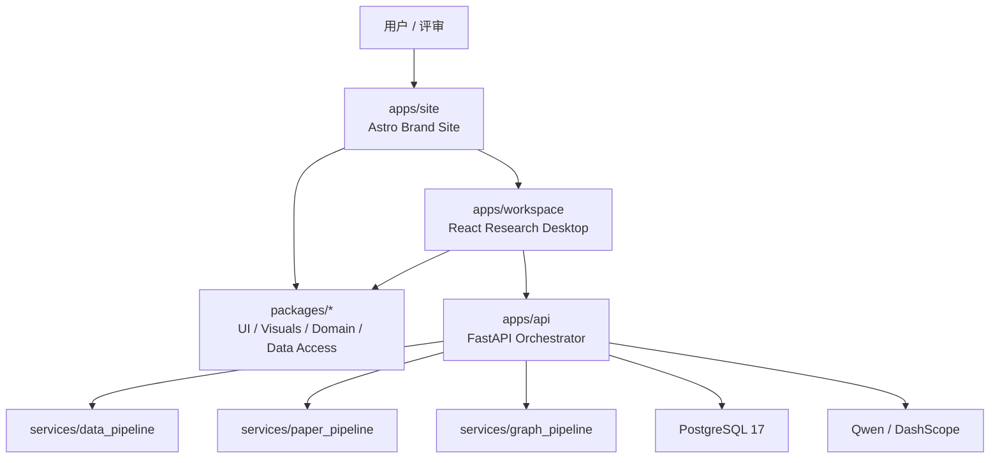

# DESIGN

| 项目状态 | 口径 |
| --- | --- |
| Status | Accepted for implementation |
| Implementation | Pending |
| Current runtime | `apps/web` 中的 Vue 3 骨架 |
| Target runtime | Astro 品牌站 + React Research Workspace Monorepo |

本文件是星文智析的产品设计、系统边界与前端体验总纲。具体视觉规范见 `docs/design/VISUAL_LANGUAGE.md`，科研工作台交互见 `docs/design/WORKSPACE_UX.md`，前端工程架构见 `docs/architecture/FRONTEND_ARCHITECTURE.md`，接口与数据结构分别见 `docs/architecture/API_CONTRACT.md` 和 `docs/architecture/DATA_MODEL.md`。

本轮只冻结目标方案；现有 Vue 前端、`/api/v1` 与 Docker 启动方式仍是当前实现事实，目标架构不得写成已交付能力。

## 1. 产品定位

星文智析不是通用聊天 Agent，也不是装饰性的天文数据大屏。产品围绕“从科学问题到可用数据与可核验证据”建立一套可运行、可复现、可溯源的天文科研工作环境。

MVP 默认主案例为：**系外行星候选体与宿主恒星参数整合**。产品架构允许扩展到其他天文数据整合任务，但提交版本不得宣传尚未完成的任意方向能力。

产品的两个核心识别面：

1. **艺术化天文入口**：以实时 ASCII / Dither 天体、编辑式排版与雾霾蓝色阶建立独立品牌记忆。
2. **科研产物桌面**：以研究项目、任务契约、数据集、论文、Claim、Relation、ReasoningTrace、Graph 与 Evidence 为界面主对象，区别于以聊天线程为主的 Agent Desktop。

## 2. 设计目标

| 目标 | 要求 |
| --- | --- |
| 科研可信 | 数据、论文、文献结论、跨文献关系与图谱边均可回到 `Evidence`、来源和运行版本 |
| 无人讲解可理解 | 首页与 Guided Tour 能在没有现场讲解时建立价值、流程和可信性认知 |
| 作品级辨识度 | ASCII / Dither 粒子、巨型裁切天体、编辑式排版和雾霾蓝色阶形成统一语言 |
| 专业工作效率 | 工作台支持多研究项目、最多三面板对照、证据检查和上下文指令，不以聊天流占据中心 |
| 稳定可提交 | 默认 Demo Replay 可确定性回放；真实运行、缓存与示例数据必须明确区分 |
| 可扩展工程 | 品牌站、工作台、共享领域契约和未来 Tauri 桌面端边界清楚 |
| 视觉有层次 | 强视觉集中在首页、阶段转场和空间关系；表格、证据与长文本区域保持克制 |
| 无障碍与性能 | 支持键盘、读屏、Reduced Motion、WebGL 降级与高/中/低性能档位 |

## 3. 评审与提交体验

赛事初审以作品材料提交为主，作品应同时服务于视频、网页、技术文档与源码检查。默认材料阅读路径为：

```text
START HERE 入口文档
-> 60–90 秒品牌短片
-> 公网首页四幕式体验
-> Guided Tour 示例研究回放
-> Workspace 真实科研工作台
-> 技术方案 PDF / API / 源码 / 测试与复现材料
```

系统不依赖现场答辩才能被理解；若进入后续终审，工作台仍支持快速跳转、自由操作与现场演示。

## 4. 产品信息架构

同一产品包含三个体验域：

| 体验域 | 路径 | 目的 |
| --- | --- | --- |
| Brand Site | `/` | 品牌建立、四幕式叙事、基础 SEO、主案例与产品入口 |
| Guided Tour | `/tour/*` | 确定性 Demo Replay 与可切换 Live Run 的引导体验 |
| Research Workspace | `/workspace/*` | 多项目并行、科研产物对照、证据审查、反馈与导出 |

### 4.1 首页四幕叙事

```text
ACT 01 / SIGNAL
巨型 ASCII + Dither 系外行星建立品牌记忆

ACT 02 / QUESTION
研究目标被解析为可编辑的 Research Contract

ACT 03 / EVIDENCE
数据、论文、Claim、Relation 与 Evidence 逐层聚合

ACT 04 / WORKSPACE
视觉场收束为真实科研工作台，用户继续体验
```

首页不是长篇营销站。完整叙事控制在约 60–90 秒，支持跳过，首屏必须在 WebGL 未完成加载时仍可阅读和操作。

### 4.2 Research Contract

用户以自然语言提出研究意图，系统先生成可编辑的研究任务契约，再执行：

- 研究目标
- 目标天体或对象类型
- 数据字段与单位要求
- 数据来源范围
- 论文检索范围
- 输出形式
- 质量、证据与缓存要求

未经确认的解析结果不直接触发昂贵或不可逆的完整运行。

### 4.3 Research Workspace

工作台采用科研产物优先的 Desktop 布局：

```text
Top Status Rail
├─ Research Atlas / 左侧研究项目与阶段导航
├─ Research Canvas / 中央 1–3 面板产物画布
├─ Provenance Observatory / 右侧证据与版本检查器
└─ Research Console / 底部上下文指令台
```

中央区域不使用持续聊天流作为默认界面。AI 对话是上下文协作者，优先生成或修改结构化科研产物。

## 5. 核心领域对象

前端信息架构必须围绕领域对象组织，而不是围绕页面或聊天消息组织：

```text
ResearchProject
└─ ResearchRun
   ├─ ResearchContract
   ├─ TaskStep
   ├─ ResearchArtifact
   │  └─ ArtifactVersion
   ├─ Dataset / FieldDefinition / QualityScore
   ├─ PaperAcquisitionRun / PaperCandidate
   ├─ PaperSummary
   ├─ LiteratureClaim
   ├─ LiteratureRelation
   ├─ ReasoningTrace
   ├─ Graph
   ├─ Evidence
   ├─ SourceSnapshot
   └─ UserFeedback

WorkspaceSnapshot
ShareSnapshot
```

产品允许一个研究项目包含多个运行、多个版本和多个产物。界面必须能区分 Demo Replay、Live Run、Cached Result、Revised Version 与历史版本。

## 6. 主流程

```text
输入研究意图
-> 生成并确认 Research Contract
-> 创建 ResearchProject / ResearchRun
-> 获取并清洗天文数据
-> 生成 Dataset、字段字典、质量与来源记录
-> 自动检索和筛选论文候选
-> 生成结构化 PaperSummary 与 Evidence
-> 抽取 Claim，构建 Relation 与 ReasoningTrace
-> 构建证据图谱
-> 对照审查、导出与分享只读结果
-> 提交局部反馈并生成新版本
```

关键要求：

- 前端不得直接调用 Qwen、论文源或外部天文数据源。
- 所有关键展示满足 `artifact -> evidence -> source/paper -> snapshot/version`。
- AI 自然语言解释不得替代结构化产物。
- 无 Evidence 的候选关系不得进入最终图谱。
- 示例数据、真实运行和真实运行缓存不得混淆。

## 7. 技术栈基线

### 7.1 前端平台

| 层级 | 固定口径 |
| --- | --- |
| Monorepo | pnpm workspace；前端应用与共享包统一管理 |
| Brand Site | Astro 静态输出，React Islands 承载交互和 WebGL |
| Workspace | React + TypeScript + Vite 客户端应用 |
| 路由 | Astro 文件路由；工作台使用类型安全客户端路由 |
| Server State | TanStack Query |
| Local UI State | Zustand；复杂流程只在确有必要时采用显式状态机 |
| UI Primitive | Radix UI 等 headless primitive；项目自有组件与视觉，不套用默认 shadcn 外观 |
| 样式 | Tailwind CSS 4 + CSS Custom Properties + design token package |
| 实时图形 | Three.js + React Three Fiber + 自定义 GLSL |
| 数据表格 | TanStack Table + 虚拟化 |
| 图谱 | React Flow / `@xyflow/react`，边和节点必须绑定业务对象 |
| 面板布局 | 受控的可拆分面板，最多三块中央产物视图 |
| 测试 | Vitest、Testing Library、Playwright、视觉回归和性能预算 |
| 桌面方向 | 后续使用 Tauri 封装；当前 Web 不依赖桌面 API |

### 7.2 后端与基础设施

| 层级 | 固定口径 |
| --- | --- |
| 后端 | FastAPI + Python 3.13 + Pydantic v2 |
| 数据库 | PostgreSQL 17 + SQLAlchemy 2 + Alembic |
| 模型 | Qwen / DashScope，经后端统一调用 |
| Python 依赖 | uv + `pyproject.toml` + `uv.lock` |
| 本地编排 | Docker Compose |
| 暂缓 | Redis、Celery、MinIO、RabbitMQ、Neo4j、向量数据库，除非有 ADR 与真实负载依据 |

前端迁移细节和目录结构以 `docs/architecture/FRONTEND_ARCHITECTURE.md` 为准。

## 8. 总体架构



## 9. 契约驱动的双通道数据访问

前端页面不得直接依赖 fixture 文件或裸 `fetch`：

```text
React View / Feature
-> Application Service
-> Repository Interface
   -> Fixture Adapter
   -> HTTP Adapter
```

两种 Adapter 返回相同领域模型：

- `Fixture Adapter`：用于视觉回归、Demo Replay、离线开发和稳定录制；数据必须版本化并标记来源。
- `HTTP Adapter`：用于真实联调和公网 Live Run。

切换 Adapter 不得改变页面组件和业务判断。Fixture、Demo Replay、Live、Cached、Revised 必须在 UI 中显式标识。

## 10. 任务状态机

| 状态 | 含义 | 下一步 |
| --- | --- | --- |
| `pending` | 任务已创建 | `planning` |
| `planning` | 解析契约并生成计划 | `fetching_data` / `failed` |
| `fetching_data` | 获取天文数据 | `cleaning_data` / `failed` |
| `cleaning_data` | 字段对齐、单位统一、质量评分 | `searching_papers` / `failed` |
| `searching_papers` | 检索、获取和筛选论文 | `summarizing_papers` / `failed` |
| `summarizing_papers` | 生成结构化文献总结 | `reasoning_literature` / `failed` |
| `reasoning_literature` | 构建 Claim、Relation 与 Trace | `building_graph` / `failed` |
| `building_graph` | 构建证据图谱 | `completed` / `failed` |
| `completed` | 运行完成 | `revising` |
| `revising` | 根据反馈生成新版本 | `completed` / `failed` |
| `failed` | 运行失败 | 重试、检查输入或选择可用缓存 |

`using_cache` 不是任务状态。缓存属于运行来源元信息。

## 11. 证据与版本原则

每个关键结果必须形成以下链路：

```text
展示值 / 结论 / 关系 / 图谱边
-> ArtifactVersion
-> Evidence
-> SourceRecord / Paper
-> locator / quote_or_value / source_snapshot
```

### 11.1 Evidence

至少包含：

- `locator`
- `quote_or_value`
- `extraction_method`
- `source_snapshot`
- `confidence`
- 关联的 `artifact_version_id`

### 11.2 论文与推理

- 自动论文获取是主链路，seed list 仅用于评测、兜底或人工校验。
- `PaperSummary -> LiteratureClaim -> LiteratureRelation -> ReasoningTrace -> Evidence` 必须可审查。
- `supports`、`extends` / `derived_from`、`limits` / `contradicts` 至少覆盖三类。
- 无 Evidence 或比较条件不完整的 Relation 只能作为候选。

### 11.3 执行方式与产物来源

| 维度 | 枚举 | 含义 |
| --- | --- | --- |
| `execution_mode` | `demo_replay` | 确定性示例研究回放 |
| `execution_mode` | `live` | 调用真实后端任务链路 |
| `source_mode` | `fixture` | 版本化演示或测试数据，不是真实运行缓存 |
| `source_mode` | `live` | 当前真实运行生成的产物 |
| `source_mode` | `cached` | 来自可定位的真实历史运行 |
| `source_mode` | `revised` | 根据反馈生成的新产物版本 |

界面必须同时显示执行方式、来源、运行时间、版本、关键参数和可用的复现入口。手写 Fixture 不得标记为 Cached。

## 12. 视觉设计总则

视觉详细规范见 `docs/design/VISUAL_LANGUAGE.md`。总则如下：

- 主色为低饱和雾霾蓝，基底为冷淡灰；提交版本只做浅色系统。
- ASCII 字符与 Dither 网点各占一半：近看可读字符，远看形成连续天体纹理。
- 首页允许高强度 WebGL 与巨型裁切天体；工作台只在状态、转场、图谱和空状态中使用受控粒子。
- 表格、论文正文、Evidence、表单和长文本不铺设动态背景。
- 中文“星文智析”为主字标，英文 `XINGWEN ASTRO AI` 为副标。
- 品牌与叙事标题使用衬线；正文与控件使用无衬线；参数、坐标与 ASCII 使用等宽。
- 不使用霓虹、高饱和渐变、黑色宇宙背景、玻璃拟态堆叠、重阴影或无业务意义粒子。

## 13. 动效与 WebGL 权限

| 区域 | 动效权限 |
| --- | --- |
| 首页 ACT 01–04 | 高：实时天体、ASCII 粒子、Dither、形态聚合、滚动编排 |
| Guided Tour | 中高：阶段转化和产物揭示，必须可跳过和暂停 |
| Workspace Shell | 低：状态提示、面板切换和焦点过渡 |
| 数据、文献、Evidence | 极低：只允许必要反馈，不允许持续背景动画 |
| Reasoning / Graph | 中：关系生成、路径聚焦和证据定位 |

实时渲染必须：

- 具备高、中、低三档质量。
- 自动限制 DPR、粒子数量和后处理。
- 页面不可见时暂停。
- 组件卸载时释放 GPU 资源。
- 支持 `prefers-reduced-motion`。
- WebGL 失败时使用静态 Poster，不影响核心内容与操作。

## 14. 响应式与桌面方向

- 桌面浏览器为完整体验目标。
- 移动端保证阅读、任务创建、结果查看和分享；复杂多面板与高密度 WebGL降级。
- 当前交付为公网 Web；后续 Tauri 封装共享 `workspace`、`domain`、`data-access` 和 `ui` 包。
- 文件系统、通知、窗口和本地缓存通过 Port / Adapter 预留，不在 Web 组件中直接调用平台 API。

## 15. 可访问性与质量门禁

- 所有核心路径可键盘操作。
- 图标按钮有可读名称，状态不只依赖颜色。
- 字体缩放至 200% 不阻塞关键任务。
- 动画可暂停或降级。
- WebGL Canvas 为装饰层时使用正确的无障碍隐藏；业务数据必须存在于 DOM。
- 首页首屏不因 WebGL 加载产生布局跳动。
- 工作台最多三面板；最小宽度不足时收束为单焦点视图。
- 视觉回归覆盖首页四幕、工作台、数据、论文、推理、图谱和 Evidence。
- 性能预算、可访问性和契约测试纳入 CI。

## 16. 安全边界

- API Key 只存在于后端环境变量或部署 Secrets。
- 前端不得直连 Qwen、论文源或天文数据源。
- `PUBLIC_` / `VITE_` 变量只保存非敏感配置。
- Demo Replay 不得伪装成实时结果。
- 分享链接默认只读，并避免暴露受限全文、密钥、内部错误堆栈或敏感用户输入。

## 17. 实施顺序

1. 冻结本文件、视觉规范、工作台交互规范、前端架构与 ADR。
2. 原位重写 A-01～A-10 Issue，更新依赖与验收标准。
3. 迁移到 Astro + React Monorepo，建立共享包和质量门禁。
4. 落地视觉 Token、字体层级、品牌字标和基础组件。
5. 完成首页四幕式 ASCII / Dither WebGL 体验。
6. 完成 Guided Tour、Research Contract 与双 Adapter 数据访问。
7. 完成 Research Desktop、三面板画布与核心产物视图。
8. 接入真实 API、证据图谱、版本、缓存、反馈与分享。
9. 完成公网部署、演示视频与提交材料入口。

任何实现不得在未同步本文件及专项规范时另起技术栈、颜色、组件或交互体系。
