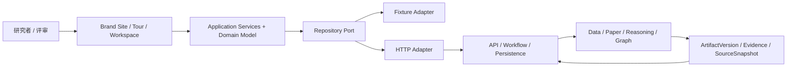

# Product Design

| 元数据         | 值                                                                                                                |
| -------------- | ----------------------------------------------------------------------------------------------------------------- |
| Status         | Accepted                                                                                                          |
| Authority      | 产品设计原则、体验域关系、交互模型与设计不变量                                                                    |
| Implementation | A-01 runtime、A-03 Port 绑定 UI、A-05 Paper Acquisition Workspace 与 X-01 真实集成 Current；A-02 视觉系统 Pending |

本文定义星文智析的设计判断标准，不重复产品主流程、页面规格、技术栈、领域枚举或验收清单。

- 产品范围与成功指标见 [PRD](PRD.md)。
- 视觉规则见 [Visual Language](docs/design/VISUAL_LANGUAGE.md)。
- 首页、Guided Tour 和工作台交互见 [Workspace UX](docs/design/WORKSPACE_UX.md)。
- 前端工程方案见 [Frontend Architecture](docs/architecture/FRONTEND_ARCHITECTURE.md)。

## 1. 设计命题

星文智析不是通用聊天 Agent，也不是装饰性天文数据大屏。产品围绕“从科学问题到可用数据与可核验证据”，把 AI 能力收束为可审查的科研产物、运行和版本。

产品需要同时建立两个识别面：

- **艺术化天文入口**：让用户快速理解主题、主案例和可信边界。
- **科研产物工作台**：以 Project、Run、Contract、Artifact、Version 和 Evidence 组织研究。

## 2. 设计原则

| 原则           | 判断标准                                                         |
| -------------- | ---------------------------------------------------------------- |
| 科研产物优先   | 中央内容以结构化产物为主，对话和日志不得占据主界面               |
| Evidence-first | 关键数据、结论、关系和图谱边可定位来源、证据和版本               |
| 自主可理解     | 无现场讲解时，用户仍能理解价值、流程和限制                       |
| 渐进复杂度     | 先说明问题与主动作，再揭示来源、版本和审查工具                   |
| 真实性分层     | Demo、Live、Cached 和 Revision 分别表达，不互相冒充              |
| 视觉服从阅读   | 强视觉集中在品牌入口天体；首页极简留白；高密度内容保持克制和可读 |
| 降级仍可用     | Canvas、字体或动效失败时，DOM 内容和主操作继续可用               |
| 当前与目标分明 | Current、Target、Pending 和 Archived 不得混写                    |

## 3. 体验域

| 体验域             | 核心职责                                            | 不负责                              |
| ------------------ | --------------------------------------------------- | ----------------------------------- |
| Brand Site         | 极简单英雄首页建立品牌识别与双入口（演示 / 工作台） | 产品说明书、项目管理、Live 模式开关 |
| Guided Tour        | 用确定性场景解释 Contract、Run、Artifact、Evidence  | 代替真实工作台或伪装 Live           |
| Research Workspace | 管理项目、运行、产物审查、反馈、分享和导出          | 以聊天历史或工具日志组织研究        |

三个体验域共享领域语言、设计 Token、证据规则和数据访问边界，但不共享不必要的页面状态。

## 4. 核心交互模型

```text
Research intent
-> editable ResearchContractDraft
-> immutable ResearchContract
-> Demo Replay or Live ResearchRun
-> versioned ResearchArtifacts
-> Evidence and SourceSnapshot inspection
-> Export / Share / Feedback
-> RevisionPlan and derived Run
```

交互要求：

- 用户确认 Contract 后才执行；
- 工作台中央最多三个受控面板；
- AI 响应优先产生结构化建议、计划或产物；
- Provenance Observatory 保持当前上下文并提供来源、证据和版本；
- Research Console 是命令与协作入口，不是永久聊天时间线；
- 原始执行日志只用于诊断。

## 5. 系统边界



边界规则：

- 体验组件只依赖稳定 Domain Model，不读取 Transport DTO 或直接调用外部来源。
- Fixture 与 HTTP 通过同一 Repository Port 返回同一领域形状。
- Workflow、权限、版本发布、缓存选择和分享冻结由服务端负责。
- Prompt 只由版本化 registry 管理；模型输出先通过 Schema 与 Evidence 校验。
- ArtifactVersion、Evidence、SourceSnapshot 和 ShareSnapshot 是复现边界。

跨模块职责见 [Module Boundaries](docs/architecture/MODULES.md)。

## 6. 设计不变量

- Project 表示持续研究上下文，Run 表示一次执行。
- Artifact 表示稳定身份，ArtifactVersion 表示不可变内容。
- Contract 固定研究输入和质量约束，不保存执行方式。
- 执行方式、产物来源和修订派生关系相互独立。
- 用户重试、修订或改变研究范围时创建派生 Run。
- 缓存只能引用真实历史 Run、ArtifactVersion 和 SourceSnapshot。
- Summary、Accepted Relation、ReasoningTrace 和 GraphEdge 按契约绑定 Evidence。
- ReasoningTrace 只记录可审查依据、条件和引用。
- WorkspaceSnapshot 是私有恢复状态；ShareSnapshot 是冻结的只读公开投影。

精确领域规则分别由 [Data Model](docs/architecture/DATA_MODEL.md)、[Workflow Design](docs/architecture/WORKFLOW_DESIGN.md) 和 [Data Versioning](docs/architecture/DATA_VERSIONING.md) 维护。

## 7. 可信与安全边界

- 前端不持有模型、论文源或天文数据源密钥。
- 私有 Project、Run 和 Artifact 必须由服务端会话所有权隔离。
- 用户输入与外部文本默认按纯文本处理。
- Seed、Fixture、缓存、模型推断和真实结果必须明确标注。
- 视觉效果不得承载唯一信息，也不得暗示不存在的科学精度。
- 未实现能力不得在产品或材料中写成已交付。

安全要求见 [Security](SECURITY.md)，HTTP 与授权语义见 [API Contract](docs/architecture/API_CONTRACT.md)。

## 8. 实施边界

设计实现必须由对应 Issue 驱动。A-01 只证明 Astro/React 运行时、路由和共享包边界；A-03 已以同一组件路径消费 Fixture / HTTP Repository Port，并通过真实 Browser/Compose 覆盖 Draft、Contract、Run/Event、Workspace 冲突与刷新恢复、匿名冻结 Share 和撤销。A-05 已在 `/workspace` 中央画布交付论文获取与候选审查面：连续分隔线面板、服务端稳定排名不重算、入选/排除原因与重复组/冲突展示、Fixture 4 候选只读审查，候选与 Evidence 接入既有 Observatory 与 Share 链路。A-02 视觉系统与 M2 科研能力仍按各自 Issue 和运行证据推进。
