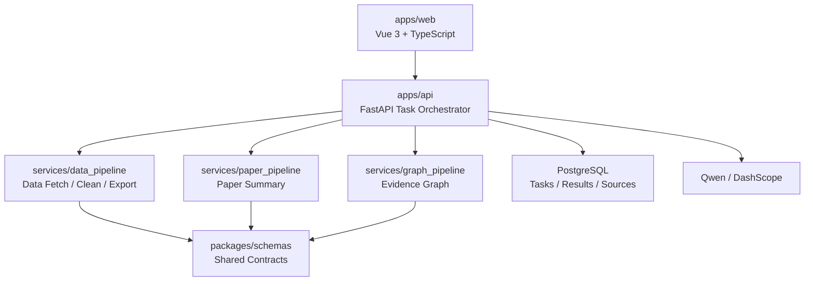

# DESIGN

## 1. 设计目标

系统设计服务三个目标：

| 目标 | 要求 |
| --- | --- |
| 科研可信 | 数据、文献、图谱均可溯源，缓存结果明确标记 |
| 演示稳定 | 主案例公网 Demo 可在外部服务失败时完整展示 |
| 协作清晰 | 前端、后端、数据、文献图谱模块通过固定契约协作 |

## 2. 总体架构



## 3. 模块边界

| 模块 | 负责 | 不负责 |
| --- | --- | --- |
| `apps/web` | 页面、状态展示、图谱交互、反馈提交 | 直接调用 Qwen、直接访问外部数据源 |
| `apps/api` | 任务编排、API、缓存、导出、鉴权预留 | 具体清洗规则和图谱算法细节 |
| `services/data_pipeline` | 数据源查询、字段映射、单位统一、溯源、质量评分 | 页面展示和用户交互 |
| `services/paper_pipeline` | 文献输入、结构化总结、事实校验提示 | 生成无法溯源的结论 |
| `services/graph_pipeline` | 图谱节点、边、证据链构建 | 只为视觉效果生成无证据边 |
| `packages/schemas` | 共享类型、枚举、JSON Schema | 业务流程实现 |

详细边界见 [docs/architecture/MODULES.md](docs/architecture/MODULES.md)。

## 4. 数据流

1. 前端提交 `goal` 和 `case_key`。
2. 后端创建 `ResearchTask`，状态为 `pending`。
3. Qwen 解析科研目标，生成结构化任务计划。
4. 数据 Pipeline 获取并清洗主案例数据，输出 `Dataset`、`FieldDictionary`、`SourceRecord`、`QualityScore`。
5. 文献 Pipeline 输出 `PaperSummary` 和引用证据。
6. 图谱 Pipeline 合并数据证据和文献证据，输出 `GraphNode`、`GraphEdge`、`Evidence`。
7. 后端聚合结果，前端按任务状态和缓存元信息展示。
8. 用户反馈进入 `UserFeedback`，触发字段、单位或来源的局部修正。

## 5. 任务状态机

| 状态 | 含义 | 下一步 |
| --- | --- | --- |
| `pending` | 任务已创建 | `planning` |
| `planning` | 正在解析目标和生成计划 | `fetching_data` / `failed` |
| `fetching_data` | 正在获取天文数据 | `cleaning_data` / `failed` |
| `cleaning_data` | 正在字段对齐、单位统一、质量评分 | `summarizing_papers` / `failed` |
| `summarizing_papers` | 正在生成文献结构化总结 | `building_graph` / `failed` |
| `building_graph` | 正在构建证据图谱 | `completed` / `failed` |
| `completed` | 任务完成 | `revising` |
| `revising` | 根据用户反馈局部修正 | `completed` / `failed` |
| `failed` | 任务失败 | 人工排查或缓存兜底 |

`using_cache` 不作为主任务状态。缓存命中通过响应 `meta.cached`、`ResearchTask.used_cache`、`SourceRecord.cached` 和页面提示表达，避免任务流和兜底策略混在一起。

M1 可先实现状态子集 `pending`、`planning`、`completed`、`failed`，细粒度步骤通过 `TaskStep` Mock 展示；M2 后再逐步接入完整状态流转。

## 6. 证据链原则

每个可展示结果必须满足至少一条证据链：

```text
展示字段/结论/图谱边 -> evidence_id -> source_id / paper_id -> url/query/retrieved_at
```

禁止将无法追踪的模型输出作为事实展示。模型输出只能作为候选结构，必须经过 schema 校验和来源绑定。

## 7. 缓存兜底

缓存分三类：

| 类型 | 用途 | 要求 |
| --- | --- | --- |
| 数据源缓存 | 外部天文数据源不可用时展示 | 记录原查询、获取时间、来源 URL |
| 模型结果缓存 | Qwen 调用失败时展示 | 记录 prompt 版本、模型名、生成时间 |
| 演示样例缓存 | 公网 Demo 稳定演示 | 必须来自真实运行，不允许手写假结果 |

缓存只能作为结果来源和展示元信息，不改变主状态机语义。缓存结果必须有 `Evidence(type=cache_record)` 或对应 `SourceRecord.cached=true`。

## 8. 安全约束

- API Key 只允许存在于后端环境变量或部署平台 Secrets。
- 前端不保存密钥、不拼接模型请求、不直连外部模型服务。
- 公网 Demo 限制主案例和调用频率。
- 日志不得输出完整密钥、原始用户敏感输入或过长模型响应。

## 9. 实现顺序

1. 先完成 `X-00`：冻结 MVP 字段清单、文献清单和 Graph 最小关系类型。
2. A/B 并行初始化前后端，C/D 提供最小真实依据，不等待完整数据链路。
3. B 先交付 `POST /api/v1/tasks`、`GET /api/v1/tasks/{task_id}` 和 Mock 聚合结果。
4. A 基于 Mock API 展示任务流、数据、文献和图谱页面。
5. 再接入数据 Pipeline、文献 Pipeline、图谱 Pipeline。
6. 最后做反馈修正、公网 Demo 和材料交接。
