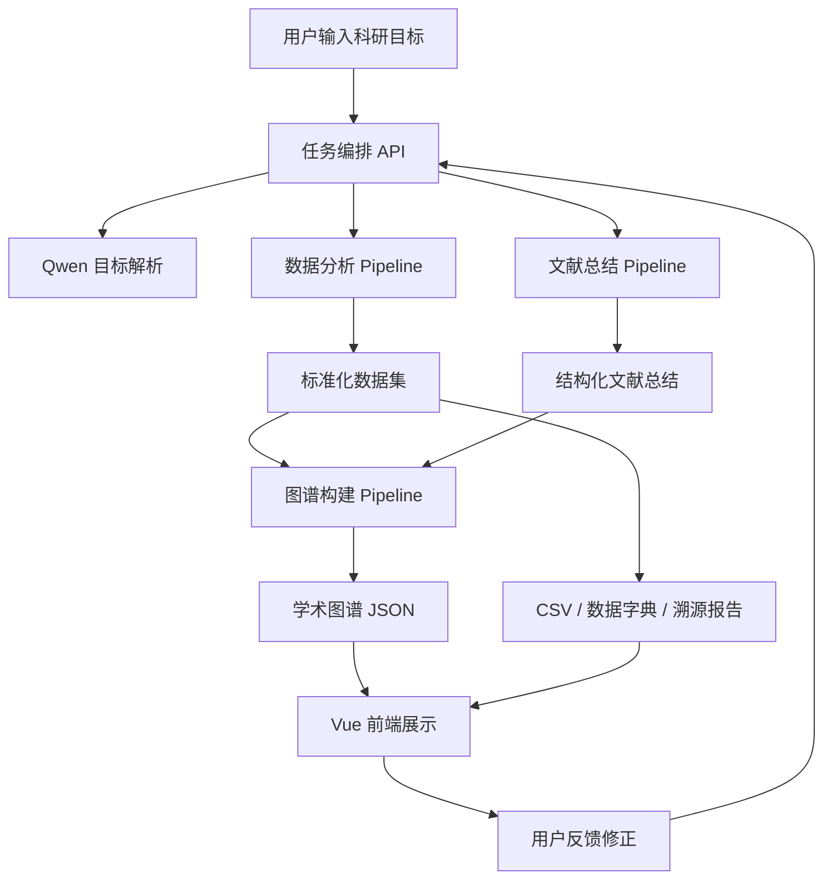

# DESIGN：系统设计说明

## 1. 设计目标

星文智析 AI 科研工具的设计目标是：将数据分析、文献总结和学术图谱整合成一条稳定、可信、可展示的科研工作流。

系统需要同时满足：

- 比赛展示效果：流程清晰、页面完整、图谱可视化有冲击力。
- 科研可信性：数据来源明确、处理过程可追踪、结果可导出。
- 工程稳定性：接口统一、任务状态明确、缓存兜底可靠。

## 2. 总体架构

## 3. 模块设计

### 3.1 前端模块

负责科研目标输入、任务状态展示、数据结果展示、文献总结展示、图谱可视化和用户反馈。

前端不直接调用 Qwen 或外部数据源，所有请求通过后端 API。

### 3.2 后端任务编排模块

负责创建任务、推进任务状态、调用 Qwen、协调数据分析、文献总结和图谱构建模块。

后端统一保存：

- 用户输入。
- 任务状态。
- 模型调用结果。
- 外部数据源响应。
- 清洗后的数据。
- 文献总结。
- 图谱数据。
- 用户反馈。

### 3.3 数据分析 Pipeline

负责围绕系外行星主案例获取数据，完成字段清洗、单位统一、来源标注和质量评分。

输出：

- 标准化数据集。
- 字段字典。
- 溯源报告。
- 数据质量评分。

### 3.4 文献总结 Pipeline

负责解析主案例相关文献或文献摘要，输出结构化总结。

输出字段：

- 研究背景。
- 研究目标。
- 方法。
- 数据集。
- 实验结论。
- 局限。
- 未来方向。

### 3.5 学术图谱 Pipeline

负责将论文、数据源、字段和证据连接成图谱数据。

图谱不是装饰图，节点必须能追溯到来源。

## 4. 数据流原则

1. 每个模块输入输出都使用 JSON。
2. 每个结果都记录来源。
3. 每次任务都记录执行时间、参数和版本。
4. 前端展示内容必须来自后端真实数据或明确标注的缓存数据。
5. 用户反馈只触发局部修正，避免重跑所有流程。

## 5. 任务状态

| 状态 | 说明 |
| --- | --- |
| pending | 任务已创建 |
| parsing | 正在解析科研目标 |
| fetching_data | 正在获取数据 |
| cleaning | 正在清洗和对齐字段 |
| summarizing_papers | 正在总结文献 |
| building_graph | 正在构建图谱 |
| completed | 任务完成 |
| failed | 任务失败 |

## 6. 关键设计约束

- API Key 只允许放在后端环境变量中。
- 公网 Demo 必须限流或限制主案例，避免模型 Key 被滥用。
- 缓存结果必须来自真实运行，不允许手写假结果冒充系统输出。
- 资料和视频中不得宣传未实现能力。

