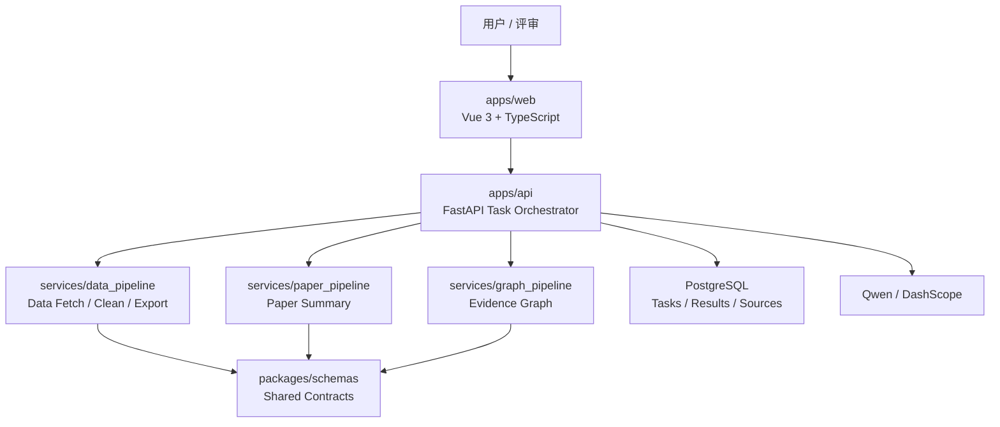

# DESIGN

本文件是系统架构与 UI 设计基线的唯一入口。接口细节见 `docs/architecture/API_CONTRACT.md`，数据结构见 `docs/architecture/DATA_MODEL.md`。

## 1. 设计目标

| 目标 | 要求 |
| --- | --- |
| 科研可信 | 数据、文献、图谱均可溯源，关键结果绑定 `Evidence` |
| 演示稳定 | 主案例公网 Demo 可在外部服务失败时使用真实运行缓存 |
| 协作清晰 | 前端、后端、数据、文献、图谱通过固定契约协作 |
| 视觉克制 | 米白纸感、低饱和灰、低饱和靛灰强调，避免炫技和包装感 |

MVP 固定主案例：**系外行星候选体与宿主恒星参数整合**。

## 2. 总体架构



## 3. 模块边界

| 模块 | 负责 | 不负责 |
| --- | --- | --- |
| `apps/web` | 页面、状态展示、图谱交互、反馈提交、UI token 落地 | 直接调用 Qwen、直接访问外部数据源 |
| `apps/api` | 任务编排、API、缓存、导出、统一错误、鉴权预留 | 具体清洗规则和图谱算法细节 |
| `services/data_pipeline` | 数据源查询、字段映射、单位统一、溯源、质量评分 | 页面展示和用户交互 |
| `services/paper_pipeline` | 文献输入、结构化总结、事实校验提示 | 生成无法溯源的结论 |
| `services/graph_pipeline` | 图谱节点、边、证据链构建 | 只为视觉效果生成无证据边 |
| `packages/schemas` | 共享类型、枚举、JSON Schema | 业务流程实现 |

详细边界见 `docs/architecture/MODULES.md`。

## 4. 数据流

```text
科研目标
-> 创建 ResearchTask
-> 解析任务计划
-> 获取并清洗主案例数据
-> 生成文献结构化总结
-> 构建证据图谱
-> 聚合展示与导出
-> 字段 / 单位 / 来源局部反馈修正
```

关键要求：

- 前端只提交 `goal`、`case_key` 和反馈，不直接调用模型或外部数据源。
- 后端统一聚合 `Dataset`、`PaperSummary`、`Graph`、`Evidence`。
- 所有展示结果至少满足 `result -> evidence -> source/paper -> url/query/retrieved_at`。
- 反馈修正只做字段单位、字段映射、来源标注三类，不做复杂自然语言重规划。

## 5. 任务状态机

| 状态 | 含义 | 下一步 |
| --- | --- | --- |
| `pending` | 任务已创建 | `planning` |
| `planning` | 正在解析目标和生成计划 | `fetching_data` / `failed` |
| `fetching_data` | 正在获取天文数据 | `cleaning_data` / `failed` |
| `cleaning_data` | 正在字段对齐、单位统一、质量评分 | `summarizing_papers` / `failed` |
| `summarizing_papers` | 正在生成文献结构化总结 | `building_graph` / `failed` |
| `building_graph` | 正在构建证据图谱 | `completed` / `failed` |
| `completed` | 任务完成 | `revising` |
| `revising` | 根据用户反馈局部修正 | `completed` / `failed` |
| `failed` | 任务失败 | 人工排查或缓存兜底 |

`using_cache` 不作为主任务状态。缓存命中通过 `meta.cached`、`ResearchTask.used_cache`、`SourceRecord.cached` 和页面提示表达。

M1 可先实现 `pending`、`planning`、`completed`、`failed` 子集；细粒度过程用 `TaskStep` 展示。

## 6. 证据与缓存原则

### 6.1 Evidence

每条关键展示结果必须能定位证据：

```text
展示字段 / 结论 / 图谱边
-> evidence_id
-> source_id / paper_id
-> locator / quote_or_value / source_snapshot
```

`Evidence` 必须支持：

- `locator`：字段名、表格列、段落、页码或 URL 片段。
- `quote_or_value`：可核验短文本、字段值或查询依据。
- `extraction_method`：规则映射、模型抽取、人工反馈或缓存记录。
- `source_snapshot`：查询时间、查询 hash、缓存版本或文献版本。

### 6.2 Cache

| 类型 | 用途 | 要求 |
| --- | --- | --- |
| 数据源缓存 | 外部天文数据源不可用时展示 | 记录原查询、来源 URL、获取时间 |
| 模型结果缓存 | Qwen 调用失败时展示 | 记录 prompt 版本、模型名、生成时间 |
| 演示样例缓存 | 公网 Demo 稳定演示 | 必须来自真实运行，不允许手写假结果 |

缓存只能描述结果来源，不改变主状态机语义。

## 7. UI 设计基线

前端视觉服务科研可信和演示清晰，不做强装饰。初始实现应优先沉淀 CSS 变量和 Tailwind 语义 utility，再开发业务页面。

### 7.1 视觉方向

| 维度 | 要求 |
| --- | --- |
| 基调 | 米白纸感、低饱和灰、低饱和靛灰强调 |
| 气质 | 安静、克制、科研工具感，避免营销大屏感 |
| 对比 | 中低对比，关键状态和证据入口保持可见 |
| 信息密度 | 数据页可读优先，图谱页关系清晰优先 |
| 装饰 | 不使用高饱和渐变、霓虹、重阴影、强拟物 |

### 7.2 颜色 Token

业务组件不得散落基础色值。初始推荐值如下，后续以前端 token 文件为准。

| Token | 建议值 | 用途 |
| --- | --- | --- |
| `--color-bg` | `#F7F3EA` | 全局米白背景 |
| `--color-surface` | `#FFFCF5` | 卡片、面板、Dialog、Popover |
| `--color-surface-muted` | `#EEE9DF` | 次级卡片、表头、弱选中 |
| `--color-surface-hover` | `#E8E3D8` | hover、浅强调背景 |
| `--color-text-primary` | `#2F3136` | 正文与标题 |
| `--color-text-secondary` | `#626873` | 辅助说明 |
| `--color-text-tertiary` | `#8A9099` | 占位、弱标签 |
| `--color-border` | `#D8D1C5` | 默认边界 |
| `--color-border-subtle` | `#E7E0D5` | 弱边界、分隔线 |
| `--color-brand` | `#4F5D7A` | 低饱和靛灰主强调 |
| `--color-brand-muted` | `#E2E6F0` | 品牌弱底色 |
| `--color-focus` | `#7482A4` | focus ring |
| `--color-success` | `#5F7F6C` | 成功、完成状态 |
| `--color-warning` | `#9A7B41` | 缓存、等待、风险提示 |
| `--color-error` | `#9B5B5B` | 失败、错误状态 |
| `--mask-overlay` | `color-mix(in srgb, #2F3136 28%, transparent)` | Dialog 遮罩 |

禁止：

- 业务组件直接写 `white`、`black`、高饱和蓝/绿/红。
- 使用 `rgba()` 乱配透明度；透明色统一用 `color-mix()` 或语义 token。
- 为单个页面另起一套颜色体系。

### 7.3 字体与排版

| 场景 | 规则 |
| --- | --- |
| UI 控件 | 系统 sans，保持清晰，不追求装饰字体 |
| 数据表格 | 数字和代码字段可使用 mono；中文说明使用 sans |
| 证据内容 | 短证据用 sans；代码、query、hash 用 mono |
| 标题 | 字重克制，避免超大标题和营销式口号 |

字号建议：

| Token | 用途 |
| --- | --- |
| `--font-size-xs` | badge、表格辅助信息 |
| `--font-size-sm` | 表单说明、弱提示 |
| `--font-size-md` | 默认正文、控件文字 |
| `--font-size-lg` | 卡片标题、页面小标题 |
| `--font-size-xl` | 页面主标题 |

### 7.4 间距、圆角、阴影

| Token | 建议值 | 用途 |
| --- | --- | --- |
| `--spacing-xs` | `4px` | 图标文字间距、badge 内距 |
| `--spacing-sm` | `8px` | 表单小 gap、紧凑列表 |
| `--spacing-md` | `12px` | 卡片内部常规间距 |
| `--spacing-lg` | `20px` | 页面区块间距 |
| `--spacing-xl` | `32px` | 页面主留白 |
| `--radius-sm` | `6px` | badge、内部小元素 |
| `--radius-md` | `10px` | Button、Input、Dropdown item |
| `--radius-lg` | `14px` | 卡片、表格容器 |
| `--radius-xl` | `20px` | 页面主面板、Dialog |
| `--shadow-soft` | 低透明柔和阴影 | 卡片和弱浮层 |
| `--shadow-popover` | 中低透明阴影 | Select、Dropdown、Tooltip |
| `--shadow-modal` | 稍强但不硬 | Dialog、Confirm |

禁止：

- 大面积重阴影、硬黑阴影。
- 强边框 + 强阴影同时出现。
- 页面级元素使用过大的圆角导致卡通感。

### 7.5 动效

允许动效只服务状态反馈和信息层级。

| Token | 建议 |
| --- | --- |
| `--motion-duration-fast` | `120ms` |
| `--motion-duration-base` | `180ms` |
| `--motion-duration-slow` | `260ms` |
| `--motion-ease-standard` | `cubic-bezier(0.2, 0, 0, 1)` |

允许属性：`opacity`、`transform`、`color`、`background-color`、`border-color`、`box-shadow`。

禁止：

- `transition-all`。
- width、height、padding、margin、max-height 等 layout 属性动画。
- 弹簧、强缩放、无依据抖动、过度粒子效果。
- 因 loading 导致按钮宽度、表格行高或页面布局抽搐。

### 7.6 基础组件

| 组件 | 基线 |
| --- | --- |
| Button | 高度统一，低饱和强调；危险操作只用低饱和错误色 |
| Input / Textarea | 米白表面、弱边界、清晰 focus；不使用暗色输入框 |
| Select / Dropdown / Tooltip | 低浮层、弱边界、柔和阴影、层级一致 |
| Card | 默认弱边界或轻阴影，不做强玻璃态 |
| Badge | 胶囊形，状态色低饱和，文字优先可读 |
| Table | 表头弱底色，行 hover 低对比，数值对齐清晰 |
| Dialog | 米白表面、克制遮罩、明确标题和操作区 |
| EmptyState | 安静说明，不默认堆操作按钮 |

### 7.7 业务页面规范

| 页面 | 关键要求 |
| --- | --- |
| 首页 | 明确主案例和工作流，不宣传任意科研问题 |
| 任务页 | 展示状态、步骤、失败原因、缓存提示 |
| 数据页 | 表格、字段字典、来源、质量评分同屏可理解 |
| 文献页 | 结构化总结优先，结论必须能打开证据 |
| 图谱页 | 小而硬；节点少但边有证据，不追求大图装饰 |
| 证据面板 | 展示来源、locator、quote/value、snapshot、confidence |
| 反馈入口 | 只支持字段单位、字段映射、来源标注三类 |

### 7.8 图谱视觉

- 节点类型至少区分：research_goal、dataset、field、source、paper、finding、evidence。
- 边类型优先：`provides_field`、`supports_finding`、`derived_from`。
- 边必须绑定 `evidence_ids`；无证据边不得作为最终图谱展示。
- 图谱默认控制规模，避免满屏节点影响可信度。
- 点击节点或边时，右侧或浮层展示证据详情。

### 7.9 可访问性与状态

- 所有图标按钮必须有可读标签。
- 键盘可访问：Tab、Enter、Escape 不破坏主要流程。
- 加载、成功、失败、空状态必须具备，不用空白页面代替。
- 错误信息要能指导下一步，例如重试、使用缓存、检查输入或稍后再试。

## 8. 安全约束

- API Key 只允许存在于后端环境变量或部署平台 Secrets。
- 前端不保存密钥、不拼接模型请求、不直连外部模型服务。
- 公网 Demo 限制主案例和调用频率。
- 日志不得输出完整密钥、原始用户敏感输入或过长模型响应。

## 9. 实现顺序

1. 完成 `X-00`：冻结 MVP 字段清单、文献清单和 Graph 最小关系类型。
2. A/B 并行初始化前后端，C/D 提供最小真实依据。
3. B 交付 `/api/v1/health`、`POST /api/v1/tasks`、`GET /api/v1/tasks/{task_id}` 和 Mock 聚合结果。
4. A 基于 Mock API 展示任务流、数据、文献和图谱页面，并落地 UI token。
5. 接入数据 Pipeline、文献 Pipeline、图谱 Pipeline。
6. 完成反馈修正、公网 Demo 和材料交接。