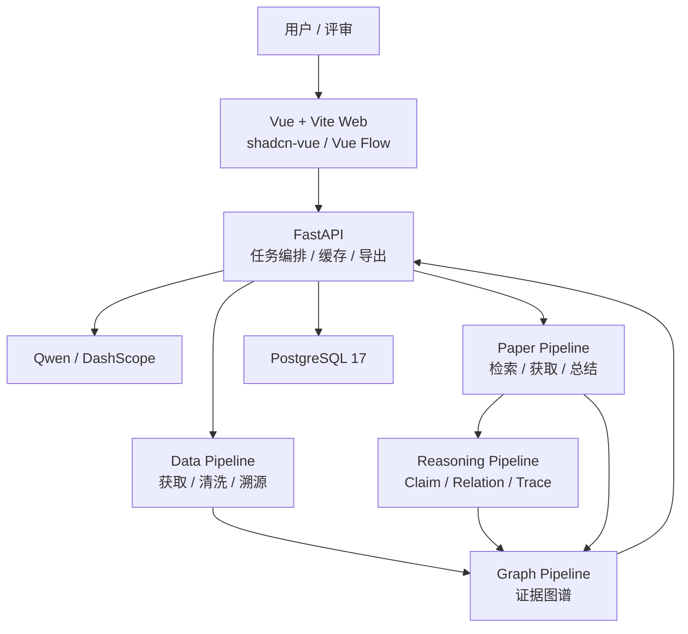

<div align="center">

# 星文智析 AI 科研工具

_面向天文科研场景的数据分析、文献获取、跨文献推理与证据图谱工作流_

      [](LICENSE)

</div>

---

> **当前实现基线：** Vue 3 `apps/web` 骨架 + FastAPI `/api/v1` + Docker Compose。
>
> **已接受的目标架构：** Astro 品牌站 + React Research Workspace Monorepo + `/api/v2` Project / Run / Artifact / Version 契约。
> **实施状态：** Pending。本分支的 RFC 不表示迁移已完成，当前启动命令保持不变。

## 项目定位

星文智析围绕固定主案例 **系外行星候选体与宿主恒星参数整合**，提供一条可复现、可溯源、可展示的科研数据工作流：

```text
科研目标 -> 数据获取 -> 字段清洗 -> 论文获取 -> 文献理解 -> 跨文献推理 -> 证据图谱 -> 结果导出 -> 反馈修正
```

项目聚焦挑战杯“基于国产开源大模型的 AI Scientist 研发与应用”赛题中“科学数据查找、解析与整合”方向。MVP 必须实现主案例内的自动论文获取和跨文献逻辑推理，但不承诺任意天文方向、任意 PDF 全文高精度解析、任意图表全自动处理或无边界科学发现。

## MVP 能力

| 能力 | 交付物 | 验收重点 |
| --- | --- | --- |
| 自动化数据分析 | 标准化系外行星与宿主恒星数据集 | 字段对齐、单位统一、来源标注、质量评分 |
| 自动论文获取 | 主案例相关论文候选集与获取记录 | 检索参数、来源、去重、相关性排序、缓存标注 |
| 智能文献总结 | 自动获取论文的结构化综述 | 目标、方法、数据、结论、局限、引用证据可追踪 |
| 跨文献逻辑推理 | Claim、Relation、ReasoningTrace | 支持、补充、派生、限制或矛盾关系绑定证据 |
| 学术图谱可视化 | 论文-数据源-字段-发现-证据关系图谱 | 节点可点击，边绑定 `evidence_ids`，推理链可查看 |
| 反馈修正 | 字段、单位、来源、文献关系问题局部修正 | 保留修正记录，不做全流程无意义重跑 |

## 当前实现基线

本项目采用 **Web-first、Docker-first、Contract-first、Evidence-first** 的开发方式。当前 Phase 0 基线用于验证本地启动、v1 Contract 和工作流骨架，不代表目标产品体验已经完成。

| 层级 | 技术栈 |
| --- | --- |
| 前端运行时 | Node.js 24 LTS |
| 前端包管理 | pnpm 10.x，禁止混用 npm/yarn/bun 安装依赖 |
| 前端框架 | Vue 3 + TypeScript + Vite |
| UI 与样式 | shadcn-vue + reka-ui + Tailwind CSS 4 + CSS Variables |
| 前端状态/路由 | Pinia + Vue Router |
| 图谱可视化 | Vue Flow；统计图表按需使用 ECharts |
| 后端 | FastAPI + Python 3.13 + Pydantic v2 |
| Python 依赖 | uv + `pyproject.toml` + `uv.lock` |
| 数据库 | PostgreSQL 17-alpine |
| 数据访问 | SQLAlchemy 2 + Alembic |
| 外部请求 | httpx |
| 本地环境 | Docker Compose：`web`、`api`、`postgres` |
| 暂不进入 M1 | Redis、Celery、MinIO、Nginx、RabbitMQ |

## 目标前端架构（待实施）

| 层级 | 已接受目标 |
| --- | --- |
| 品牌站 | `apps/site`：Astro 静态输出、四幕式首页、SEO、React visual island |
| 科研工作台 | `apps/workspace`：React + TypeScript、Guided Tour、Artifact-first Workspace |
| 共享包 | design-tokens、ui、visual-engine、domain、contracts、data-access、workspace-core、testing |
| 数据访问 | Repository Port + Fixture / HTTP Adapter，共享同一 Domain Model |
| 图谱与实时视觉 | `@xyflow/react`；Three.js + React Three Fiber + GLSL |
| 未来桌面 | Tauri 仅通过 Platform Adapter 预留，本轮不实现 |

目标详情见 [Frontend Architecture](docs/architecture/FRONTEND_ARCHITECTURE.md)。迁移完成前不在 Vue 与 React 中重复实现同一业务功能。

## 当前技术架构



## 仓库结构

```text
apps/web                  Vue 3 + TypeScript + Vite 前端
apps/api                  FastAPI 后端
services/data_pipeline    数据获取、清洗、字段对齐、导出
services/paper_pipeline   论文检索、获取、结构化总结
services/graph_pipeline   Claim、Relation、图谱节点、边、证据链构建
packages/schemas          前后端共享 Schema
samples                   可复现输入输出样例
scripts                   开发、验证、导出脚本
docs                      架构、产品、质量、交接文档
```

目标迁移将新增 `apps/site`、`apps/workspace` 和共享前端 packages；这些目录当前不存在，不能按目标命令启动。`apps/web` 在目标验收完成前仍是当前前端基线。

## 快速开始

本地开发以 Docker Compose 为主，固定入口为：

```powershell
Copy-Item .env.example .env
docker compose up --build
```

默认地址：

| 服务 | 地址 |
| --- | --- |
| 前端 | `http://127.0.0.1:5173` |
| 后端 API | `http://127.0.0.1:8000` |
| API 文档 | `http://127.0.0.1:8000/api/v1/docs` |
| PostgreSQL | `127.0.0.1:5432` |

前端本地命令只允许使用 pnpm：

```powershell
cd apps/web
pnpm install --frozen-lockfile
pnpm dev
```

后端本地命令只允许使用 uv：

```powershell
cd apps/api
uv sync
uv run uvicorn app.main:app --reload
```

环境变量模板见 [.env.example](.env.example)。真实密钥只允许写入本地 `.env` 或部署平台 Secrets。

## 文档入口

### 必读

| 文档 | 用途 |
| --- | --- |
| [PRD.md](PRD.md) | MVP 范围、用户、成功标准 |
| [DESIGN.md](DESIGN.md) | 系统架构、状态机、证据链、缓存、UI 设计基线 |
| [docs/design/VISUAL_LANGUAGE.md](docs/design/VISUAL_LANGUAGE.md) | 品牌、Token、字体、ASCII / Dither 与动效规范 |
| [docs/design/WORKSPACE_UX.md](docs/design/WORKSPACE_UX.md) | 首页四幕、Guided Tour 与 Research Workspace 交互 |
| [docs/architecture/FRONTEND_ARCHITECTURE.md](docs/architecture/FRONTEND_ARCHITECTURE.md) | Astro / React Monorepo、包边界、迁移与质量门禁 |
| [AGENTS.md](AGENTS.md) | Agent 操作协议、协作红线、验证要求 |
| [CONTRIBUTING.md](CONTRIBUTING.md) | Git 分支、Issue、PR、合并流程 |
| [docs/setup.md](docs/setup.md) | 本地启动、Docker Compose、环境变量 |

### 完整索引

架构、产品、质量、部署安全、参考资料等文档分类见 [docs/README.md](docs/README.md)。

### 推荐阅读顺序

新成员依次读：README → PRD → DESIGN → AGENTS → CONTRIBUTING → docs/setup.md → 当前 Issue 对应的契约文档。

## 开发红线

1. 主案例优先，不扩大到泛 AI Scientist。
2. 自动论文获取和跨文献推理必须可运行、可缓存兜底、可证据追踪。
3. 关键输出必须绑定来源、时间、参数和 `Evidence`。
4. 模型输出必须结构化校验，不能直接作为事实。
5. 前端不直连 Qwen、论文源或天文数据源。
6. pnpm / uv / Docker Compose 是团队统一开发基线，不混用包管理器或本机裸环境口径。
7. Fixture、Live、Cached、Revised 必须准确标识；手写 Fixture 不能冒充真实运行缓存。
8. 材料交接不得宣传未实现能力。

## License

This project is licensed under the MIT License. See [LICENSE](LICENSE) for details.
