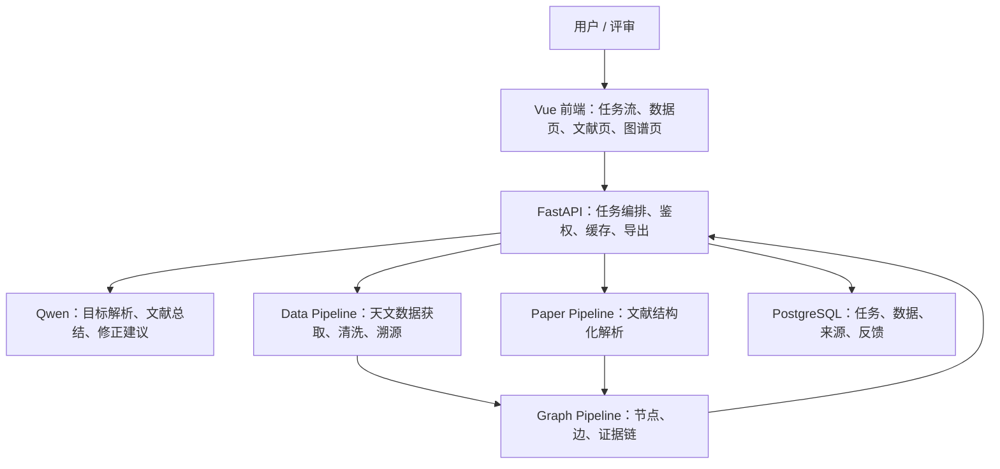

<div align="center">

# 星文智析 AI 科研工具

_面向天文科研场景的 AI 数据分析、文献总结与证据图谱工作流_

    [](LICENSE)

</div>

---

## 项目定位

星文智析是面向天文科研场景的一体化 AI 科研工具，围绕“科研目标 -> 数据获取 -> 字段清洗 -> 文献理解 -> 证据图谱 -> 结果导出 -> 反馈修正”的链路，完成可复现、可溯源、可展示的科研数据工作流。

MVP 固定主案例：**系外行星候选体与宿主恒星参数整合**。

项目服务挑战杯“揭榜挂帅”赛题“基于国产开源大模型的 AI Scientist 研发与应用”，聚焦赛道二方向一 A：科学数据查找、解析与整合。

## 核心能力

| 能力 | MVP 交付 | 关键要求 |
| --- | --- | --- |
| 自动化数据分析 | 系外行星与宿主恒星标准化数据集 | 字段对齐、单位统一、来源标注、质量评分 |
| 智能文献总结 | 主案例文献结构化综述 | 研究目标、方法、数据、结论、局限可追踪 |
| 学术图谱可视化 | 论文-数据源-字段-证据关系图谱 | 节点可点击，边有证据，不做装饰图 |
| 反馈修正 | 字段、单位、来源问题局部修正 | 保留修正记录，避免全流程无意义重跑 |

## 系统架构



## 仓库结构

```text
.
├── README.md                  # 项目入口与文档地图
├── PRD.md                     # MVP 产品范围与验收口径
├── DESIGN.md                  # 系统架构、模块边界、数据流
├── AGENTS.md                  # 开发协作规范与岗位边界
├── CONTRIBUTING.md            # 分支、提交、PR 与联调规则
├── DEPLOYMENT.md              # 公网 Demo 部署策略
├── SECURITY.md                # 密钥、模型调用与公网 Demo 安全规则
├── apps/
│   ├── web/                   # Vue 前端，M1 初始化
│   └── api/                   # FastAPI 后端，M1 初始化
├── services/
│   ├── data_pipeline/         # 数据获取、清洗、字段对齐、导出
│   ├── paper_pipeline/        # 文献解析与结构化总结
│   └── graph_pipeline/        # 图谱节点、边、证据链构建
├── packages/
│   └── schemas/               # 前后端共享 schema，M1 初始化
├── docs/
│   ├── README.md              # 文档索引
│   ├── architecture/          # API、数据模型、模块边界、架构决策
│   ├── product/               # 项目章程、路线图、任务池、验收标准
│   ├── quality/               # 审查清单与风险台账
│   └── handoff/               # 给总负责人/材料组的真实素材交接
├── samples/                   # 可复现输入输出样例
└── scripts/                   # 开发、验证、导出脚本
```

## 快速开始

当前仓库处于项目基础搭建阶段。M1 完成后，本地启动入口固定为：

| 服务 | 命令 | 地址 |
| --- | --- | --- |
| 前端 | `cd apps/web && npm run dev` | `http://127.0.0.1:5173` |
| 后端 | `cd apps/api && uvicorn app.main:app --reload` | `http://127.0.0.1:8000` |
| API 文档 | 后端启动后访问 | `http://127.0.0.1:8000/docs` |

环境变量模板见 [.env.example](.env.example)。真实密钥只允许写入本地 `.env` 或部署平台 Secrets。

## 文档地图

| 目标 | 文档 |
| --- | --- |
| 了解项目范围 | [PRD.md](PRD.md) |
| 了解架构和模块边界 | [DESIGN.md](DESIGN.md), [docs/architecture/MODULES.md](docs/architecture/MODULES.md) |
| 对齐 API 与数据结构 | [docs/architecture/API_CONTRACT.md](docs/architecture/API_CONTRACT.md), [docs/architecture/DATA_MODEL.md](docs/architecture/DATA_MODEL.md) |
| 安排开发任务 | [docs/product/ROADMAP.md](docs/product/ROADMAP.md), [docs/product/BACKLOG.md](docs/product/BACKLOG.md) |
| 判断是否完成 | [docs/product/ACCEPTANCE.md](docs/product/ACCEPTANCE.md), [docs/quality/REVIEW_CHECKLIST.md](docs/quality/REVIEW_CHECKLIST.md) |
| 协作规范 | [AGENTS.md](AGENTS.md), [CONTRIBUTING.md](CONTRIBUTING.md) |
| 部署和安全 | [DEPLOYMENT.md](DEPLOYMENT.md), [SECURITY.md](SECURITY.md) |
| 材料交接 | [docs/handoff/README.md](docs/handoff/README.md) |

## 开发原则

1. 主案例优先，所有功能先服务系外行星候选体与宿主恒星参数整合。
2. 三大功能串成一条科研工作流，不做互不相干的页面堆叠。
3. 所有关键输出必须带来源、时间、参数和处理记录。
4. 模型输出必须结构化校验，不能直接把自然语言结果当作事实。
5. 公网 Demo 必须有真实运行缓存兜底，不用手写假数据冒充结果。

## License

This project is licensed under the MIT License. See [LICENSE](LICENSE) for details.
