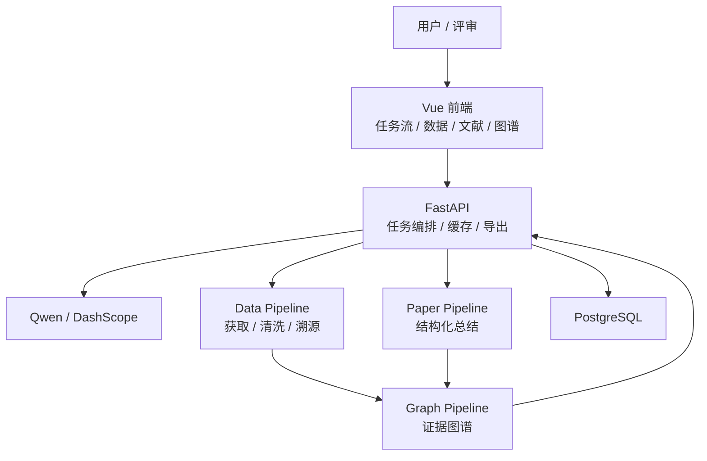

<div align="center">

# 星文智析 AI 科研工具

_面向天文科研场景的数据分析、文献总结与证据图谱工作流_

    [](LICENSE)

</div>

---

## 项目定位

星文智析围绕固定主案例 **系外行星候选体与宿主恒星参数整合**，提供一条可复现、可溯源、可展示的科研数据工作流：

```text
科研目标 -> 数据获取 -> 字段清洗 -> 文献理解 -> 证据图谱 -> 结果导出 -> 反馈修正
```

项目聚焦挑战杯“基于国产开源大模型的 AI Scientist 研发与应用”赛题中“科学数据查找、解析与整合”方向。MVP 不承诺任意天文方向、任意 PDF 或任意图表全自动处理。

## MVP 能力

| 能力 | 交付物 | 验收重点 |
| --- | --- | --- |
| 自动化数据分析 | 标准化系外行星与宿主恒星数据集 | 字段对齐、单位统一、来源标注、质量评分 |
| 智能文献总结 | 主案例文献结构化综述 | 目标、方法、数据、结论、局限均可追踪 |
| 学术图谱可视化 | 论文-数据源-字段-证据关系图谱 | 节点可点击，边绑定 `evidence_ids` |
| 反馈修正 | 字段、单位、来源问题局部修正 | 保留修正记录，不做全流程无意义重跑 |

## 技术架构



## 仓库结构

```text
apps/web                  Vue 前端
apps/api                  FastAPI 后端
services/data_pipeline    数据获取、清洗、字段对齐、导出
services/paper_pipeline   文献解析与结构化总结
services/graph_pipeline   图谱节点、边、证据链构建
packages/schemas          前后端共享 Schema
samples                   可复现输入输出样例
scripts                   开发、验证、导出脚本
docs                      架构、产品、质量、交接文档
```

## 快速开始

当前仓库处于 M1 初始化阶段。完成骨架后，本地入口固定为：

| 服务 | 命令 | 地址 |
| --- | --- | --- |
| 前端 | `cd apps/web && npm run dev` | `http://127.0.0.1:5173` |
| 后端 | `cd apps/api && uvicorn app.main:app --reload` | `http://127.0.0.1:8000` |
| API 文档 | 后端启动后访问 | `http://127.0.0.1:8000/docs` |

环境变量模板见 [.env.example](.env.example)。真实密钥只允许写入本地 `.env` 或部署平台 Secrets。

## 文档入口

| 目标 | 文档 |
| --- | --- |
| 项目范围 | [PRD.md](PRD.md) |
| 架构与 UI 基线 | [DESIGN.md](DESIGN.md) |
| Agent 操作协议 | [AGENTS.md](AGENTS.md) |
| Git 与 PR 流程 | [CONTRIBUTING.md](CONTRIBUTING.md) |
| 完整文档索引 | [docs/README.md](docs/README.md) |
| 本地启动 | [docs/setup.md](docs/setup.md) |

## 开发红线

1. 主案例优先，不扩大到泛 AI Scientist。
2. 关键输出必须绑定来源、时间、参数和 `Evidence`。
3. 模型输出必须结构化校验，不能直接作为事实。
4. 缓存只能作为结果来源元信息，不能冒充实时结果。
5. 材料交接不得宣传未实现能力。

## License

This project is licensed under the MIT License. See [LICENSE](LICENSE) for details.
