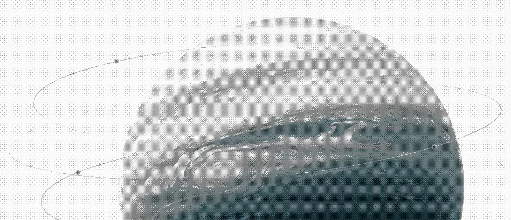
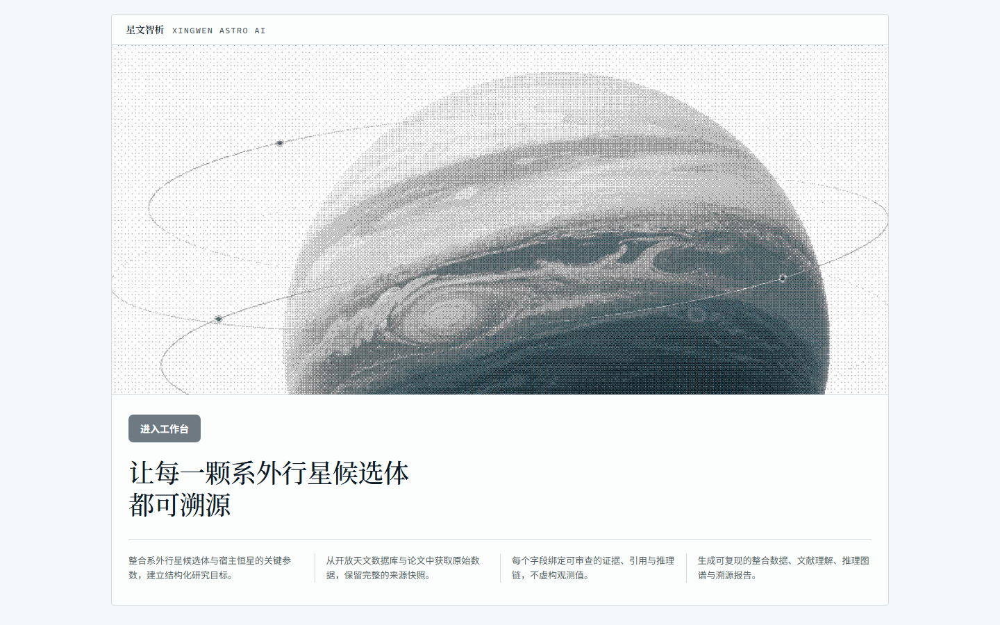
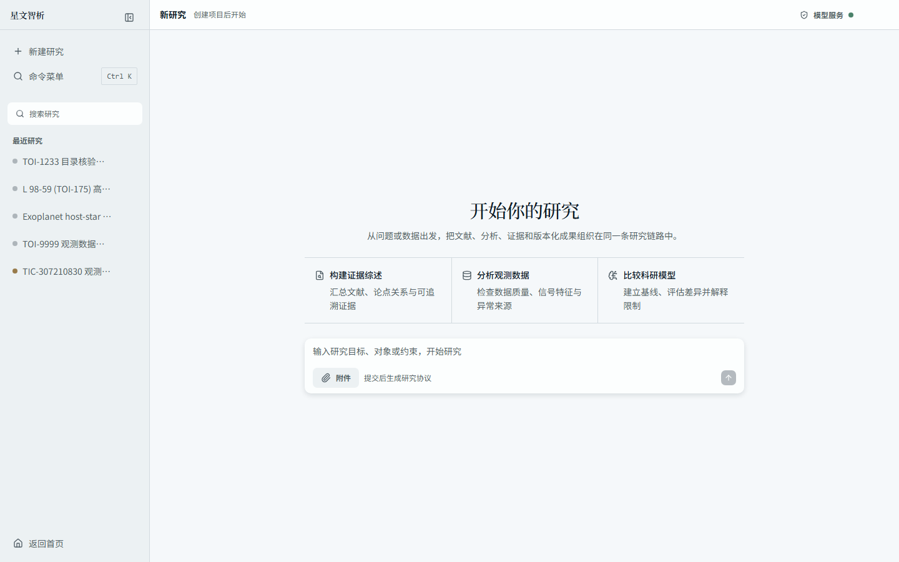
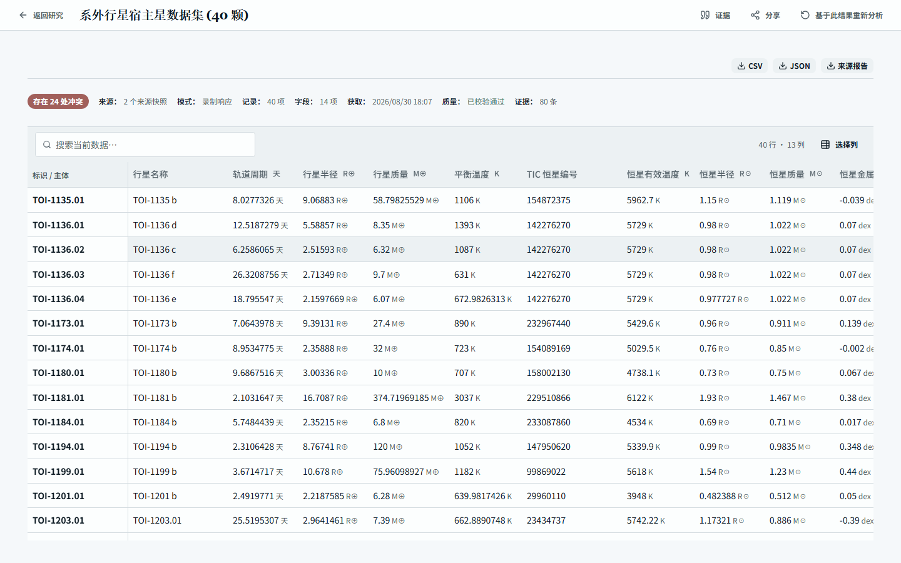
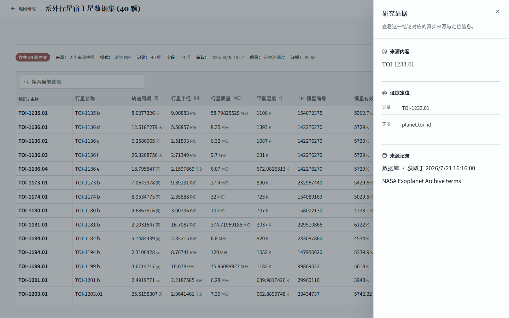
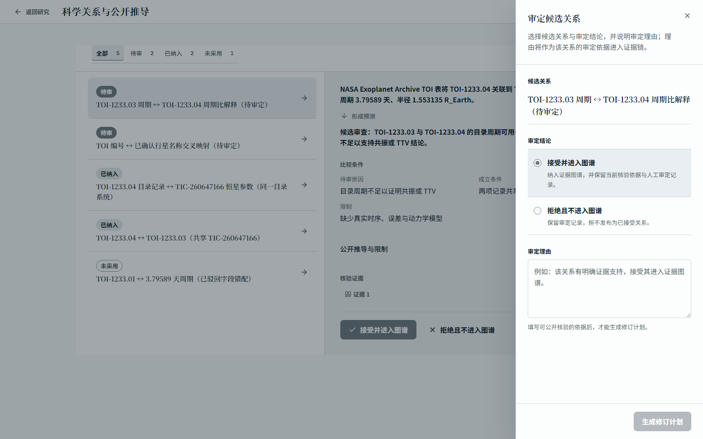
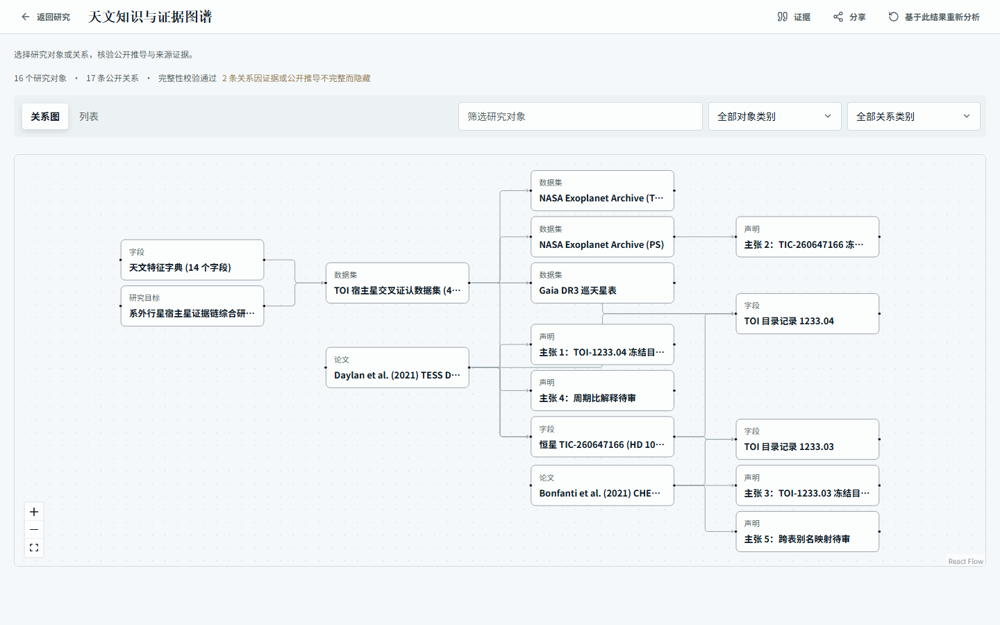
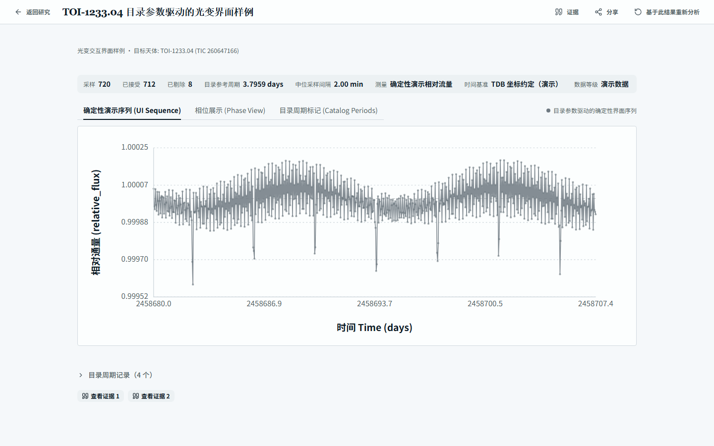
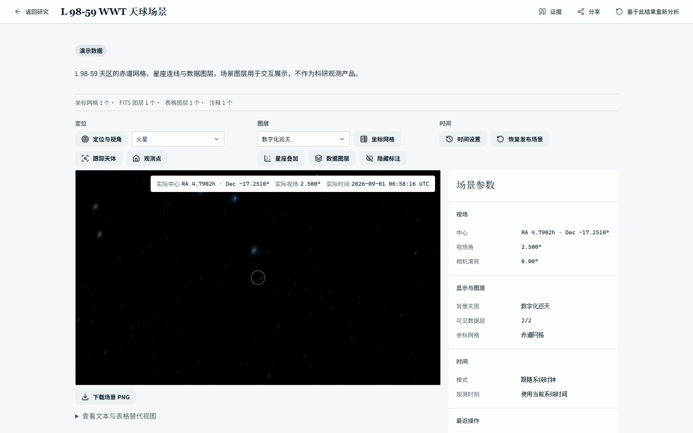

<div align="center">

# 星文智析

**面向天文科研的数据整合、文献理解与证据驱动研究工作台。**


![Playwright](https://img.shields.io/badge/Playwright-E2E-6E9B7A?style=flat&labelColor=555555&logo=data%3Aimage%2Fsvg%2Bxml%3Bbase64%2CPHN2ZyB4bWxucz0iaHR0cDovL3d3dy53My5vcmcvMjAwMC9zdmciIHZpZXdCb3g9IjAgMCAyNCAyNCI%2BPHBhdGggZmlsbD0id2hpdGUiIGQ9Ik0yMy45OTYgNy40NjJjLS4wNTYuODM3LS4yNTcgMi4xMzUtLjcxNiAzLjg1LS45OTUgMy43MTUtNC4yNyAxMC44NzQtMTAuNDIgOS4yMjctNi4xNS0xLjY1LTUuNDA3LTkuNDg3LTQuNDEyLTEzLjIwMS40Ni0xLjcxNi45MzQtMi45NCAxLjMwNS0zLjY5NC40Mi0uODUzLjg0Ni0uMjg5IDEuODE1LjUyMy42ODQuNTczIDIuNDEgMS43OTEgNS4wMTEgMi40ODggMi42MDEuNjk3IDQuNzA2LjUwNiA1LjU4My4zNTIgMS4yNDUtLjIxOSAxLjg5Ny0uNDk0IDEuODM0LjQ1NVptLTkuODA3IDMuODYzcy0uMTI3LTEuODE5LTEuNzczLTIuMjg2Yy0xLjY0NC0uNDY3LTIuNjEzIDEuMDQtMi42MTMgMS4wNFptNC4wNTggNC41MzktNy43NjktMi4xNzJzLjQ0NiAyLjMwNiAzLjMzOCAzLjE1M2MyLjg2Mi44MzYgNC40My0uOTggNC40My0uOTgxWm0yLjcwMS0yLjUxcy0uMTMtMS44MTgtMS43NzMtMi4yODZjLTEuNjQ0LS40NjktMi42MTIgMS4wMzgtMi42MTIgMS4wMzhaTTguNTcgMTguMjNjLTQuNzQ5IDEuMjc5LTcuMjYxLTQuMjI0LTguMDIxLTcuMDhDLjE5NyA5LjgzMS4wNDQgOC44MzIuMDAzIDguMTg4Yy0uMDQ3LS43My40NTUtLjUyIDEuNDE1LS4zNTQuNjc3LjExOCAyLjMuMjYxIDQuMzA4LS4yOGExMS4yOCAxMS4yOCAwIDAgMCAyLjQxLS45NTZjLS4wNTguMTk3LS4xMTQuNC0uMTcuNjEtLjQzMyAxLjYxOC0uODI3IDQuMDU1LS42MzIgNi40MjYtMS45NzYuNzMyLTIuMjY3IDIuNDIzLTIuMjY3IDIuNDIzbDIuNTI0LS43MTVjLjIyNyAxLjAwMi42IDEuOTg3IDEuMTUgMi44MzhhNS45MTQgNS45MTQgMCAwIDEtLjE3MS4wNDlabS00LjE4OC02LjI5OGMxLjI2NS0uMzMzIDEuMzYzLTEuNjMxIDEuMzYzLTEuNjMxbC0zLjM3NC44ODhzLjc0NSAxLjA3NiAyLjAxLjc0M1oiLz48L3N2Zz4%3D)



[核心能力](#核心能力) · [研究链路](#研究链路) · [可复核证据](#可复核证据) · [架构](#架构) · [技术栈](#技术栈) · [快速开始](#快速开始) · [仓库结构](#仓库结构) · [文档](#文档)

</div>

## 项目概览

星文智析围绕固定主案例 **系外行星候选体与宿主恒星参数整合**，把研究意图转化为可执行研究协议，经真实数据源、文献解析与 Qwen 推理，产出版本化科研产物与 Evidence 闭环。

<table>
<tr>
<td></td>
<td></td>
</tr>
<tr>
<td></td>
<td></td>
</tr>
<tr>
<td></td>
<td></td>
</tr>
<tr>
<td></td>
<td></td>
</tr>
</table>

## 核心能力

- **科学数据整合**：系外行星与宿主恒星多源查询、交叉比对与参数融合。
- **论文全文解析**：PDF 原生文本优先， bounded 可视解析补齐版式与表格证据。
- **证据驱动推理**：Paper Summary → Literature Claims → Literature Relations → Evidence Graph。
- **Evidence Graph**：主张、关系与来源快照的可视化追溯。
- **可修订 Research Workspace**：反馈经确认的 RevisionPlan 派生新 Run 与新 ArtifactVersion，原版本保持不变。
- **科学分析**：Analysis Report、光变曲线、光谱、周期图、模型评估与 ONNX 模型产物，Observation 支持 FITS 与 WWT 天球场景。

## 研究链路

```text
Research Intent → Contract → Data & Literature → Analysis
→ Artifact → Evidence → Revision / Export / Share
```

评审者从 Brand Site 或 Research Workspace 进入，沿同一产品路径检查：确认 Research Contract，观察 ResearchRun 与 Activity，打开 Dataset、Field Dictionary、Source Collection、Paper Collection、Paper Summary、Literature Claims、Literature Relations 与 Evidence Graph，从 Evidence Inspector 核对 SourceSnapshot 定位，对固定版本提交反馈并执行 Revision Run，对比 Scientific Diff 后导出或创建只读 Share。Public Share 冻结精确 ArtifactVersion。

## 可复核证据

每个结论沿 `ArtifactVersion → Evidence → SourceSnapshot` 追溯，附 `ProducerExecution` 记录实际模型调用。ArtifactVersion 不可变，修订只产生新版本。科学 Evidence 在 full-content 读取下保留完整 upstream 引用。

真实性分层：`Fixture`（仓库固定测试输入）、`Recorded`（真实外部响应录制）、`Benchmark`（冻结评测语料）、`Live`（当前运行真实外部来源）、`Cached`（历史 Live 产物复用）、`Revision`（反馈派生的新 Run / ArtifactVersion）、`Real Model Execution`（真实 Qwen 调用对应的 ProducerExecution）。

主案例 Live 交付证据见 [tests/evidence](tests/evidence)：Research Contract、数据源采集、文档与文献证据、Graph、人工裁决修订、Data Profile 分析、Qwen 调用证明、浏览器截图、重启恢复与失败样例。

## 架构

```text
Workspace (Astro Brand Site + React Research Workspace)
    ↓
FastAPI
    ↓
ResearchRun / Scientific Runtime (Qwen via DashScope, PaddleOCR-VL visual parsing)
    ↓
PostgreSQL
    ↓
ArtifactVersion / Evidence / SourceSnapshot (+ ProducerExecution)
```

契约与模型见 [API Contract](docs/architecture/API_CONTRACT.md) 与 [Data Model](docs/architecture/DATA_MODEL.md)。

## 技术栈

| 层级 | 技术 | 职责 |
| --- | --- | --- |
| Brand Site | Astro 7、React 19、TypeScript | 营销首页与产品入口 |
| Research Workspace | React 19、Vite 8、Tailwind 4、TanStack Query / Router、zustand、xyflow、vega、WWT | 研究交互、证据图谱、科学可视化 |
| 后端 | FastAPI、Python 3.13、SQLAlchemy、Pydantic | 研究运行时、科学管线、API 契约 |
| 数据 | PostgreSQL 17 | ResearchRun、Artifact、Evidence 权威存储 |
| 模型 | Qwen（Alibaba Cloud Model Studio / DashScope OpenAI 兼容接口） | 科学推理与文献推理执行 |
| 文档解析 | 原生文本优先 ＋ PaddleOCR-VL bounded 可视解析 | PDF 全文与版式证据 |
| 验证 | Playwright、pytest、vitest | 浏览器、后端与前端验证 |

## 快速开始

```powershell
Copy-Item .env.example .env
docker compose up --build --wait
```

| 服务 | 本地地址 |
| --- | --- |
| Brand Site | `http://127.0.0.1:4321` |
| Research Workspace | `http://127.0.0.1:5173` |
| 后端 API | `http://127.0.0.1:8000` |
| API 文档 | `http://127.0.0.1:8000/api/docs` |
| PostgreSQL | `127.0.0.1:5432` |

真实 Qwen 调用需在运行环境提供 `DASHSCOPE_API_KEY` 与 `DASHSCOPE_MODEL`，仓库无默认测试型号。API Key 只写入本地 `.env` 或环境 Secret。前端开发与完整环境说明见 [docs/setup.md](docs/setup.md)，Windows 可用 `start-dev.bat` 一键启动。

## 仓库结构

```text
apps/       Brand Site、Research Workspace、FastAPI 后端
packages/   UI、contracts、prompts、schemas 等共享包
services/   数据管线、论文管线、科学文档解析
tests/      fixtures、e2e-integration、evidence（Live 交付证据）
docs/       产品、架构、AI、工程与环境文档
```

## 竞赛与模型

参赛固定主赛道 Track 2 / Direction 1 / A（科学数据查询、解析与整合）。合格模型为 Qwen，经 Alibaba Cloud Model Studio 官方兼容接口调用，主案例验证模型 `qwen3.8-max-0902`，调用证明见 [tests/evidence/qwen-call-proof](tests/evidence/qwen-call-proof)。合规细节见 [Competition Compliance](docs/product/COMPETITION_COMPLIANCE.md)。

## 文档

| 文档 | 范围 |
| --- | --- |
| [PRD](PRD.md) | 产品范围与成功指标 |
| [Design](DESIGN.md) | 产品设计与体验原则 |
| [API Contract](docs/architecture/API_CONTRACT.md) | HTTP 资源与传输契约 |
| [Data Model](docs/architecture/DATA_MODEL.md) | 领域实体与不变式 |
| [Test Strategy](docs/engineering/TEST_STRATEGY.md) | 测试分层与真实性等级 |
| [Setup](docs/setup.md) | 本地环境与故障排查 |
| [Security](SECURITY.md) | 安全边界与报告渠道 |
| [Deployment](DEPLOYMENT.md) | 部署方式 |

完整索引见 [docs/README.md](docs/README.md)。

## License

This project is licensed under the MIT License. See [LICENSE](LICENSE) for details.
