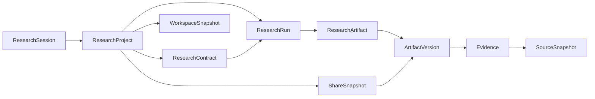

# API Contract

| 元数据         | 值                                                         |
| -------------- | ---------------------------------------------------------- |
| Status         | Accepted                                                   |
| Authority      | HTTP 资源、传输结构、错误、授权语义与 Schema authoring     |
| Implementation | `/api/v1` Current；`/api/v2` M1 核心 Runtime、Session 安全、Project/Contract/Run/Event、Artifact/Evidence/SourceSnapshot、Workspace/Share 与 A-03/X-01 集成 Implemented |

本文定义 Current 与 Pending API。`/api/v2` 七个核心资源的 Pydantic、JSON Schema、契约 OpenAPI，以及匿名 Session / CSRF / ownership 已实现；M1 Runtime 已挂载 Project、ContractDraft、Contract、Run、RunEvent、Artifact、ArtifactVersion、Evidence、SourceSnapshot、WorkspaceSnapshot 与 ShareSnapshot。Compose 配置 `DATABASE_URL` 并强制启用 `PERSISTENT_WORKFLOW_ENABLED`，资源归属、Research 写路径与公开分享投影读取 PostgreSQL 权威事实；真实 HTTP Browser 已验证 A-03/X-01 主链路。Snapshot/Share 状态当前仍为进程生命周期存储。当前 `/api/v1` 保持兼容；不得原地修改 v1 响应来伪装 M2 完成。

## 1. 设计原则

- URI 使用复数资源名与 snake_case JSON 字段。
- Project、Run、Artifact、ArtifactVersion 是独立资源，不以聊天线程或页面为资源。
- 成功响应使用统一 Envelope；v2 错误使用 `application/problem+json`。
- 集合接口使用不透明 cursor，默认 20、最大 100。
- 写操作通过 `Idempotency-Key`、版本前置条件或唯一约束避免重复。
- `execution_mode` 与 `source_mode` 分离；Fixture 不能冒充 Cached。
- 前端组件不得直接依赖 Transport DTO，必须经 Repository Adapter 校验与映射。
- API 不返回模型私有思维过程；ReasoningTrace 只含可审查依据、条件和引用。



## 2. 版本状态

| 版本      | 状态              | 说明                                                          |
| --------- | ----------------- | ------------------------------------------------------------- |
| `/api/v1` | Current           | 当前后端 Task Contract                                        |
| `/api/v2` | M1 Core Runtime Implemented | 24 个冻结 operation 已挂载；Compose 启用持久 Research 写路径，A-03/X-01 真实集成已验证；M2 科研 Pipeline Pending |

版本推进规则：

1. v2 先以 Pydantic 模型和生成 OpenAPI 落地。
2. `packages/contracts` 从 OpenAPI / JSON Schema 生成 Transport Type 与校验器。
3. Fixture / HTTP Adapter 通过同场景 Domain 一致性测试，A-03 Workspace 已接入 v2。
4. Workspace 主流程、分享、安全和 E2E 通过前，不宣布 v1 deprecated。
5. 宣布弃用时使用 `Deprecation`、`Sunset` 和 successor `Link` 响应头；本 RFC 不冻结下线日期。

## 3. 会话、安全与授权

### 3.1 匿名会话

- `POST /api/v2/sessions` 在无有效 Cookie 时创建隔离临时会话；有效 Cookie 存在时恢复同一 Session，用于刷新恢复。
- 服务端通过 Secure、HttpOnly、SameSite Cookie 识别会话，不把编辑凭据放入 URL 或 localStorage。
- 响应返回会话过期时间、资源配额和轮换后的内存态 CSRF token；所有非安全方法发送 `X-CSRF-Token`。服务端最多保留最近 4 个有效 token，支持同一 Session 的并行标签页而不无限增长。
- 所有私有资源按服务端 session ownership 授权，客户端传入的 project/run id 不能替代授权检查。
- 会话创建、Run 创建、分享和反馈分别限流；返回标准 `RateLimit-*` 与 `Retry-After`。

### 3.2 只读分享

- 分享 token 至少 128 bit 随机熵，服务端只保存 hash。
- ShareSnapshot 锁定明确的 ArtifactVersion、允许公开的 Evidence 与脱敏规则，不指向动态 latest。
- 分享可设置过期时间并可撤销；公开读取不授予 Project、Run 或反馈写权限。
- 分享响应过滤受限全文、密钥、内部错误堆栈、会话信息和未授权用户输入。
- 分享页使用严格 CSP、`Referrer-Policy: no-referrer` 与默认 `Cache-Control: no-store`。

## 4. 通用成功响应

```json
{
  "data": {},
  "meta": {
    "request_id": "req_01J...",
    "schema_version": "2.0.0",
    "generated_at": "2026-07-16T08:00:00Z"
  },
  "links": {
    "self": "/api/v2/projects/proj_01J..."
  }
}
```

规则：

- `request_id` 同时写入 `X-Request-Id` 响应头。
- 单个 ArtifactVersion 的执行和来源信息放在 Artifact Envelope，不放在全局 UI 状态。
- 创建资源返回 `201 Created` 与 `Location`；异步导出返回 `202 Accepted`。
- 删除或撤销成功可返回 `204 No Content`。

集合额外包含：

```json
{
  "page": {
    "next_cursor": "opaque-cursor-or-null",
    "has_more": false,
    "limit": 20
  }
}
```

## 5. 错误响应

v2 错误使用 RFC 9457 Problem Details：

```json
{
  "type": "https://xingwen.example/errors/contract-invalid",
  "title": "Research Contract is invalid",
  "status": 422,
  "detail": "requested_fields must contain at least one supported field",
  "instance": "/api/v2/research-contract-drafts/rcd_01J...",
  "code": "CONTRACT_INVALID",
  "request_id": "req_01J...",
  "errors": [
    {
      "field": "requested_fields",
      "code": "MIN_ITEMS",
      "message": "Select at least one field"
    }
  ]
}
```

| HTTP | `code`                                                                           | 场景                                                       |
| ---- | -------------------------------------------------------------------------------- | ---------------------------------------------------------- |
| 400  | `INVALID_REQUEST`                                                                | 语法、cursor 或不支持参数                                  |
| 401  | `SESSION_REQUIRED`                                                               | 会话缺失或过期                                             |
| 403  | `ACTION_FORBIDDEN` / `CSRF_INVALID`                                              | 已明确识别的当前主体无权执行该动作，或写请求 CSRF 校验失败 |
| 404  | `PROJECT_NOT_FOUND` / `RUN_NOT_FOUND` / `ARTIFACT_NOT_FOUND` / `SHARE_NOT_FOUND` | 资源不存在，或私有资源不属于当前会话；不得泄露其存在性     |
| 409  | `RUN_STATE_CONFLICT` / `VERSION_CONFLICT` / `IDEMPOTENCY_CONFLICT`               | 状态、版本或幂等键冲突                                     |
| 410  | `SHARE_EXPIRED`                                                                  | 分享已过期或被撤销                                         |
| 422  | `CONTRACT_INVALID` / `SCHEMA_VALIDATION_FAILED`                                  | 业务或 Schema 校验失败                                     |
| 429  | `RATE_LIMITED` / `QUOTA_EXCEEDED`                                                | 请求频率或匿名配额超限                                     |
| 502  | `UPSTREAM_INVALID_RESPONSE`                                                      | 外部来源返回不可校验内容                                   |
| 503  | `UPSTREAM_UNAVAILABLE`                                                           | 外部来源暂不可用，可能存在真实缓存建议                     |
| 504  | `UPSTREAM_TIMEOUT`                                                               | 外部来源或模型超时                                         |

公开错误不得包含密钥、数据库信息、堆栈、受限全文或模型原始长输出。

授权错误口径冻结为：会话缺失或过期返回 `401`；私有资源不属于当前会话返回不泄露存在性的 `404`；CSRF 失败或已明确识别的当前主体无权执行允许列表中的动作返回 `403`。

## 6. 枚举

### 6.1 执行与来源

```text
execution_mode = demo_replay | live
source_mode    = fixture | live | cached
derivation_kind = original | retry | revision | fork
```

`execution_mode` 只出现在 ResearchRun、创建 Run 请求和 Guided Tour 启动状态中，不进入 ResearchContract 或 ResearchContractDraft。HTTP Adapter 只定义传输方式，创建 Run 时可携带 `execution_mode=demo_replay | live`，不得因使用 HTTP 而把实体的 `source_mode` 自动标记为 `live`；Fixture Adapter 在浏览器内返回相同 Domain Model，并固定标记 `execution_mode=demo_replay`、`source_mode=fixture`。修订由 `derivation_kind=revision` 或 `supersedes_version_id` 非空推导，不新增 `source_mode` 值。

`source_scope.allowed_sources` 使用稳定的 provider source id（例如 `nasa_exoplanet_archive`），不接受 `nasa_exoplanet_archive.ps` 等 table source id。C-01 通过 Field Manifest 中既有 `SourceDefinition.provider_source_id` 与 `source_table` 派生 table source id；API 不维护第二套来源定义或映射表。未经 Case Manifest `allowed_source_ids` 授权的 provider source id 必须拒绝。

### 6.2 Run 状态

传输字段 `ResearchRun.status` 使用 `RunStatus`；完整状态集合和转换规则只在 [WORKFLOW_DESIGN.md](WORKFLOW_DESIGN.md) 冻结。`cached`、`fixture` 和修订关系不是 Run 状态。

### 6.3 Artifact 类型

```text
dataset
field_dictionary
source_collection
paper_collection
paper_summary
literature_claims
literature_relations
reasoning_traces
graph
export
```

## 7. Research Contract Draft

### `POST /api/v2/research-contract-drafts`

根据自然语言意图创建可编辑草案，不启动 Run。

```json
{
  "intent": "整合系外行星候选体与宿主恒星参数，并追踪字段和论文证据",
  "case_key": "exoplanet_host_star"
}
```

返回 `201`：

```json
{
  "data": {
    "id": "rcd_01J...",
    "status": "draft",
    "contract": {
      "research_goal": "整合系外行星候选体与宿主恒星关键参数",
      "target_objects": ["exoplanet_candidate", "host_star"],
      "data_requirements": { "unit_policy": "canonical" },
      "requested_fields": [
        "planet.orbital_period",
        "planet.radius",
        "planet.mass",
        "star.effective_temperature"
      ],
      "source_scope": { "allowed_sources": ["nasa_exoplanet_archive"] },
      "paper_search_scope": { "year_from": 2015, "max_candidates": 20 },
      "output_requirements": ["dataset", "field_dictionary", "graph"],
      "evidence_requirements": { "require_locator": true },
      "quality_constraints": { "source_completeness_min": 1.0 }
    },
    "warnings": []
  },
  "meta": {
    "request_id": "req_01J...",
    "schema_version": "2.0.0",
    "generated_at": "2026-07-16T08:00:00Z"
  },
  "links": { "self": "/api/v2/research-contract-drafts/rcd_01J..." }
}
```

### `PATCH /api/v2/research-contract-drafts/{draft_id}`

更新草案字段。请求携带 `If-Match` 或 `version`，防止多个编辑器静默覆盖。

## 8. Project 与不可变 Contract

| Method  | Path                                                     | 说明                                                 |
| ------- | -------------------------------------------------------- | ---------------------------------------------------- |
| `GET`   | `/api/v2/projects?cursor=&limit=`                        | 当前会话的 Project 列表                              |
| `POST`  | `/api/v2/projects`                                       | 创建临时 ResearchProject                             |
| `GET`   | `/api/v2/projects/{project_id}`                          | Project 聚合：当前 Contract、Run 摘要、Artifact 摘要 |
| `PATCH` | `/api/v2/projects/{project_id}`                          | 修改名称、描述等非科研产物元信息                     |
| `POST`  | `/api/v2/projects/{project_id}/contracts`                | 从 draft 创建不可变 ResearchContract                 |
| `GET`   | `/api/v2/projects/{project_id}/contracts?cursor=&limit=` | Contract 历史                                        |

创建 Contract 请求：

```json
{
  "draft_id": "rcd_01J...",
  "expected_draft_version": 3
}
```

确认后 Contract 不原地修改；改变科研范围必须创建新 Contract，并由新 Run 引用。

## 9. Run 与进度

| Method | Path                                                | 说明                                     |
| ------ | --------------------------------------------------- | ---------------------------------------- |
| `GET`  | `/api/v2/projects/{project_id}/runs?cursor=&limit=` | Run 列表，默认按创建时间倒序             |
| `POST` | `/api/v2/projects/{project_id}/runs`                | 创建 Live Run；要求 `Idempotency-Key`    |
| `GET`  | `/api/v2/runs/{run_id}`                             | Run 状态快照、steps、产物摘要和可用动作  |
| `GET`  | `/api/v2/runs/{run_id}/events?cursor=&limit=`       | 有序进度事件；可协商 `text/event-stream` |
| `POST` | `/api/v2/runs/{run_id}/cancellations`               | 创建取消请求；重复请求幂等               |

创建 Run：

```json
{
  "contract_id": "rc_01J...",
  "execution_mode": "live",
  "parent_run_id": null,
  "derivation_kind": "original",
  "feedback_ids": [],
  "retry_from_step": null,
  "cache_policy": "fallback_on_recoverable_failure"
}
```

Run Snapshot 至少返回：

```json
{
  "id": "run_01J...",
  "project_id": "proj_01J...",
  "contract_id": "rc_01J...",
  "status": "searching_papers",
  "progress": 55,
  "execution_mode": "live",
  "parent_run_id": null,
  "derivation_kind": "original",
  "steps": [],
  "latest_event_sequence": 18,
  "artifact_summaries": [],
  "available_actions": ["cancel"],
  "created_at": "2026-07-16T08:00:00Z",
  "updated_at": "2026-07-16T08:02:30Z"
}
```

事件必须有单调递增 `sequence`、`occurred_at`、`run_id`、`step_key`、公开消息和可选进度；不得包含 chain-of-thought。

## 10. 重试、修订与派生

用户发起的 retry、revision、fork 均通过 `POST /projects/{project_id}/runs` 创建新 Run：

- `retry`：引用失败 `parent_run_id`，可指定 `retry_from_step`，复用经过 hash 校验的完成产物。
- `revision`：引用 Feedback 与父 Run，只重算受影响步骤，生成新的 ArtifactVersion。
- `fork`：引用父 Run 与新 Contract，表示研究范围或约束变化。
- 自动瞬态重试留在同一 Run 的 StepAttempt 中，每次 attempt 都保留；终态失败不得静默回到 running。

## 11. Artifact 与统一 Envelope

| Method | Path                                                   | 说明                          |
| ------ | ------------------------------------------------------ | ----------------------------- |
| `GET`  | `/api/v2/runs/{run_id}/artifacts?kind=&cursor=&limit=` | Run 的 Artifact 摘要          |
| `GET`  | `/api/v2/artifacts/{artifact_id}`                      | Artifact 身份和版本列表摘要   |
| `GET`  | `/api/v2/artifact-versions/{version_id}`               | 统一 ArtifactVersion Envelope |
| `GET`  | `/api/v2/evidence/{evidence_id}`                       | Evidence 与 SourceSnapshot    |
| `GET`  | `/api/v2/source-snapshots/{snapshot_id}`               | 当前 Project 的脱敏来源快照   |
| `GET`  | `/api/v2/artifact-versions/{version_id}/paper-collection` | 校验后的 PaperCollection 与完整溯源 |
| `GET`  | `/api/v2/artifact-versions/{version_id}/paper-candidates?cursor=&limit=` | 稳定排序的候选、去重组、来源与 Evidence |

ArtifactVersion Envelope：

```json
{
  "data": {
    "id": "artv_01J...",
    "artifact_id": "art_01J...",
    "project_id": "proj_01J...",
    "created_by_run_id": "run_01J...",
    "version_number": 2,
    "schema_version": "2.0.0",
    "content": {},
    "content_hash": "sha256:...",
    "input_hash": "sha256:...",
    "source_mode": "live",
    "producer": { "type": "pipeline", "name": "data", "version": "1.0.0" },
    "source_snapshot_ids": ["srcs_01J..."],
    "evidence_ids": ["ev_01J..."],
    "supersedes_version_id": "artv_01H...",
    "created_at": "2026-07-16T08:08:00Z",
    "producer_execution": {},
    "source_snapshots": [],
    "evidence": []
  },
  "meta": {
    "request_id": "req_01J...",
    "schema_version": "2.0.0",
    "generated_at": "2026-07-16T08:08:00Z"
  },
  "links": { "self": "/api/v2/artifact-versions/artv_01J..." }
}
```

`content` 是 #78 已经 Pydantic 准入并以 hash 固定的发布 payload；通用读取边界不重复执行领域算法。B-05～B-09 必须在各自领域端点继续映射为判别联合读取模型。读取层会删除凭据、认证头、Cookie、受限全文、原始模型长输出和内部堆栈类字段；SourceSnapshot `request_metadata` 只保留明确允许的可复现字段。

Artifact 列表 cursor 同时绑定 `run_id` 和 `kind` 过滤条件；不得跨 Run 或跨过滤条件复用，scope 不匹配时返回 `400 INVALID_CURSOR`。

PaperCollection 领域读取只接受 `kind=paper_collection` 的不可变版本，并重新校验 D-02 Pydantic content、input/output hash、producer output hash、`source_mode`、SourceSnapshot 集合和候选 Evidence 绑定。ArtifactVersion `content_hash` 按 #78 对完整持久化 JSON 计算；D-02 `output_hash` 按科研稳定规则排除 wall-clock 字段，两者分别校验且不得混用。Pipeline snapshot identifier 通过 source/type/query hash/content hash/retrieved time 的稳定指纹一一映射到持久化 SourceSnapshot UUID，不改写已冻结 content。它不执行检索、canonicalization、去重或重新排序。候选 cursor 绑定 ArtifactVersion，并包含既有 `ranking_key`、`canonical_paper_id` 与 `candidate_id`；跨版本复用返回 `400 INVALID_CURSOR`，`limit` 最大为 100。

领域读取的失败语义固定为：`PAPER_SOURCE_RATE_LIMITED`（429）、`PAPER_SOURCE_FAILED`（502）、`PAPER_COLLECTION_EMPTY`（404）、`PAPER_COLLECTION_SCHEMA_INVALID`（422）以及通用 ownership / provenance Problem Details。响应不返回来源凭据、受限全文或未净化 HTML，并统一使用 `Cache-Control: no-store`。

上例的 `source_mode=live` 表示实际来源；`supersedes_version_id` 非空表示它是修订版本。界面可组合显示 `LIVE · REVISED`，但不得把 `revised` 写回来源枚举。

## 12. Workspace 恢复

| Method | Path                                               | 说明                             |
| ------ | -------------------------------------------------- | -------------------------------- |
| `GET`  | `/api/v2/projects/{project_id}/workspace-snapshot` | 当前会话的工作台恢复状态         |
| `PUT`  | `/api/v2/projects/{project_id}/workspace-snapshot` | 幂等保存布局、打开产物和选择对象 |

WorkspaceSnapshot 最多保存三个 panel slot；不得保存未提交敏感文本、会话 token、模型内部状态或无限自由窗口位置。

- `PUT` 使用数字 revision 的 `If-Match` 前置条件；成功响应通过 `ETag` 返回当前 revision。
- 同 payload 重放不增加 revision；不同 payload 使用陈旧 revision 时返回 `409 VERSION_CONFLICT`。
- Snapshot 按 `session + project` 私有隔离，跨 Session 与不存在 Project 使用不泄露存在性的 `404`。
- 当前运行适配器为进程内恢复边界，进程重启后失效；不得描述为跨实例持久化。

## 13. 分享

| Method   | Path                                                  | 说明                                      |
| -------- | ----------------------------------------------------- | ----------------------------------------- |
| `GET`    | `/api/v2/projects/{project_id}/shares?cursor=&limit=` | 私有分享记录，不返回原 token              |
| `POST`   | `/api/v2/projects/{project_id}/shares`                | 创建冻结的 ShareSnapshot 与一次性可见 URL |
| `DELETE` | `/api/v2/projects/{project_id}/shares/{share_id}`     | 撤销分享                                  |
| `GET`    | `/api/v2/shares/{share_token}`                        | 无编辑权限的公开快照                      |

创建请求必须列出 `artifact_version_ids`、可公开 Evidence 范围、`expires_at` 和 redaction policy。公开响应只能包含 ShareSnapshot 锁定内容。

- M1 当前只接受 `redaction_policy=public_metadata_only`，公开投影不返回 Artifact content、Evidence locator、Project/Session 信息或内部 producer 数据。
- 原始 token 只在创建响应返回；私有列表、公开响应和错误的 `instance` 均不返回 token 或 token hash。
- 无效、撤销和过期 token 统一返回 `404 SHARE_NOT_FOUND`；公开错误也使用固定 `/api/v2/shares/public` instance。
- Share 创建按 Session 独立限流，默认每分钟 `20` 次；成功返回 `RateLimit-Limit` / `RateLimit-Remaining` / `RateLimit-Reset`，超限返回 `429 RATE_LIMITED` 及 `Retry-After`。
- 公开读取无需 Session，但不授予任何写权限，并返回 `Cache-Control: no-store`、严格 CSP、`Referrer-Policy: no-referrer` 和 `X-Content-Type-Options: nosniff`。
- 私有列表使用稳定不透明 cursor；撤销与创建受 ownership 和 CSRF 保护。

## 14. Feedback 与修订计划

| Method | Path                             | 说明                                                                    |
| ------ | -------------------------------- | ----------------------------------------------------------------------- |
| `POST` | `/api/v2/feedback`               | 针对 Field、Source、Paper、Claim、Relation、Trace 或 GraphEdge 提交反馈 |
| `GET`  | `/api/v2/feedback/{feedback_id}` | 反馈状态、影响范围与 RevisionPlan                                       |

```json
{
  "target": {
    "object_type": "literature_relation",
    "object_id": "rel_01J...",
    "artifact_version_id": "artv_01J..."
  },
  "category": "evidence_mismatch",
  "message": "该关系缺少温度范围条件",
  "proposed_change": { "add_condition": "st_teff >= 6000 K" }
}
```

反馈本身不修改产物。确认 RevisionPlan 后创建 `derivation_kind=revision` 的新 Run。

## 15. 导出

| Method | Path                                             | 说明                              |
| ------ | ------------------------------------------------ | --------------------------------- |
| `POST` | `/api/v2/artifact-versions/{version_id}/exports` | 创建 CSV、JSON 或溯源报告导出任务 |
| `GET`  | `/api/v2/exports/{export_id}`                    | 查询状态与短期下载 URL            |

导出必须锁定 ArtifactVersion、内容 hash、生成时间与 provenance；下载 URL 短期有效且不暴露底层文件路径。

## 16. Cache 语义

- Cache 不是 Run 状态。
- 只有来自真实历史 Run、可定位 ArtifactVersion 与 SourceSnapshot 的结果才能标记 `source_mode=cached`。
- 使用缓存前记录本次 Live 失败、匹配 input hash、来源 Run、适用范围和选择原因。
- 缓存不满足 Contract 或 Evidence 要求时返回失败，不以“尽量展示”覆盖科研约束。

## 17. OpenAPI、Schema 与 Adapter 门禁

实施时必须：

1. FastAPI / Pydantic 生成 OpenAPI 3.1 与 JSON Schema；不得并行手写第二套生产 Schema。
2. OpenAPI 暴露唯一 operationId、完整错误、Cookie / CSRF 安全说明、请求和响应示例。
3. 所有集合声明 cursor 与 limit，所有写入声明幂等或版本冲突语义。
4. `packages/contracts` 生成 Transport Type 和运行时校验；`packages/domain` 不依赖 HTTP。
5. Fixture 与 HTTP Adapter 对同一 Contract Fixture 运行一致性测试。
6. OpenAPI lint、Schema export diff 和生成类型漂移检查进入 CI。

当前 v2 OpenAPI 已由 Pydantic 唯一 authoring source 生成并提交，Runtime parity 自动核对冻结 operation 的 method、path、operationId、必需 Header 与成功响应 Schema；生成物漂移检查已进入 CI。

## 18. 非功能与安全验证

- 跨会话 Project / Run / Artifact ID 访问统一返回不泄露存在性的 `404`；会话缺失或过期返回 `401`；CSRF 失败或已知主体缺少允许动作返回 `403`。
- 会话固定攻击、过期 Cookie、无效 CSRF、撤销/过期 Share、token 枚举和水平越权必须有测试。
- 用户输入、论文文本和外部摘要默认按文本输出；渲染 HTML 前严格净化。
- 外部 URL 只允许 `https` 和配置的来源 host，防止 SSRF 与恶意协议。
- 请求体、Research Contract、Feedback 与导出设大小上限。
- API 与前端部署定义 CSP、HSTS、MIME sniffing、Referrer Policy、Permissions Policy 和最小 CORS allowlist。
- Rate limit 与匿名配额数值由部署配置冻结，并在 OpenAPI / `.env.example` 实施时同步；本 RFC 不编造未经容量测试的阈值。

## 19. 当前 v1 边界

当前实现仍提供 `/api/v1/health`、`/api/v1/tasks` 及 dataset、sources、paper-acquisition、papers、literature-reasoning、graph、evidence 等 Task 子资源。它们是 Phase 0 Fixture-backed 契约，不支持本文件的 Project、Run、ArtifactVersion、WorkspaceSnapshot 或 ShareSnapshot。

`/api/v1` 的字段、必填性、默认值、枚举和 legacy wire alias 冻结在
[`DATA_MODEL_V1.md`](DATA_MODEL_V1.md)，逐字段实现决策见
[`V1_SCHEMA_FIELD_MATRIX.md`](V1_SCHEMA_FIELD_MATRIX.md)。当前 v2 目标契约
不得隐式改变 v1 Wire Contract。

Phase 0 Task 状态快照必须保持内部一致：新建 `pending` Task 的 `progress=0`，且 `steps` 为空或全部为 `pending`；`pending` Task 不得包含已开始步骤；存在 `running` Step 时顶层状态不得为 `pending`；`completed` Task 的 `progress=100`。固定演示 Task `task_001` 保持其运行中 Fixture 语义。

README、PR、演示材料必须保持这一“当前实现 / 目标契约”区分，直到 v2 有可执行代码和验证证据。
