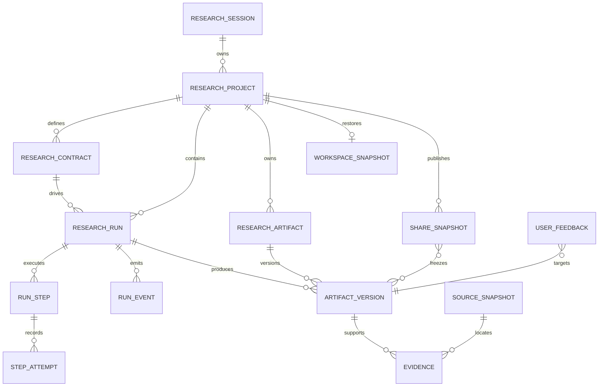

# Data Model

| 项目状态 | 口径 |
| --- | --- |
| Status | Accepted for implementation |
| Implementation | Pending |
| Current model | `/api/v1` 的 ResearchTask 与结果 DTO |
| Target model | Project / Run / Artifact / ArtifactVersion |

本文冻结 `/api/v2` 与前端 Domain Model 的目标实体和不变量，不表示数据库表或 Pydantic Schema 已实现。字段使用 snake_case；时间统一为带时区 UTC ISO 8601。

## 1. 建模原则

- Project 是持续研究上下文，Run 是一次契约驱动执行。
- Artifact 是稳定身份，ArtifactVersion 是不可变内容快照。
- Evidence 绑定明确 ArtifactVersion，不绑定漂移的 latest。
- `execution_mode` 与 `source_mode` 正交；Fixture 不能冒充 Cached。
- 重试、修订、派生创建新 Run；自动瞬态重试只增加 StepAttempt。
- WorkspaceSnapshot 是私有 UI 恢复状态，ShareSnapshot 是冻结的只读公开投影。
- ReasoningTrace 只记录可审查依据、条件和引用，不保存模型私有 chain-of-thought。

## 2. 实体关系



## 3. 通用类型与枚举

- 对外 ID 使用不可枚举的 UUIDv7、ULID 或等价高熵标识；数据库内部实现不暴露。
- `schema_version` 使用语义版本字符串。
- `content_hash` 使用 `sha256:<hex>`，只识别内容，不替代业务 ID。
- 所有资源至少包含 `created_at`；可变元数据包含 `updated_at` 和乐观锁 `revision`。

```text
execution_mode = demo_replay | live
source_mode = fixture | live | cached | revised
derivation_kind = original | retry | revision | fork
```

不变量：Fixture Adapter 产生 `demo_replay + fixture`；HTTP Live Run 产生 `execution_mode=live`，其产物可为 `live`、`cached` 或 `revised`。Cached 必须引用真实历史 Run；Revised 必须引用被替代版本和 Feedback。

## 4. ResearchSession

免登录访问者的服务端隔离边界。

```text
id
status: active | expired | revoked
created_at
expires_at
last_seen_at
quota_profile
project_count
run_count
```

Session id 不进入公开 URL、日志或导出。Cookie、CSRF token 和原始 share token 不属于领域 DTO。

## 5. ResearchProject

```text
id
session_id
name
description
case_key
active_contract_id
latest_run_id
created_at
updated_at
revision
```

Project 表示持续研究问题，不保存聊天消息流。一个 Project 可有多个 Contract、并行 Run、Artifact 和 ShareSnapshot。

## 6. ResearchContract

确认后的科研输入契约；Run 创建后引用不可变版本。

```text
id
project_id
version
research_goal
target_objects[]
data_requirements
requested_fields[]
source_scope
paper_search_scope
output_requirements[]
evidence_requirements
quality_constraints
execution_mode
created_from_draft_id
created_at
content_hash
```

| 字段 | 最低约束 |
| --- | --- |
| `research_goal` | 4–500 字符，不能只含空白 |
| `target_objects` | 至少一个受当前 case 支持的对象类型 |
| `requested_fields` | 至少一个字段，由 case manifest 校验 |
| `source_scope` | 允许来源、优先级、合规和缓存策略 |
| `paper_search_scope` | 关键词、年份、来源、候选上限和选择规则 |
| `evidence_requirements` | locator、snapshot、引用和最低覆盖要求 |
| `quality_constraints` | 来源完整性、单位一致性等可验证阈值 |

ResearchContractDraft 是短期可编辑资源，包含 `id`、`session_id`、`version`、`intent`、`contract`、`warnings`、`expires_at`；确认时复制为不可变 Contract。

## 7. ResearchRun、Step 与 Event

ResearchRun：

```text
id
project_id
contract_id
execution_mode
status
progress
parent_run_id
derivation_kind
retry_from_step
cache_policy
started_at
finished_at
created_at
updated_at
latest_event_sequence
failure_code
failure_summary
```

状态：

```text
queued | planning | fetching_data | cleaning_data | searching_papers
summarizing_papers | reasoning_literature | building_graph
waiting_for_input | completed | failed | cancelled
```

`cached`、`fixture`、`revised` 和 `using_cache` 不是 Run 状态。

RunStep：

```text
id
run_id
key
label
status: pending | running | waiting | completed | failed | cancelled | skipped
progress
started_at
finished_at
input_hash
output_artifact_version_ids[]
failure_code
public_message
```

StepAttempt 记录 `attempt_number`、状态、时间、error class/code、retryable 和 upstream request id；重试不得覆盖前一次失败。

RunEvent 包含 `run_id`、单调递增 `sequence`、event_type、step_key、progress、public_message、artifact_version_ids 和 occurred_at。Event 用于增量通知，不作为当前状态事实来源，也不包含 chain-of-thought。

## 8. ResearchArtifact 与 ArtifactVersion

ResearchArtifact：

```text
id
project_id
kind
title
logical_key
created_at
latest_version_id
```

`kind`：`dataset`、`field_dictionary`、`source_collection`、`paper_collection`、`paper_summary`、`literature_claims`、`literature_relations`、`reasoning_traces`、`graph`、`export`。

ArtifactVersion：

```text
id
artifact_id
project_id
created_by_run_id
version_number
schema_version
content
content_hash
input_hash
source_mode
origin_source_mode
producer
source_snapshot_ids[]
evidence_ids[]
supersedes_version_id
created_at
```

不变量：

- `(artifact_id, version_number)` 唯一，content 创建后不可原地修改。
- Evidence、ShareSnapshot 与 Export 固定引用 version id，不引用 latest。
- Cached 还需 CacheRecord 与 origin Run；Revised 还需 supersedes version 和 Feedback。
- `producer` 包含 type、name、version，以及适用的 model、prompt、parameters hash；不包含密钥或私有推理。

## 9. 科研 Artifact 内容

### 9.1 Dataset 与 FieldDefinition

Dataset 包含 name、columns、rows 或 page_reference、row_count、quality_score、source_snapshot_ids。大型数据集保存 manifest 与分页引用，不强制嵌入全部 rows。

FieldDefinition 包含 name、label、description、data_type、canonical_unit、source_field、source_snapshot_ids、transformation_rule、missing_rate、evidence_ids。

### 9.2 PaperCollection 与 PaperSummary

PaperCollection 包含 query、acquisition_run、candidates、selected_paper_ids、dedupe_rule、ranking_rule、source_snapshot_ids。Candidate 至少包含 title、authors、year、DOI/arXiv/URL、source snapshot、relevance、selected 和 selection_reason。Seed 只能标记 benchmark、manual_review 或 fixture。

PaperSummary 包含 paper_id、research_goal、method、dataset、findings、limitations、future_work、evidence_ids；每个核心 finding / limitation 可定位 Evidence。

### 9.3 Claim、Relation 与 ReasoningTrace

LiteratureClaim：paper_id、claim_type、text、conditions、evidence_ids、confidence、`candidate | accepted | rejected`。

LiteratureRelation：source/target claim、relation_type、conditions、reasoning_trace_id、evidence_ids、confidence、状态。Accepted Relation 必须同时有 Evidence 和 ReasoningTrace。

ReasoningTrace：relation_id、premise_claim_ids、显式 steps、conditions、evidence_ids、review_status。Step 只描述引用、比较条件和结构化结论，不记录隐藏 prompt、内部 token 或逐 token 推理。

### 9.4 Graph

Graph 包含 nodes、edges、layout_hint 和 filters。每条 GraphEdge 必须有 evidence_ids；跨文献边还必须有 relation_id 和 reasoning_trace_id。不得为装饰生成无科研意义的边。

## 10. Evidence 与 SourceSnapshot

Evidence：

```text
id
artifact_version_id
target_type
target_id
evidence_type
source_snapshot_id
paper_id
locator
quote_or_value
extraction_method
confidence
created_at
```

Locator 使用判别联合：database cell 定位 query hash、row key 和 field；paper text 定位 section/page/paragraph/range；model extraction 引用输入 evidence 与 prompt/model version；reasoning trace 引用 relation 和显式 step。

SourceSnapshot：

```text
id
source_id
source_type
retrieved_at
query
query_hash
source_version_or_etag
content_hash
license_note
cache_version
request_metadata
```

request_metadata 只保存可复现且非敏感字段；认证头、Cookie、API Key 和完整受限响应不得保存。

## 11. Feedback 与 RevisionPlan

UserFeedback 包含 project/run、target_type、target_id、artifact_version_id、category、message、proposed_change、status 和 created_at。目标覆盖 Field、Source、Paper、PaperSummary、Claim、Relation、ReasoningTrace、GraphEdge。

RevisionPlan 包含 feedback_ids、affected_artifact_version_ids、affected_steps、reuse_artifact_version_ids、conflicts 和 status。确认后创建 `derivation_kind=revision` 的新 Run，原版本保持可读。

## 12. WorkspaceSnapshot 与 ShareSnapshot

WorkspaceSnapshot 保存 session/project、active_run_id、最多三个 panel_slots、selected_object_ref、pinned_evidence_ids、Atlas/Observatory 状态、layout_preset、revision 和 updated_at。不保存 token、未提交敏感输入、GPU 状态或模型内部状态。

ShareSnapshot：

```text
id
project_id
created_by_session_id
title
artifact_version_ids[]
evidence_ids[]
redaction_policy
token_hash
status: active | expired | revoked
created_at
expires_at
revoked_at
```

原始 token 只在创建响应中出现一次。ShareSnapshot 不引用动态 latest，不授予反馈、再生成或私有 Project 读取权限。

## 13. CacheRecord 与 ProducerExecution

CacheRecord 至少包含 origin_run_id、artifact_version_id、source_snapshot_ids、input_hash、contract_hash、producer_version、created_at 和 validity_scope。缓存不得只是无来源 JSON。

ProducerExecution 可由现有 ExperimentRun 迁移，记录 run、step、producer/model、prompt version、parameters/input/output hash、状态、时间、token usage、latency 和 error code；不保存密钥、受限全文或私有 chain-of-thought。

## 14. 一致性边界

- Project 聚合只内嵌 Run / Artifact 摘要，不内嵌完整大产物。
- Run Snapshot 是状态事实来源；Event 只做增量通知。
- ArtifactVersion 与 latest 指针在同一事务登记。
- Evidence 创建前验证 target 属于对应 ArtifactVersion。
- Graph 发布前验证所有边 Evidence，跨文献边再验证 Relation / Trace。
- ShareSnapshot 创建时验证版本属于同一 Project，并执行脱敏。
- Revision Run 只复用 content hash 与 Contract 允许的完成版本。

## 15. v1 迁移映射

| 当前 v1 | 目标 v2 |
| --- | --- |
| `ResearchTask` | `ResearchProject` + 一个 `ResearchRun` |
| Task options | `ResearchContract` |
| Task status / steps | `ResearchRun` + RunStep + RunEvent |
| dataset/papers/reasoning/graph 响应 | ResearchArtifact + ArtifactVersion.content |
| `meta.cached` / `used_cache` | ArtifactVersion.source_mode + CacheRecord |
| 同一 Task 的 `revising` | 新 `derivation_kind=revision` Run |

迁移适配只用于过渡；v1 Task DTO 不得成为新 React 组件的 Domain Model。
