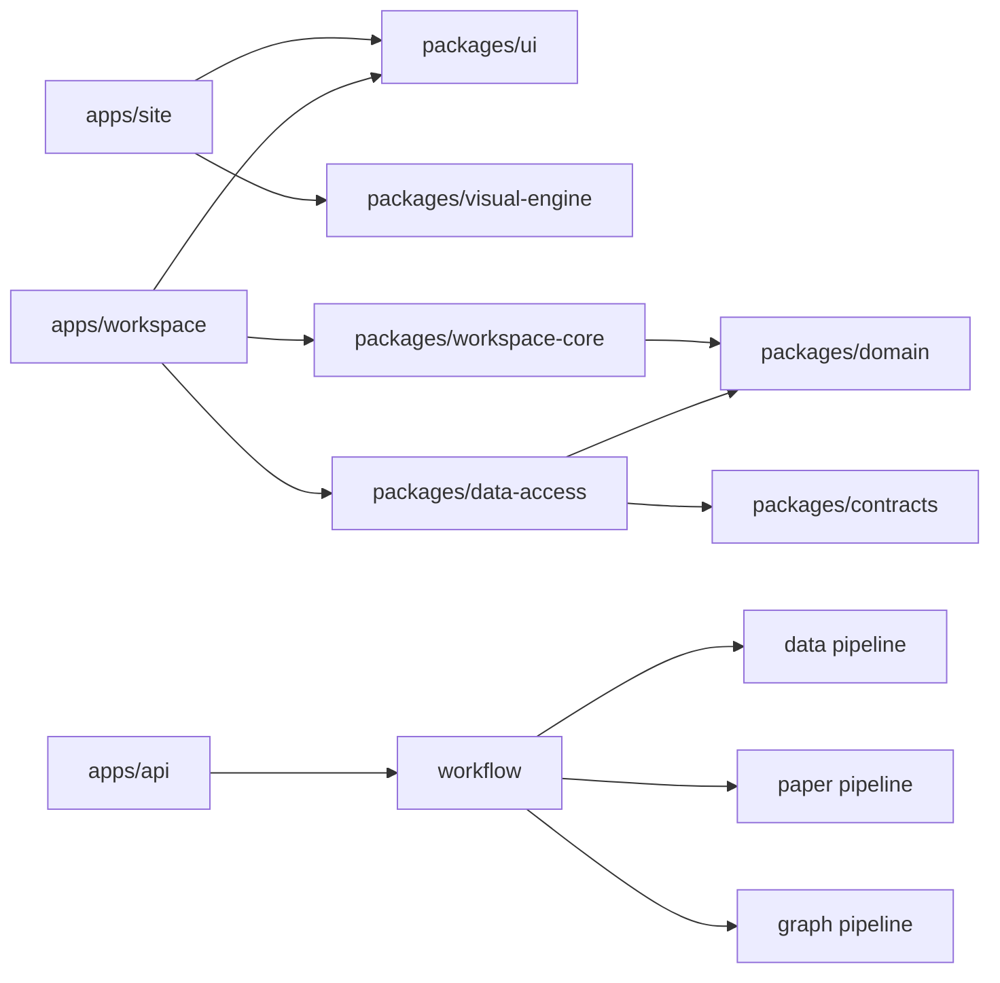

# Module Boundaries

| 项目状态 | 口径 |
| --- | --- |
| Status | Accepted for implementation |
| Implementation | Pending for target frontend and v2 contracts |
| Current runtime | `apps/web` Vue 骨架 + `apps/api` FastAPI |
| Target runtime | `apps/site` Astro + `apps/workspace` React + shared packages |

本文件同时标明当前实现与目标边界，避免把计划目录写成已存在。当前 Docker、启动命令和 v1 API 继续以 `README.md`、`docs/setup.md` 和代码为准。

## 1. 当前与目标目录

| 目录 | 状态 | 职责 |
| --- | --- | --- |
| `apps/web` | Current, migration source | Vue / Vite 骨架；目标迁移完成后删除 |
| `apps/site` | Target, pending | Astro 静态品牌站、首页四幕、SEO、React visual island |
| `apps/workspace` | Target, pending | React Guided Tour 与 Research Workspace |
| `apps/desktop` | Documentation only | 未来 Tauri 壳；本轮不创建 |
| `apps/api` | Current, evolving | FastAPI、v1 基线、目标 v2 Application Service 与 Workflow |
| `packages/design-tokens` | Target, pending | OKLCH Raw / Semantic Token、字体、motion、visual token |
| `packages/ui` | Target, pending | React UI primitives 与产品组件，不调用 HTTP |
| `packages/visual-engine` | Target, pending | Three.js / R3F / GLSL、ASCII atlas、质量与生命周期 |
| `packages/domain` | Target, pending | Project / Run / Artifact / Version 稳定领域模型 |
| `packages/contracts` | Target, pending | 生成 Transport Type、OpenAPI / JSON Schema 校验 |
| `packages/data-access` | Target, pending | Repository Port、HTTP / Fixture Adapter、Mapper、错误归一化 |
| `packages/workspace-core` | Target, pending | 面板、选择、命令、Research Console 上下文、分享状态 |
| `packages/testing` | Target, pending | 版本化 Fixture、测试工具、a11y 与视觉基线 |
| `packages/schemas` | Current transition | Pydantic 导出的 Phase 0 JSON Schema；迁移时并入 contracts 流程 |
| `packages/prompts` | Current | 不可变生产 Prompt 与 registry |
| `services/data_pipeline` | Planned implementation | 数据获取、清洗、字段映射、质量和导出 |
| `services/paper_pipeline` | Planned implementation | 论文检索、获取、去重、总结和来源绑定 |
| `services/graph_pipeline` | Planned implementation | Claim、Relation、Trace 和 Graph 构建 |

## 2. 依赖方向

禁止：

- Domain 依赖 React、Astro、HTTP 或平台 API。
- UI、Visual Engine 或页面直接调用 HTTP。
- Visual Engine 读取 Transport DTO 或成为科研数据来源。
- Pipeline 调用 Router 或推进 Run 主状态。
- 前端直连模型、天文数据源或论文源。
- Prompt 散落在 Router、组件或临时脚本。
- generated Schema 成为手工 authoring source。

## 3. A 前端与产品体验

### 3.1 负责范围

- `apps/site`、`apps/workspace`；
- `packages/design-tokens`、`ui`、`visual-engine`、`domain`、`contracts`、`data-access`、`workspace-core`、`testing` 的前端部分；
- 首页四幕、Guided Tour、Research Contract、科研产物工作台、分享与状态体验。

### 3.2 必须交付

- 静态首屏、SEO、WebGL Poster / Reduced Motion 降级；
- Research Atlas、最多三面板 Canvas、Provenance Observatory、Research Console；
- Fixture / HTTP Adapter 同一 Domain Model 与一致性测试；
- Dataset、Paper、Summary、Reasoning、Graph、Evidence、Feedback 的完整状态；
- 键盘、a11y、视觉回归和性能门禁。

### 3.3 禁止

- 在迁移期同时向 Vue 与 React 增加同一业务功能；
- 让 Fixture 冒充 Live / Cached，或自行补造后端科研结果；
- 使用聊天流、IDE 或无限自由窗口作为核心模型；
- 在业务组件散落 Raw Color、裸 URL、组件内 fetch 或未经净化 HTML。

## 4. B 后端与 Workflow

负责 `apps/api`、Pydantic authoring source、v1 稳定性与 v2 资源 API。

必须：

- Router 只处理传输、授权和 Application Service 调用；
- Workflow 管理 Run / Step / Attempt / Event，Pipeline 管理业务算法；
- PostgreSQL 成为状态事实来源；
- OpenAPI / JSON Schema 可重复生成并驱动 `packages/contracts`；
- 匿名 Session、CSRF、Share token hash、授权、限流与安全错误可测试；
- ArtifactVersion、Evidence、SourceSnapshot、CacheRecord 与 Feedback 关系可审查。

不得返回模型自由文本作为科研事实，不得保存私有 chain-of-thought，不得在日志暴露密钥或受限全文。

## 5. C 数据 Pipeline

输入：ResearchContract、已校验来源配置、父 Run 可复用版本。

输出：Dataset、FieldDefinition、QualityScore、SourceSnapshot、Evidence、Export content。

必须记录单位、来源、转换规则、query hash、producer version 与关键值 Evidence。不得手写无来源字段或把 Fixture 当真实数据。

## 6. D 论文与总结 Pipeline

输入：ResearchContract、数据 ArtifactVersion、论文来源、版本化 Prompt。

输出：PaperCollection、PaperCandidate、PaperSummary、SourceSnapshot、Evidence。

必须记录 Query、来源、去重、排序、选择依据和许可边界；seed 仅用于 benchmark、Fixture 或人工校验。

## 7. D 推理与图谱 Pipeline

输入：已校验 Summary、Claim、Evidence 与数据 ArtifactVersion。

输出：Claim、候选/最终 Relation、ReasoningTrace、Graph 与 Evidence。

Accepted Relation 需要 Evidence、显式条件和 ReasoningTrace；GraphEdge 全部绑定 Evidence，跨文献边再绑定 Relation / Trace。不得为装饰制造节点或边。

## 8. X 基建

当前负责 Compose、CI、env、版本锁定和验证脚本。前端迁移实施前更新 ADR、Issue 与 target command；实施完成前不改 `docs/setup.md` 当前命令。

MVP 不因 Monorepo 引入 Redis、Celery、MinIO、Nginx、RabbitMQ、Neo4j 或向量数据库。Turborepo 只有在任务图和缓存收益明确时使用。

## 9. Platform Adapter

Web 实现 FileExport、Notification、LocalCache、DeepLink 等 Port。未来 Tauri 只替换这些 Adapter；Feature、Domain、Repository 与 Workspace Core 不 import Tauri API。本轮不创建桌面应用。

## 10. 联调顺序

1. 文档、ADR、v2 Contract 与 A-01～A-10 Issue 冻结。
2. A-01 建立 Monorepo、Astro / React 空应用、contracts / domain / testing 门禁。
3. A-02 建立 Token、UI、Visual Engine 基础、首页框架和 Workspace Shell。
4. A-03 建立 Research Contract、Fixture / HTTP Adapter、Guided Tour 与 Project / Run Shell。
5. B / C / D 分阶段实现 v2、真实数据、论文、推理和图谱，A-04～A-08 接入。
6. A-09 / A-10 对齐来源、版本、缓存和修订；完成分享与交付。
7. 新前端通过 Contract、E2E、a11y、visual、fallback 和部署门禁后删除 `apps/web`。

## 11. 交接标准

每个模块交接必须提供：输入/输出 Schema、错误与权限场景、Fixture / Live 样例、Evidence/版本要求、验证命令与结果、契约/风险/材料影响。未实现内容明确标记 Pending，不得写成已完成。
