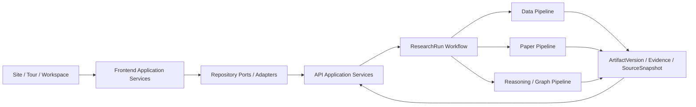

# Module Boundaries

| 元数据         | 值                                                                                                                                                                                                                              |
| -------------- | ------------------------------------------------------------------------------------------------------------------------------------------------------------------------------------------------------------------------------- |
| Status         | Accepted                                                                                                                                                                                                                        |
| Authority      | 跨模块职责、输入输出、依赖方向和交接边界                                                                                                                                                                                        |
| Implementation | A-01 frontend runtime、A-03 Workspace/HTTP 集成、A-05 Paper Acquisition Workspace、A-06 Literature Summary Workspace、X-01、C-02 NASA TOI source acquisition、D-02 PaperCollection Pipeline、#78 Publisher 与 `/api` M1 Core Runtime current；A-02 视觉 Pending |

本文不维护完整前端目录、技术选型或任务顺序。前端包结构见 [Frontend Architecture](FRONTEND_ARCHITECTURE.md)，实时任务依赖见 [Backlog](../product/BACKLOG.md)。

## 1. 依赖方向

禁止反向依赖：

- Domain 依赖 React、Astro、HTTP 或平台 API；
- UI、Visual Engine 或页面直接调用 HTTP 或外部科研来源；
- Pipeline 调用 Router 或推进 ResearchRun 主状态；
- Workflow 内嵌字段映射、论文检索、Prompt 或图谱算法；
- generated Contract 成为手工编写源；
- Prompt 散落在 Router、组件或临时脚本；
- 前端状态替代服务端 Run、ArtifactVersion 或权限事实。

## 2. A：前端与产品体验

### 输入

- PRD、DESIGN、Visual Language 和 Workspace UX；
- 生成 Transport Contract 与稳定 Domain Model；
- Run、ArtifactVersion、Evidence、SourceSnapshot 和可执行动作；
- 版本化 Fixture 与测试基准。

### 输出

- Brand Site、Guided Tour 和 Research Workspace；
- Research Contract、项目/运行导航和最多三面板 Research Canvas；
- Provenance Observatory、Research Console、分享和反馈体验；
- Fixture / HTTP Adapter、Domain mapper 和前端状态模型；
- A-16 的 Tour、Workspace 与匿名 Share 页面通过 Repository Port 消费 Domain Model；
- A-05 论文获取与候选审查工作区：`PaperAcquisitionRepository` 深 Port 隐藏 B-06 读端点与分页，Fixture/HTTP 共享同一装配函数产出 `PaperAcquisitionReview`；论文 Fixture 由真实 D-02 Pipeline（`services/paper_pipeline/demo_fixture.py`）基于冻结 benchmark 生成，经后端 Pydantic 语义门禁验证，前端只消费生成结果；
- A-06 文献总结与 Evidence 阅读工作区：`PaperSummaryRepository` 深 Port 隐藏 B-07 读端点，Fixture/HTTP 共享同一 `assemblePaperSummaryReview` 产出 `PaperSummaryReview`（论文元信息、revision/supersedes、Cached 审计、五区语句、逐项 Evidence 与 supported/unsupported/unverifiable 状态）；`LiteratureSummaryWorkspace` 提供单篇 Evidence 审查与当前 Run 最多三篇的可达对照模式，对比列分别保留 model/Prompt、Evidence 覆盖与 Cached origin/Live 失败上下文。PaperSummary Fixture 由真实 D-03 `PaperSummaryPipeline`（`services/paper_pipeline/demo_summary_fixture.py`）生成并经后端 Pydantic 语义门禁验证，前端只消费生成结果；
- a11y、visual、E2E、性能和降级测试。

### 不负责

- 直接调用模型、数据源或论文源；
- 决定 Run 状态、缓存选择、版本发布或访问权限；
- 自行补造后端未返回的科研事实；
- 在 Site 与 Workspace 重复维护同一业务状态。
- 将 Fixture E2E 或 HTTP-shaped 组件测试表述为真实 HTTP Browser / Compose 集成证据。

## 3. B：API、Application 与 Workflow

### 输入

- ResearchContract、用户动作和 Session；
- Pipeline 的结构化产物；
- Pydantic Schema、Prompt registry 和部署配置。

### 输出

- Pipeline `/api` 回归稳定性与 Current `/api` M1 资源 API；M2 资源按后续 Issue 推进；
- Session、Project、Contract、Run、Event、Artifact、Version、Workspace 和 Share；
- Workflow、幂等、取消、重试、CacheSelector、Feedback 与 RevisionPlan；
- OpenAPI / JSON Schema、Problem Details 和授权语义；
- PostgreSQL 持久化、事务、版本登记和导出。

### 不负责

- 具体数据清洗、论文检索、Relation 算法或图谱布局；
- 在 Router 中串联完整科研链路；
- 返回未经校验的模型自由文本；
- 保存密钥、受限全文或模型私有推理。

## 4. C：数据 Pipeline

### 输入

- Case / Field Manifest；
- ResearchContract 的对象、字段、来源和质量约束；
- 数据源配置、父 Run 可复用 ArtifactVersion 和 RevisionPlan。

### 输出

- 原始查询和 SourceSnapshot；
- crossmatch 与匹配 Evidence；
- Dataset、FieldDictionary、SourceCollection 和 Quality 内容；
- mapping / unit / quality rule version、input/output hash；
- 数据修订内容和 Export 输入。

当前 C-02 只实现 `exoplanet_host_star` 的 NASA Exoplanet Archive TOI TAP 主来源 Adapter、原始记录、SourceSnapshot、Recorded Fixture 与有界 smoke 入口；运行规则见 [Data Source Acquisition](../engineering/DATA_SOURCE_ACQUISITION.md)。Crossmatch、字段合并、单位统一、质量评分、ArtifactVersion 发布和 Run 编排仍由后续原子 Issue 负责。

### 不负责

- 推进 Run 状态、发布 HTTP DTO 或选择缓存；
- 使用缓存代替第二真实来源；
- 把缺失值、低置信匹配或质量分解释为科学事实。

## 5. D：论文、推理与图谱 Pipeline

### 输入

- Benchmark Package、ResearchContract 和数据 ArtifactVersion；
- 论文来源、版本化 Prompt、已校验 Summary / Claim / Evidence；
- 父 Run 可复用 ArtifactVersion 和 RevisionPlan。

### 输出

- PaperCollection、PaperSummary 和 SourceSnapshot；
- Claim、candidate/accepted/rejected Relation、ReasoningTrace；
- 通过完整性门的 Graph 内容；
- Prompt/model/producer、input/output hash 和评测报告；
- 文献、推理和 Graph 修订内容。

当前 D-02 仅实现 Crossref metadata 检索到 validated PaperCollection content 的边界；运行规则见 [PaperCollection Pipeline](../engineering/PAPER_COLLECTION_PIPELINE.md)。ArtifactVersion 事务、领域读取 API 与 Run 编排仍由 B/Workflow 负责。

### 不负责

- 绕过来源许可、付费全文或安全边界；
- 让 seed 冒充自动检索；
- 让无 Evidence / Trace 的关系进入最终 Graph；
- 记录模型私有 chain-of-thought；
- 为视觉效果制造科研节点和边。

## 6. X：基建、集成与交付

### 输入

- A/B/C/D 的可运行模块、Contract、测试和部署要求。

### 输出

- Compose、CI、环境变量、版本锁定和生成物门禁；
- X-01、X-06、X-07、X-08 阶段集成验收；
- 公网 Site / Workspace / API / DB 部署；
- START HERE、材料 provenance 和复现入口。

### 不负责

- 替代原子 Issue 实现业务；
- 在没有 ADR 和真实负载依据时引入复杂基础设施；
- 用部署成功替代科研链路和 Evidence 验收。

## 7. 共享事实的所有权

| 事实                             | 唯一所有者                                 |
| -------------------------------- | ------------------------------------------ |
| Product scope and flow           | PRD                                        |
| Experience and design principles | DESIGN / design docs                       |
| Transport Contract               | API Contract + generated OpenAPI/Schema    |
| Domain entities                  | Data Model                                 |
| Run lifecycle                    | Workflow Design                            |
| Version/cache/revision/share     | Data Versioning                            |
| Prompt content and version       | `packages/prompts` + Prompt Versioning     |
| Relation admission               | Reasoning Protocol                         |
| Current task state               | GitHub Issue / Milestone                   |
| Runtime status                   | Code, deployment and verified run evidence |

## 8. 交接标准

跨模块交接至少提供：

- 输入/输出 Schema 和版本；
- 示例及其数据等级；
- Evidence、SourceSnapshot、hash 和 producer 要求；
- 错误、权限、空结果和失败场景；
- 可执行验证命令和结果；
- Contract、风险、部署和材料影响；
- 明确的非目标和未实现项。

缺少这些信息时，消费者不得根据字段名或示例自行推断生产语义。
