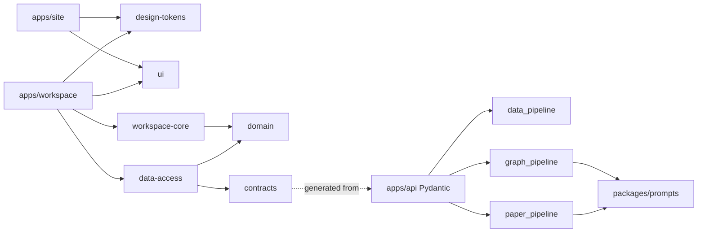

# Modules

| 项目状态         | 口径                                 |
| ---------------- | ------------------------------------ |
| Status           | Active                               |
| Frontend runtime | A-01 Implemented                     |
| API              | `/api/v1` Current；`/api/v2` Pending |

本文维护仓库模块职责与允许依赖方向。前端的精确版本、入口与构建规则见 [FRONTEND_ARCHITECTURE.md](FRONTEND_ARCHITECTURE.md)。

## 1. 目录职责

| 目录                      | 状态               | 职责                                                    |
| ------------------------- | ------------------ | ------------------------------------------------------- |
| `apps/site`               | Current            | Astro 静态 Brand Site；只负责品牌入口与静态页面         |
| `apps/workspace`          | Current            | React Workspace 路由与产品入口；A-03 前无业务行为       |
| `apps/api`                | Current            | FastAPI `/api/v1`、Schema、Workflow 与服务边界          |
| `packages/design-tokens`  | Current foundation | 基础 Token 导出；完整设计系统 Pending A-02              |
| `packages/ui`             | Current foundation | 共享 React UI public entry；完整组件 Pending A-02       |
| `packages/domain`         | Current boundary   | 无框架、HTTP 或 DOM 依赖的领域类型入口                  |
| `packages/contracts`      | Current boundary   | Pydantic 生成 Contract 的前端消费边界                   |
| `packages/data-access`    | Current boundary   | Repository Port；实现 Pending A-03/X-01                 |
| `packages/workspace-core` | Current boundary   | 工作台编排 Port；实现 Pending A-03                      |
| `packages/visual-engine`  | Current boundary   | 视觉运行时 Port；实现 Pending A-02                      |
| `packages/testing`        | Current foundation | 共享测试入口                                            |
| `packages/schemas`        | Current            | Pydantic JSON Schema 导出说明与产物位置                 |
| `packages/prompts`        | Current            | 生产 Prompt 注册表与不可变版本                          |
| `services/data_pipeline`  | Current skeleton   | 数据源、字段映射、单位、质量与导出                      |
| `services/paper_pipeline` | Current skeleton   | 论文检索、获取与结构化总结                              |
| `services/graph_pipeline` | Current skeleton   | Claim、Relation、Trace 与 Graph 构建                    |
| `scripts`                 | Current            | Foundation、前端架构、runtime-retirement 与 Schema 工具 |

## 2. 总依赖方向

禁止反向依赖：

- Shared Package 依赖 App。
- `domain` 依赖 UI、HTTP、Browser API 或传输 DTO。
- `ui` / `visual-engine` 调用 Repository、API 或 Pipeline。
- App 读取其他 Package 的内部文件。
- 前端直连 Qwen、天文数据源或论文源。
- Python Pipeline 反向依赖前端 App。

## 3. A 前端与产品体验

职责：

- A-01：维护两个 App、共享包边界、根工具链、CI 与 Compose。
- A-02（Pending）：品牌视觉、Design Token、静态 Workspace Shell 与 Visual Engine。
- A-03（Pending）：Research Contract、Guided Tour、Project/Run、Repository Adapter、恢复与分享。
- A-04～A-10（Pending）：各科研产物工作区、反馈、响应式与发布收口。

红线：

- Site 不持有完整 Workspace 状态。
- Workspace 不手写生产 Transport Schema。
- 页面不直接拼接来源 URL 或模型请求。
- A-01 占位页面不扩展为无 Issue 的业务实现。

## 4. B 后端与 Workflow

`apps/api` 当前维护 `/api/v1` 稳定性、Pydantic Schema、错误模型、客户端、缓存边界和显式 Workflow。`/api/v2` Project / Run / Artifact / Version、Session 与 Share 能力均为 Pending。

后端对 Pipeline 只依赖结构化接口，不把路由处理函数当作编排器。模型输出必须先通过 Schema 与 Evidence 校验。

## 5. C 数据 Pipeline

`services/data_pipeline` 负责 SourceRecord、字段映射、单位统一、质量评分、SourceSnapshot 与导出。它不负责前端展示、用户会话或模型路由。

## 6. D 论文、推理与图谱 Pipeline

- `services/paper_pipeline`：查询、候选、去重、选择依据、摘要与 Evidence。
- `services/graph_pipeline`：Claim、Relation、ReasoningTrace、GraphEdge 与 Evidence。
- `packages/prompts`：版本化生产 Prompt；不得散落在 Router、组件或 Notebook。

GraphEdge 必须绑定 Evidence；跨文献边还需 Relation / ReasoningTrace。

## 7. X 基建

根目录、`.github` 与 `docs/setup.md` 负责：

- Node/pnpm 与 Python/uv 版本锁定。
- 单一前端 lockfile 与 frozen install。
- Compose 四服务、环境变量和 healthcheck。
- Foundation、format、lint、typecheck、unit、build、E2E、architecture、runtime-retirement、pytest 与 Schema export。
- 文档、Issue、PR 与实现状态一致。

## 8. 联调顺序

1. B/C/D 冻结字段、论文来源、关系与 Evidence 最小契约。
2. B 由 Pydantic 导出 Transport Contract。
3. A 在 `contracts` 消费生成 Contract，并在 `data-access` 映射 Domain。
4. Fixture / HTTP 一致性测试通过后，Workspace 才消费 Repository。
5. Product E2E、权限、来源、版本与失败路径通过后，能力才可标记 Implemented。

## 9. 交接标准

每个模块交付至少包含：

- 公开输入、输出与错误语义。
- Fixture / Live / Cached 的真实来源说明。
- 版本、Evidence 与 ReasoningTrace 规则。
- 单元、契约或 E2E 证据。
- 对应架构、产品、风险与启动文档同步。
