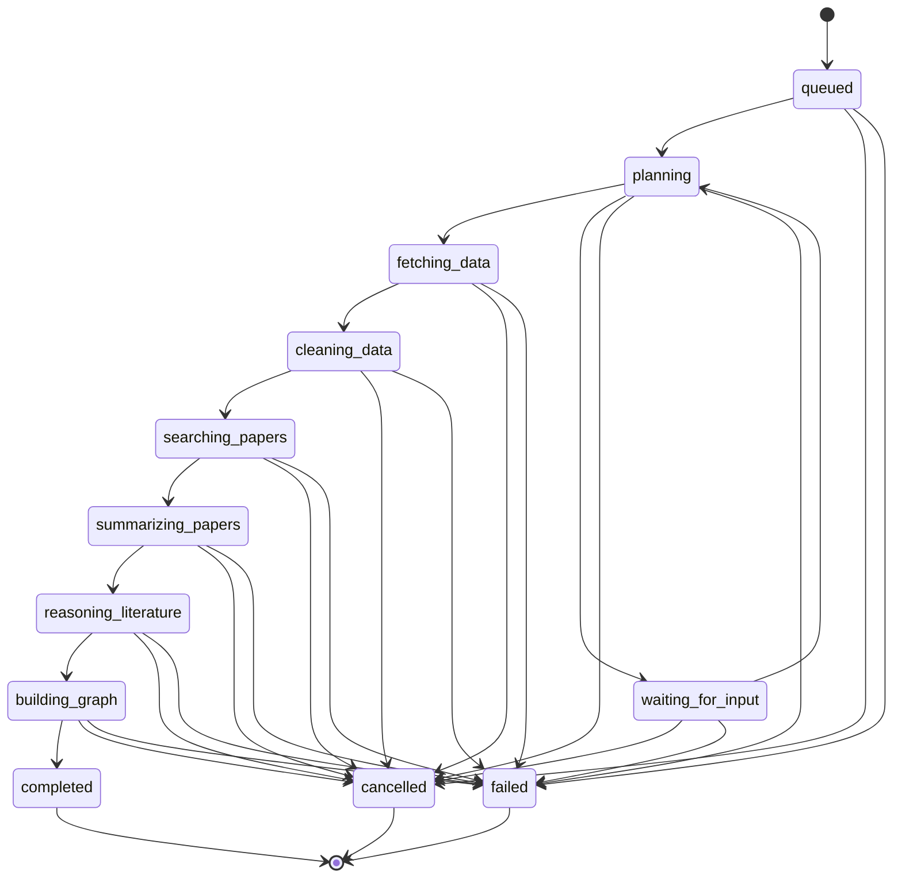

# Research Workflow Design

| 项目状态 | 口径 |
| --- | --- |
| Status | Accepted |
| Authority | Run 状态、事件、取消、重试、缓存与派生语义 |

本文定义 ResearchRun 编排、事件、取消、重试、缓存、修订与派生语义。Phase 0 Executor、Hooks 与测试构成兼容基线，其行为边界保持不变。Core Run 的创建/读取与 Event 读取以 PersistentWorkflowStore 为持久化边界；数据库 Hooks、Pipeline 接线、对外取消资源、CacheSelector 与自动执行同属 Core 编排职责。

## 1. 职责边界

工作流负责：

- Run 与 RunStep 状态转换；
- Step 排序、输入产物校验和输出登记；
- StepAttempt、RunEvent、失败和取消记录；
- 幂等、自动重试、真实缓存选择和派生 Run 入口；
- ArtifactVersion 的发布协调。

工作流不负责：天文清洗规则、论文检索策略、Prompt 内容、Claim/Relation 算法、图谱布局、HTTP DTO 或前端状态。

```text
routers
  -> application services
      -> workflow executor
          -> step adapters
              -> data / paper / reasoning / graph pipelines

workflow executor
  -> RunRepository / ArtifactRepository / EventSink ports
      -> PostgreSQL / observability adapters
```

Router 不串联 Pipeline；Pipeline 不推进 Run 主状态；浏览器不编排后端步骤。

## 2. Run 状态机



`cached`、`fixture`、修订关系和 `using_cache` 不属于状态。Core 模型不在原 Run 中使用 `revising -> completed`；人工修订创建新的 `derivation_kind=revision` Run。

## 3. Step 契约

每个 Step 声明：

| 字段 | 含义 |
| --- | --- |
| `key` | 稳定机器标识 |
| `enter_status` | 开始时要求和设置的 Run 状态 |
| `success_status` | 完成后的下一状态 |
| `input_kinds` | 必需 ArtifactKind 与 Schema 版本 |
| `output_kinds` | 可发布 ArtifactKind |
| `idempotency_key` | run + step + input hash + producer version |
| `retry_policy` | 可重试错误、次数与退避 |
| `run(context)` | 只调用对应 Port / Pipeline Adapter |

Step 输出先通过 Schema、Evidence 和质量约束，再登记 ArtifactVersion。模型自由文本不得直接成为完成产物。

D-03 PaperSummary 的 detached 准入顺序为 `JSON 解析 -> PaperSummaryModelOutput Schema -> 逐项 Evidence`。JSON 无效和 Schema 失败产生 `rejected` ProducerExecution 安全记录；Evidence 缺失、quote/value 不匹配或来源不可访问不回退成自由文本，而分别降级为 `unsupported` / `unverifiable`；来源版本冲突保留冲突记录并使用 SourceSnapshot 声明版本。`PaperSummaryModelOutput` 是不可直接发布的中间模型，通用 Publisher 拒绝其绕过 Evidence 阶段；通过后得到可交给 ArtifactVersion 准入端口的 `PaperSummaryArtifactContent`，但 D-03 本身不推进 ResearchRun、创建数据库 Version 或选择 Cache。

D-07 LiteratureClaim 的 detached 顺序固定为 `JSON -> Pydantic -> PaperSummary Version -> Evidence/SourceSnapshot existence -> ownership -> normalization -> exact structured duplicate -> final admission`。JSON/Schema 失败保留安全 ProducerExecution 和 hash 而不伪造 Claim；accepted 要求 supported Evidence，弱 Evidence 保留 candidate，硬错误稳定 rejected。`LiteratureClaimExtractionOutput` 不能绕过 Pipeline；封印后的 `LiteratureClaimsCandidate` 可交给 ArtifactVersion 准入端口。D-07 同样不推进 Run、不发布数据库 Version，也不实现 Relation/Trace/Graph 或 HTTP。

D-08 LiteratureRelation 的 detached 顺序固定为 `JSON -> Schema -> input
ArtifactVersion/content -> Claim existence/status -> Evidence/SourceSnapshot -> ownership ->
pairing -> direction -> duplicate -> conditions -> comparability(object/metric/unit) ->
ReasoningTrace -> confidence`。多重失败只保留最早阶段的稳定拒绝原因；Evidence、方向、
conditions、可比性和 Trace 硬门先于 confidence。confidence 只引用外部版本化且已校准的
assessment；阈值 `0.9` 仅在其他门通过后区分 accepted/candidate，`not_evaluable` 为
candidate，未定义/未版本化/未校准为 rejected。assessment subject 必须精确绑定双方
Claim ArtifactVersion/id、方向和 relation type fingerprint，并绑定最终 admission decision；
跨方向、版本、类型或 decision 复用为硬拒绝。comparability 声明必须受输入和 Trace
约束：object 必须显式 comparable 并由 basis、Trace 和 Evidence 支撑；
metric/unit 双方都缺失才是 `not_applicable`，同一非空值才是 `comparable`。
Trace conditions/conflicts 必须与 Relation conditions/condition conflicts 精确闭合；
任一 conflict 在 conditions 阶段拒绝，不一致时不保留伪完整 Trace。

`LiteratureRelationExtractionOutput` 不能绕过 Pipeline；封印后的单一
`LiteratureRelationsCandidate@1.0.0` 在 `kind=literature_relations` 内容中同时携带
Relation、ReasoningTrace 与 Evidence/SourceSnapshot 闭包，可交给 ArtifactVersion 准入
端口。D-08 不推进 Run、不发布数据库 Version/HTTP、不另行发布 `reasoning_traces`
Artifact，也不生成 Graph。

## 4. 进度快照与事件

- `GET /runs/{id}` 返回可恢复的权威快照。
- RunEvent 使用 `(run_id, sequence)` 单调有序，支持 cursor polling 或 SSE。
- Event 只包含公开状态、进度、步骤、产物引用和可执行提示，不包含 chain-of-thought。
- 客户端丢失事件后重新拉取 Snapshot，再从 `latest_event_sequence` 继续。
- 进度不得倒退；未知工作量时使用阶段状态，不伪造百分比。

## 5. 持久化与并发

PostgreSQL 是 Run、Step、Attempt、ArtifactVersion 和 Event 的事实来源。更新使用条件写入：

```text
expected_status + expected_revision -> target_status + new_revision
```

同一 Run 只允许一个 Executor lease。有效 lease 保存 token、owner、数据库时间 expires_at 和单调 generation；acquire 与状态事务递增 revision，heartbeat 只续期 expires_at，不使执行中的 Attempt revision 失效；超时接管递增 generation 并返回仍为 running 的 Attempt，接管者必须先登记其失败或恢复结论。旧 token 或 generation、过期 lease、旧 revision 和终态 Run 的后续提交全部拒绝。

`create_run` 使用 PostgreSQL 原子 conflict handling 保证并发 Idempotency-Key 语义，验证完整规范状态链，并在数据库层冻结 Step 集合与转换定义。`begin_step` 在持有 ResearchRun 行锁的短事务中校验冻结顺序，条件更新 Run/Step，追加 StepAttempt，并从 Run 的 `latest_event_sequence` 分配下一 Event。可重试失败保留旧 Attempt 并把 Step 恢复为 pending；耗尽重试、不可重试失败和取消在单个事务内更新 Attempt、Step、Run 与 Event。Snapshot 使用单个 PostgreSQL repeatable-read/read-only 事务，并从 `latest_event_sequence` 提供 Event cursor 恢复。

Publisher 在固定 `ResearchRun -> RunStep -> ResearchArtifact（id 排序）` 锁顺序下，将产物登记、latest、Attempt、Step、Run 与完成 Event 放入同一 fenced 事务，避免出现 completed 却找不到产物的快照。外部模型、数据源和算法调用在事务外执行，ProducerExecution 开始、结束和产物发布分别使用短事务。

MVP 可继续使用 FastAPI BackgroundTasks，但不得以进程内字典作为唯一事实来源。只有真实负载证明需要时才通过 ADR 引入队列。

## 6. 幂等与自动重试

- 创建 Live Run 要求 `Idempotency-Key`；同一 key 与同一请求返回同一 Run。
- 外部读取和模型调用以 input hash、producer version、source scope 组成幂等键。
- 超时、限流和临时网络错误可自动重试；Schema、Evidence、权限和非法状态错误不可自动重试。
- D-03/D-07/D-08 的 JSON/Schema、Evidence、ownership、normalization/pairing、方向、可比性、Trace、confidence 和 duplicate 结果是确定性准入结论，不在 detached pipeline 内自动重试模型；上层若重试必须创建新的 StepAttempt/ProducerExecution 并保留旧终态。
- 每次自动重试创建 StepAttempt，保留 attempt、时间、上游 request id 和错误分类。
- 重试不得覆盖失败 Attempt，也不得重复发布相同 ArtifactVersion。

D-02 Paper Adapter 在 Pipeline 边界内执行有界 HTTP request retry，并把 page attempt count、SourceExecution retry count 与错误分类返回给调用方；它不写 Run/Step/Attempt 或推进状态。B-06/Workflow 接入时必须把 Pipeline 返回的执行证据登记到所属 StepAttempt，且不得因 Pipeline 已重试而省略工作流审计。

## 7. 用户重试与派生 Run

终态 Run 不恢复为 running。用户动作创建新 Run：

| `derivation_kind` | 语义 | 复用规则 |
| --- | --- | --- |
| `retry` | 从失败步骤重新执行 | 可复用父 Run 中通过 hash 和 Contract 校验的完成版本 |
| `revision` | 应用 Feedback / RevisionPlan | 只重算受影响步骤，生成新 ArtifactVersion |
| `fork` | 更换 Contract 或研究范围 | 只有新 Contract 允许且输入 hash 一致的版本可复用 |

新 Run 必须保存 `parent_run_id`、原因、复用版本和新生成版本；历史 Run 保持终态。

## 8. 取消语义

- `POST /runs/{id}/cancellations` 创建幂等取消请求。
- queued / waiting Run 可立即 cancelled；运行中 Run 使用 best-effort 协作取消。
- 已发出的外部请求可能完成，但取消确认后的输出不得自动发布为 latest。
- 取消保留已完成且可审查的 ArtifactVersion，UI 明确标记来自 cancelled Run。
- completed / failed / cancelled 重复取消返回当前终态，不伪造状态转换。

## 9. Cache 选择

只有同时满足以下条件才能使用真实缓存：

1. Live 执行发生明确且可恢复的外部失败；
2. CacheRecord 指向真实历史 Run、ArtifactVersion 与 SourceSnapshot；
3. Contract、input hash、producer / prompt version 和适用范围匹配；
4. Evidence 与质量约束仍满足；
5. RunEvent、ArtifactVersion 与页面明确记录缓存选择和本次失败。

Fixture 永远不进入 CacheSelector。缓存不适用时 Run 失败，并向用户提供可执行下一步。

## 10. 修订与版本发布

```text
UserFeedback
-> RevisionPlan
-> 人工确认
-> revision ResearchRun
-> 受影响 Step
-> 新 ArtifactVersion
-> 可选更新 Artifact.latest_version_id
```

GraphEdge 修订若影响 Relation、ReasoningTrace 或 Evidence，RevisionPlan 必须包含完整影响闭包。版本发布前验证 Evidence、SourceSnapshot、content hash 与 supersedes chain。

## 11. 失败和公开错误

- 内部异常转换为稳定 error code、公开摘要和 request/run/step context。
- 公开 API 不返回堆栈、密钥、连接串、受限全文或原始模型长输出。
- 非法状态跳转立即 409，不做“尽量继续”。
- 上游返回不可校验结构时记录 `UPSTREAM_INVALID_RESPONSE`，不得把自由文本降级为科研事实。
- `waiting_for_input` 只用于确实需要用户选择的安全边界，不用于掩盖未知错误。

## 12. Phase 0 与 Core 编排边界

Phase 0 编排使用显式状态转换表与 WorkflowHooks。Core 编排由 PostgreSQL Workflow Store 提供 create/acquire/heartbeat/begin/retry/fail/cancel/snapshot 边界，`PersistentWorkflowExecutor` 按 Step 调用 Adapter，ProducerExecution Store、结构化 candidate 准入端口与 ArtifactVersion Publisher 承担产物发布。Executor 在 `begin_step` 事务提交后调用外部 Adapter，并可把成功提交委托给 Publisher 注入端口；本机 uvicorn 默认由 `PERSISTENT_WORKFLOW_ENABLED=false` 保持关闭，Compose 的 `/api` Runtime 显式强制为 `true`，Phase 0 Executor 与 Pipeline `/api` 不切换实现。

Phase 0 `ResearchTask` 快照同时校验顶层状态、进度和 Step 状态：初始 `pending` 快照不得包含已开始 Step，含 `running` Step 的快照不得为 `pending`，`completed` 快照的进度必须为 100。

Core 持久化边界覆盖 PostgreSQL Schema、Alembic migration 与最小 Repository / Unit of Work、Run lease 与条件状态事务、Attempt 自动重试账本、失败/取消、Event cursor 与一致性 Snapshot、ProducerExecution 账本与 ArtifactVersion 原子发布；对外取消资源、CacheSelector、各 Pipeline 生产接线与自动执行同属 Core 编排职责。

迁移期间 Phase 0 `ResearchTask` 可适配为一个 Project + 一个 Run，但 Core 语义不得回写破坏现有接口。

## 13. 验收门禁

- 状态转换、并发 lease、幂等、取消、自动重试和派生 Run 均有单元/集成测试。
- Event 丢失恢复、SSE 断线和 Snapshot 一致性有测试。
- Run 状态、`execution_mode`、`source_mode` 与修订派生关系分别有 Contract 测试，且不会混作同一枚举。
- RevisionPlan 只重算影响闭包，旧版本保持可读。
- Relation/ReasoningTrace 的固定准入顺序、三态、Evidence 闭包、confidence 与 publication seal 有单元/Benchmark 回归，Pipeline 不推进 Run 或分配 Version。
- Graph 发布验证全部 Evidence，跨文献边验证 Relation / Trace。
- 权限、CSRF、匿名配额和跨会话访问在应用服务层验证。
