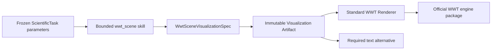

# WWT declarative scene boundary

## Context

MAVIS 把 Python Agent、私有 WebSocket、Vue 组件和 WWT 引擎连成远程命令通道。该方式覆盖定位、时间、太阳系目标、图层和 annotation，但依赖本机路径、自由消息分派、100 ms 状态轮询与截图上传；命令到最终画面的关系没有版本化 Artifact、来源所有权或可访问降级。星文智析需要迁移这些用户能力，同时维持 Project ownership、可复现发布、资源预算和无任意代码执行不变量。

## Decision

- Scene 意图按相机、时钟、observer、覆盖层、内容寻址图层、annotation、tour、readback 和文本替代建模；不保存 UI 事件或远程命令。
- 坐标相机与太阳系目标相机使用判别联合。太阳系目标只能来自固定天体 allowlist，且必须使用太阳系背景。
- 时间播放倍率非零且有界；暂停/播放必须给出 UTC 起始时间。系统时钟不允许同时给出偏移时间或倍率。
- FITS/table 二进制与文本只允许内容寻址引用及 SourceSnapshot，禁止任意路径和 URL。table 坐标、单位、时间与视觉字段由 schema 约束。
- Contract、官方 Engine 与标准 Renderer 的支持状态分别记录。只有三者均为 `supported` 且通过真实浏览器/WebGL 验收的能力才可作为 Live 闭环证据。
- Renderer 遇到未支持意图必须 fail closed 或显示 `text_alternative`，不得静默忽略后宣称场景完整。
- 自由 WebSocket、自动截图上传、截图轮询和未受控远端图层 URL 永不进入生产 Contract。

## Alternatives considered

- 复制 MAVIS WebSocket 命令协议：迁移快，但建立第二运行时、绕过 Artifact/ownership 边界并恢复任意消息分派，拒绝。
- 让前端直接读取原始 task 参数：减少模型数量，但会复制校验规则并使 Producer 与 Renderer 拥有不同事实源，拒绝。
- 只保留旧的静态中心/单网格场景：风险低，但无法表达基准中的太阳系目标和顺序跳转，也遗漏参考项目已公开的 observer、播放与覆盖层能力，拒绝。

## Consequences

- 场景 Artifact 可审计、可哈希、可版本化，并能在 WebGL 不可用时保留有意义的文本内容。
- 新能力必须先进入强类型 Contract，再由标准 Renderer 显式接线；生成契约和前端 Domain 必须与 schema 同步。
- table/FITS 内容需要现有内容存储和 SourceSnapshot 闭包，不能直接加载第三方 URL。
- 支持矩阵会使尚未接线的能力保持 `unsupported`；已接线能力只能进入 `implemented_unverified`，仍需真实终态 Run 与浏览器/WebGL 人工验收才能晋升 `implemented_verified`。
